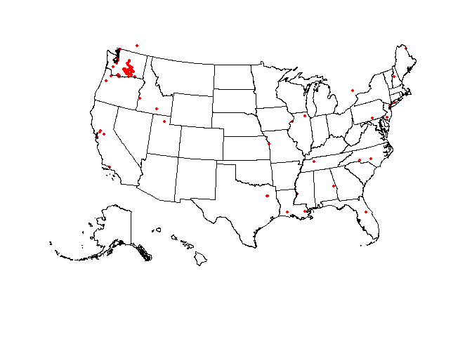
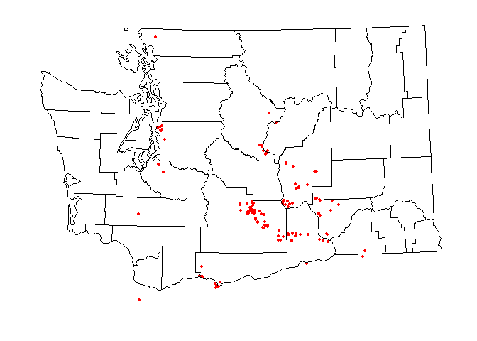

-   [Executive Summary](#executive-summary)
-   [Data Dictionary](#data-dictionary)
    -   [evDownload.01 subset](#evdownload.01-subset)
    -   [evStart subset](#evstart-subset)
    -   [evViewPage.01 subset](#evviewpage.01-subset)
    -   [Detailed variable
        descriptions](#detailed-variable-descriptions)
-   [Descriptive Statistics](#descriptive-statistics)
    -   [evDownload.01](#evdownload.01)
        -   [Frequencies](#frequencies)
        -   [Frequencies](#frequencies-1)
        -   [Frequencies](#frequencies-2)
    -   [evStart](#evstart)
        -   [Frequencies](#frequencies-3)
        -   [Frequencies](#frequencies-4)
    -   [evViewPage.01](#evviewpage.01)
        -   [Frequencies](#frequencies-5)
        -   [Frequencies](#frequencies-6)
        -   [Frequencies](#frequencies-7)
        -   [Frequencies](#frequencies-8)
-   [App use by location](#app-use-by-location)
-   [Device time use patterns](#device-time-use-patterns)
-   [Dataframe summaries](#dataframe-summaries)

# Executive Summary

A data dictionary and descriptive statistics were prepared based on the
Pesticide Labels Now (PLN) [analysis
plan](https://docs.google.com/document/d/1mUHPYdpWljCWroODGenUjYlyae2ZWwqN4MScBLXlr2U/edit).
For a better representation of users, we ignored a list of random
identifiers (‘aid’ in *ignores.csv*) associated with the project team
members and generated descriptive statistics for three subsets:

-   evDownload.01
-   evStart
-   evViewPage.01

# Data Dictionary

## evDownload.01 subset

Unique devices (aid)

    print(n_distinct(evDownload.01$aid), style="rmarkdown")

    ## [1] 93

<table>
<thead>
<tr class="header">
<th>Variable</th>
<th>Description</th>
</tr>
</thead>
<tbody>
<tr class="odd">
<td>aid</td>
<td>Random device identifier</td>
</tr>
<tr class="even">
<td>epaReg</td>
<td>EPA regsistration number</td>
</tr>
<tr class="odd">
<td>prodName</td>
<td>Pesticide product name</td>
</tr>
<tr class="even">
<td>sourcePage</td>
<td>App page visited?</td>
</tr>
<tr class="odd">
<td>evType</td>
<td>Action taken on app (download)</td>
</tr>
<tr class="even">
<td>ts</td>
<td>Timestamp yyy:mm:dd:hh:mm:ss</td>
</tr>
</tbody>
</table>

## evStart subset

Unique users (aid)

    print(n_distinct(evStart$aid), style="rmarkdown")

    ## [1] 397

<table>
<thead>
<tr class="header">
<th>Variable</th>
<th>Description</th>
</tr>
</thead>
<tbody>
<tr class="odd">
<td>aid</td>
<td>Random device identifier</td>
</tr>
<tr class="even">
<td>evDesc1</td>
<td>App version?</td>
</tr>
<tr class="odd">
<td>evDesc2</td>
<td>Device type</td>
</tr>
<tr class="even">
<td>evDesc3</td>
<td>GPS coordinates</td>
</tr>
<tr class="odd">
<td>evType</td>
<td>Action taken on app (start page)</td>
</tr>
<tr class="even">
<td>ts</td>
<td>Timestamp yyy:mm:dd:hh:mm:ss</td>
</tr>
</tbody>
</table>

## evViewPage.01 subset

Unique users (aid)

    print(n_distinct(evViewPage.01$aid), style="rmarkdown")

    ## [1] 362

<table>
<thead>
<tr class="header">
<th>Variable</th>
<th>Description</th>
</tr>
</thead>
<tbody>
<tr class="odd">
<td>aid</td>
<td>Random device identifier</td>
</tr>
<tr class="even">
<td>evDesc1</td>
<td>First action on app</td>
</tr>
<tr class="odd">
<td>evDesc2</td>
<td>English or Spanish</td>
</tr>
<tr class="even">
<td>evDesc3</td>
<td>Pesticide label viewed</td>
</tr>
<tr class="odd">
<td>evType</td>
<td>Action taken on app (view page)</td>
</tr>
<tr class="even">
<td>ts</td>
<td>Timestamp yyy:mm:dd:hh:mm:ss</td>
</tr>
</tbody>
</table>

## Detailed variable descriptions

-   Device = identified by a randomly assigned identifier. = Person.
    Person = device. There is no way to distinguish individual users.
    One device can be used by ≥ 1 person and 1 person can use ≥ 1
    device.
-   Access = accessed app = put PLN on device and opened app (app opens
    to label List).
-   Session = time from when the app opened until just before next time
    it is opened.
-   PICOL Searches = PICOL results viewed.
-   Label searches = Label menu viewed.
-   View = accessed and viewed information (any combination of ≥ 1 of
    the following)
-   Label view = accessed + \[(opened ≥ 1 label) + (opened ≥ 1 menu
    bar)\] Label view + PDF = accessed + \[(opened ≥ 1 label) + (opened
    ≥ 1 menu bar)+ (downloaded label PDF)\]
-   PICOL view = accessed + \[(conducted ≥ 1 PICOL search) + (viewed ≥ 1
    PICOL result)\]
-   PICOL view + PDF = accessed app + \[(conducted ≥ 1 PICOL search) +
    (viewed ≥ 1 PICOL result) + (downloaded app)\]
-   General view = accessed +(viewed label search page + selected a
    label, but did not open menu bar) and/or ( viewed PICOL search page)
    and/or viewed more pages General view + links
-   Location = GPS coordinates. de-identified location in that it is
    somewhere within the ~ 500 ft radius. We will only report by broad
    areas. Agricultural regions if they are defined. Currently, many
    iPhone users are declining location as Apple is asking users if they
    want the location turned on/off with each update. We may only be
    able to evaluate this up to the April release date. App is only
    available to devices registered in the US, CA, and MX. However,
    phones registered in these countries can be used anywhere. For
    example, we had a user connect from S. America from a US registered
    phone.
-   Population A definition: anyone that has accessed the app. There is
    1 excluded population and 3 study subpopulations (based on gps
    location coordinates at time the app is opened.)
    -   Device used in WA state GPS data. (Not Seattle or King County)
    -   Device used outside of WA state
    -   No location (location services are off.)
    -   Exclude. King County or at least the Seattle metropolitan area
        locations. These are likely team and PNASH staff. Exclusion
        list. Selected random devices IDs are on an exclusion list.
        These are test devices.
-   Population B definition: (Only use if enough people respond to in
    app questions). Those users that respond to the location in-app
    question. (This response can be linked to app analytic data as it
    has the same random unique ID). This will be implemented very soon.
    -   Response I work in WA state (not quite the same as where they
        downloaded it)
    -   Response I work outside of Washington state
    -   Do not want to answer
    -   Skips answering the question. (will combine with c)

# Descriptive Statistics

## evDownload.01

### Frequencies

**evDownload.01$prodName**  
**Type:** Character

<table>
<thead>
<tr class="header">
<th style="text-align: right;"> </th>
<th style="text-align: right;">Freq</th>
<th style="text-align: right;">%</th>
</tr>
</thead>
<tbody>
<tr class="odd">
<td style="text-align: right;"><strong>Lorsban® Advanced</strong></td>
<td style="text-align: right;">23</td>
<td style="text-align: right;">6.50</td>
</tr>
<tr class="even">
<td style="text-align: right;"><strong>PARAQUAT 43.2% SL</strong></td>
<td style="text-align: right;">18</td>
<td style="text-align: right;">5.08</td>
</tr>
<tr class="odd">
<td style="text-align: right;"><strong>2,4-D AMINE 4 HERBICIDE</strong></td>
<td style="text-align: right;">16</td>
<td style="text-align: right;">4.52</td>
</tr>
<tr class="even">
<td style="text-align: right;"><strong>2,4-D /AMINE 4 HERBICIDE</strong></td>
<td style="text-align: right;">14</td>
<td style="text-align: right;">3.95</td>
</tr>
<tr class="odd">
<td style="text-align: right;"><strong>Lorsban®-4E Insecticide</strong></td>
<td style="text-align: right;">12</td>
<td style="text-align: right;">3.39</td>
</tr>
<tr class="even">
<td style="text-align: right;"><strong>440 SUPERIOR SPRAY OIL</strong></td>
<td style="text-align: right;">11</td>
<td style="text-align: right;">3.11</td>
</tr>
<tr class="odd">
<td style="text-align: right;"><strong>Delegate® WG</strong></td>
<td style="text-align: right;">11</td>
<td style="text-align: right;">3.11</td>
</tr>
<tr class="even">
<td style="text-align: right;"><strong>Carbaryl 4L</strong></td>
<td style="text-align: right;">10</td>
<td style="text-align: right;">2.82</td>
</tr>
<tr class="odd">
<td style="text-align: right;"><strong>ABBA ULTRA MITICIDE/INSECTICIDE</strong></td>
<td style="text-align: right;">9</td>
<td style="text-align: right;">2.54</td>
</tr>
<tr class="even">
<td style="text-align: right;"><strong>440 Superior Spray Oil</strong></td>
<td style="text-align: right;">8</td>
<td style="text-align: right;">2.26</td>
</tr>
<tr class="odd">
<td style="text-align: right;"><strong>Acramite® - 50WS</strong></td>
<td style="text-align: right;">8</td>
<td style="text-align: right;">2.26</td>
</tr>
<tr class="even">
<td style="text-align: right;"><strong>Assail® 70WP Insecticide</strong></td>
<td style="text-align: right;">8</td>
<td style="text-align: right;">2.26</td>
</tr>
<tr class="odd">
<td style="text-align: right;"><strong>Belt® SC Insecticide</strong></td>
<td style="text-align: right;">7</td>
<td style="text-align: right;">1.98</td>
</tr>
<tr class="even">
<td style="text-align: right;"><strong>Calypso® 4 Flowable Insecticide</strong></td>
<td style="text-align: right;">7</td>
<td style="text-align: right;">1.98</td>
</tr>
<tr class="odd">
<td style="text-align: right;"><strong>3336 F TURF &amp; ORNAMENTAL FUNGICIDE</strong></td>
<td style="text-align: right;">6</td>
<td style="text-align: right;">1.69</td>
</tr>
<tr class="even">
<td style="text-align: right;"><strong>Rex Lime Sulfur Solution</strong></td>
<td style="text-align: right;">6</td>
<td style="text-align: right;">1.69</td>
</tr>
<tr class="odd">
<td style="text-align: right;"><strong>ABBA 0.15EC MITICIDE/INSECTICIDE</strong></td>
<td style="text-align: right;">5</td>
<td style="text-align: right;">1.41</td>
</tr>
<tr class="even">
<td style="text-align: right;"><strong>GRAMOXONE SL 2.0 HERBICIDE</strong></td>
<td style="text-align: right;">5</td>
<td style="text-align: right;">1.41</td>
</tr>
<tr class="odd">
<td style="text-align: right;"><strong>120 HERBICIDE</strong></td>
<td style="text-align: right;">4</td>
<td style="text-align: right;">1.13</td>
</tr>
<tr class="even">
<td style="text-align: right;"><strong>ABACUS AGRICULTURAL MITICIDE/INSECTICIDE</strong></td>
<td style="text-align: right;">4</td>
<td style="text-align: right;">1.13</td>
</tr>
<tr class="odd">
<td style="text-align: right;"><strong>ABBA 0.15</strong></td>
<td style="text-align: right;">4</td>
<td style="text-align: right;">1.13</td>
</tr>
<tr class="even">
<td style="text-align: right;"><strong>BRANDT LIME SULFUR FUNGICIDE</strong></td>
<td style="text-align: right;">4</td>
<td style="text-align: right;">1.13</td>
</tr>
<tr class="odd">
<td style="text-align: right;"><strong>FireLineâ„¢ 17 WP fungicide/bactericide</strong></td>
<td style="text-align: right;">4</td>
<td style="text-align: right;">1.13</td>
</tr>
<tr class="even">
<td style="text-align: right;"><strong>GALIGAN 2E HERBICIDE</strong></td>
<td style="text-align: right;">4</td>
<td style="text-align: right;">1.13</td>
</tr>
<tr class="odd">
<td style="text-align: right;"><strong>ROUNDUP POWER MAX HERB</strong></td>
<td style="text-align: right;">4</td>
<td style="text-align: right;">1.13</td>
</tr>
<tr class="even">
<td style="text-align: right;"><strong>2,4-D AMINE 4</strong></td>
<td style="text-align: right;">3</td>
<td style="text-align: right;">0.85</td>
</tr>
<tr class="odd">
<td style="text-align: right;"><strong>470 SUPREME SPRAY OIL</strong></td>
<td style="text-align: right;">3</td>
<td style="text-align: right;">0.85</td>
</tr>
<tr class="even">
<td style="text-align: right;"><strong>AGRI-FLEX MITICIDE/INSECTICIDE</strong></td>
<td style="text-align: right;">3</td>
<td style="text-align: right;">0.85</td>
</tr>
<tr class="odd">
<td style="text-align: right;"><strong>ASSAIL 70WP INSECTICIDE</strong></td>
<td style="text-align: right;">3</td>
<td style="text-align: right;">0.85</td>
</tr>
<tr class="even">
<td style="text-align: right;"><strong>DuPont™ Fontelis® FUNGICIDE</strong></td>
<td style="text-align: right;">3</td>
<td style="text-align: right;">0.85</td>
</tr>
<tr class="odd">
<td style="text-align: right;"><strong>Isomate® CM Flex</strong></td>
<td style="text-align: right;">3</td>
<td style="text-align: right;">0.85</td>
</tr>
<tr class="even">
<td style="text-align: right;"><strong>SULFUR DRY FLOWABLE</strong></td>
<td style="text-align: right;">3</td>
<td style="text-align: right;">0.85</td>
</tr>
<tr class="odd">
<td style="text-align: right;"><strong>3336 70EG TURF &amp; ORNAMENTAL SYSTEMIC FUNGICIDE</strong></td>
<td style="text-align: right;">2</td>
<td style="text-align: right;">0.56</td>
</tr>
<tr class="even">
<td style="text-align: right;"><strong>ABAMEX MITICIDE/INSECTICIDE</strong></td>
<td style="text-align: right;">2</td>
<td style="text-align: right;">0.56</td>
</tr>
<tr class="odd">
<td style="text-align: right;"><strong>ABBA 0.15EC</strong></td>
<td style="text-align: right;">2</td>
<td style="text-align: right;">0.56</td>
</tr>
<tr class="even">
<td style="text-align: right;"><strong>ACENTHRIN INSECTICIDE</strong></td>
<td style="text-align: right;">2</td>
<td style="text-align: right;">0.56</td>
</tr>
<tr class="odd">
<td style="text-align: right;"><strong>ACETO BIFENTHRIN 2 EC</strong></td>
<td style="text-align: right;">2</td>
<td style="text-align: right;">0.56</td>
</tr>
<tr class="even">
<td style="text-align: right;"><strong>AGRI-MEK SC</strong></td>
<td style="text-align: right;">2</td>
<td style="text-align: right;">0.56</td>
</tr>
<tr class="odd">
<td style="text-align: right;"><strong>AGRI-MYCIN 17</strong></td>
<td style="text-align: right;">2</td>
<td style="text-align: right;">0.56</td>
</tr>
<tr class="even">
<td style="text-align: right;"><strong>AGRISOLUTIONS DIMATE 4E SYSTEMIC INSECTICIDE</strong></td>
<td style="text-align: right;">2</td>
<td style="text-align: right;">0.56</td>
</tr>
<tr class="odd">
<td style="text-align: right;"><strong>Asana® XL Insecticide</strong></td>
<td style="text-align: right;">2</td>
<td style="text-align: right;">0.56</td>
</tr>
<tr class="even">
<td style="text-align: right;"><strong>CHAMP DRY PRILL AGRICULTURAL FUNGICIDE / BACTERICIDE</strong></td>
<td style="text-align: right;">2</td>
<td style="text-align: right;">0.56</td>
</tr>
<tr class="odd">
<td style="text-align: right;"><strong>CHAMP FORMULA 2 FLOWABLE</strong></td>
<td style="text-align: right;">2</td>
<td style="text-align: right;">0.56</td>
</tr>
<tr class="even">
<td style="text-align: right;"><strong>Cidetrak® Da Mec™</strong></td>
<td style="text-align: right;">2</td>
<td style="text-align: right;">0.56</td>
</tr>
<tr class="odd">
<td style="text-align: right;"><strong>DELEGATE WG INSECTICIDE</strong></td>
<td style="text-align: right;">2</td>
<td style="text-align: right;">0.56</td>
</tr>
<tr class="even">
<td style="text-align: right;"><strong>DiPel® DF Biological Insecticide Dry Flowable</strong></td>
<td style="text-align: right;">2</td>
<td style="text-align: right;">0.56</td>
</tr>
<tr class="odd">
<td style="text-align: right;"><strong>DuPONT LANNATE LV INSECTICIDE</strong></td>
<td style="text-align: right;">2</td>
<td style="text-align: right;">0.56</td>
</tr>
<tr class="even">
<td style="text-align: right;"><strong>DuPont™ Altacor®</strong></td>
<td style="text-align: right;">2</td>
<td style="text-align: right;">0.56</td>
</tr>
<tr class="odd">
<td style="text-align: right;"><strong>FUSILADE DX HERBICIDE</strong></td>
<td style="text-align: right;">2</td>
<td style="text-align: right;">0.56</td>
</tr>
<tr class="even">
<td style="text-align: right;"><strong>Intruder® Max 70WP Insecticide</strong></td>
<td style="text-align: right;">2</td>
<td style="text-align: right;">0.56</td>
</tr>
<tr class="odd">
<td style="text-align: right;"><strong>LEAF LIFE GAVICIDE GREEN 415</strong></td>
<td style="text-align: right;">2</td>
<td style="text-align: right;">0.56</td>
</tr>
<tr class="even">
<td style="text-align: right;"><strong>LEPROTEC</strong></td>
<td style="text-align: right;">2</td>
<td style="text-align: right;">0.56</td>
</tr>
<tr class="odd">
<td style="text-align: right;"><strong>REGULATE SELECT</strong></td>
<td style="text-align: right;">2</td>
<td style="text-align: right;">0.56</td>
</tr>
<tr class="even">
<td style="text-align: right;"><strong>ROUNDUP POWER MAX HERBICIDE</strong></td>
<td style="text-align: right;">2</td>
<td style="text-align: right;">0.56</td>
</tr>
<tr class="odd">
<td style="text-align: right;"><strong>TIMECTIN 0.15EC AG INSECTICIDE/MITICIDE</strong></td>
<td style="text-align: right;">2</td>
<td style="text-align: right;">0.56</td>
</tr>
<tr class="even">
<td style="text-align: right;"><strong>Warrior II with Zeon Technology®</strong></td>
<td style="text-align: right;">2</td>
<td style="text-align: right;">0.56</td>
</tr>
<tr class="odd">
<td style="text-align: right;"><strong>6-BA</strong></td>
<td style="text-align: right;">1</td>
<td style="text-align: right;">0.28</td>
</tr>
<tr class="even">
<td style="text-align: right;"><strong>ABAMECTIN 2% MITICIDE/INSECTICIDE</strong></td>
<td style="text-align: right;">1</td>
<td style="text-align: right;">0.28</td>
</tr>
<tr class="odd">
<td style="text-align: right;"><strong>ACADEMY FUNGICIDE</strong></td>
<td style="text-align: right;">1</td>
<td style="text-align: right;">0.28</td>
</tr>
<tr class="even">
<td style="text-align: right;"><strong>ACEPHATE 97UP INSECTICIDE</strong></td>
<td style="text-align: right;">1</td>
<td style="text-align: right;">0.28</td>
</tr>
<tr class="odd">
<td style="text-align: right;"><strong>ACRAMITE-50WS</strong></td>
<td style="text-align: right;">1</td>
<td style="text-align: right;">0.28</td>
</tr>
<tr class="even">
<td style="text-align: right;"><strong>ACTIGARD 50WG</strong></td>
<td style="text-align: right;">1</td>
<td style="text-align: right;">0.28</td>
</tr>
<tr class="odd">
<td style="text-align: right;"><strong>ADAMENT 50 WG FUNGICIDE</strong></td>
<td style="text-align: right;">1</td>
<td style="text-align: right;">0.28</td>
</tr>
<tr class="even">
<td style="text-align: right;"><strong>ADMIRE PRO SYSTEMIC PROTECTANT</strong></td>
<td style="text-align: right;">1</td>
<td style="text-align: right;">0.28</td>
</tr>
<tr class="odd">
<td style="text-align: right;"><strong>ADORN FUNGICIDE</strong></td>
<td style="text-align: right;">1</td>
<td style="text-align: right;">0.28</td>
</tr>
<tr class="even">
<td style="text-align: right;"><strong>AGCLOR 310</strong></td>
<td style="text-align: right;">1</td>
<td style="text-align: right;">0.28</td>
</tr>
<tr class="odd">
<td style="text-align: right;"><strong>AGRI-FOS SYSTEMIC FUNGICIDE PLUS</strong></td>
<td style="text-align: right;">1</td>
<td style="text-align: right;">0.28</td>
</tr>
<tr class="even">
<td style="text-align: right;"><strong>AGRI-MEK SC MITICIDE/INSECTICIDE</strong></td>
<td style="text-align: right;">1</td>
<td style="text-align: right;">0.28</td>
</tr>
<tr class="odd">
<td style="text-align: right;"><strong>AGRISOLUTIONS RUGGED HERBICIDE</strong></td>
<td style="text-align: right;">1</td>
<td style="text-align: right;">0.28</td>
</tr>
<tr class="even">
<td style="text-align: right;"><strong>AIM EC HERBICIDE</strong></td>
<td style="text-align: right;">1</td>
<td style="text-align: right;">0.28</td>
</tr>
<tr class="odd">
<td style="text-align: right;"><strong>ALTUS</strong></td>
<td style="text-align: right;">1</td>
<td style="text-align: right;">0.28</td>
</tr>
<tr class="even">
<td style="text-align: right;"><strong>Ambush® 25W Insecticide Wettable Powder</strong></td>
<td style="text-align: right;">1</td>
<td style="text-align: right;">0.28</td>
</tr>
<tr class="odd">
<td style="text-align: right;"><strong>APOGEE PLANT GROWTH REGULATOR</strong></td>
<td style="text-align: right;">1</td>
<td style="text-align: right;">0.28</td>
</tr>
<tr class="even">
<td style="text-align: right;"><strong>AZAGUARD BOTANICAL INSECTICIDE/NEMATICIDE</strong></td>
<td style="text-align: right;">1</td>
<td style="text-align: right;">0.28</td>
</tr>
<tr class="odd">
<td style="text-align: right;"><strong>AZAMAX</strong></td>
<td style="text-align: right;">1</td>
<td style="text-align: right;">0.28</td>
</tr>
<tr class="even">
<td style="text-align: right;"><strong>BATTALLION 2EC</strong></td>
<td style="text-align: right;">1</td>
<td style="text-align: right;">0.28</td>
</tr>
<tr class="odd">
<td style="text-align: right;"><strong>BSP LIME-SULFUR SOLUTION</strong></td>
<td style="text-align: right;">1</td>
<td style="text-align: right;">0.28</td>
</tr>
<tr class="even">
<td style="text-align: right;"><strong>BUCCANEER PLUS GLYPHOSATE HERBICIDE</strong></td>
<td style="text-align: right;">1</td>
<td style="text-align: right;">0.28</td>
</tr>
<tr class="odd">
<td style="text-align: right;"><strong>CAPTIVA</strong></td>
<td style="text-align: right;">1</td>
<td style="text-align: right;">0.28</td>
</tr>
<tr class="even">
<td style="text-align: right;"><strong>CLEANSHOT 4L HERBICIDE</strong></td>
<td style="text-align: right;">1</td>
<td style="text-align: right;">0.28</td>
</tr>
<tr class="odd">
<td style="text-align: right;"><strong>DREXEL MALATHION 5EC INSECTICIDE/MITICIDE</strong></td>
<td style="text-align: right;">1</td>
<td style="text-align: right;">0.28</td>
</tr>
<tr class="even">
<td style="text-align: right;"><strong>DuPONT EXIREL</strong></td>
<td style="text-align: right;">1</td>
<td style="text-align: right;">0.28</td>
</tr>
<tr class="odd">
<td style="text-align: right;"><strong>ecoFOG-170 DPA POST-HARVEST DIPHENYLAMINE</strong></td>
<td style="text-align: right;">1</td>
<td style="text-align: right;">0.28</td>
</tr>
<tr class="even">
<td style="text-align: right;"><strong>ENTRUST</strong></td>
<td style="text-align: right;">1</td>
<td style="text-align: right;">0.28</td>
</tr>
<tr class="odd">
<td style="text-align: right;"><strong>ENTRUST SC NATURALYTE INSECT CONTROL</strong></td>
<td style="text-align: right;">1</td>
<td style="text-align: right;">0.28</td>
</tr>
<tr class="even">
<td style="text-align: right;"><strong>Entrust® SC Naturalite® Insect Control</strong></td>
<td style="text-align: right;">1</td>
<td style="text-align: right;">0.28</td>
</tr>
<tr class="odd">
<td style="text-align: right;"><strong>Eraserâ„¢</strong></td>
<td style="text-align: right;">1</td>
<td style="text-align: right;">0.28</td>
</tr>
<tr class="even">
<td style="text-align: right;"><strong>FLUDIOXONIL 2L PH</strong></td>
<td style="text-align: right;">1</td>
<td style="text-align: right;">0.28</td>
</tr>
<tr class="odd">
<td style="text-align: right;"><strong>GLY STAR ORIGINAL</strong></td>
<td style="text-align: right;">1</td>
<td style="text-align: right;">0.28</td>
</tr>
<tr class="even">
<td style="text-align: right;"><strong>GLY STAR PLUS</strong></td>
<td style="text-align: right;">1</td>
<td style="text-align: right;">0.28</td>
</tr>
<tr class="odd">
<td style="text-align: right;"><strong>GOVERN 4E INSECTICIDE</strong></td>
<td style="text-align: right;">1</td>
<td style="text-align: right;">0.28</td>
</tr>
<tr class="even">
<td style="text-align: right;"><strong>HAWK-I 2L INSECTICIDE</strong></td>
<td style="text-align: right;">1</td>
<td style="text-align: right;">0.28</td>
</tr>
<tr class="odd">
<td style="text-align: right;"><strong>HDH TBZ</strong></td>
<td style="text-align: right;">1</td>
<td style="text-align: right;">0.28</td>
</tr>
<tr class="even">
<td style="text-align: right;"><strong>IAP 440 SPRAY OIL</strong></td>
<td style="text-align: right;">1</td>
<td style="text-align: right;">0.28</td>
</tr>
<tr class="odd">
<td style="text-align: right;"><strong>IAP HI SUPREME 440 SPRAY OIL-NW</strong></td>
<td style="text-align: right;">1</td>
<td style="text-align: right;">0.28</td>
</tr>
<tr class="even">
<td style="text-align: right;"><strong>KASUMIN 2L</strong></td>
<td style="text-align: right;">1</td>
<td style="text-align: right;">0.28</td>
</tr>
<tr class="odd">
<td style="text-align: right;"><strong>Lambda-CYâ„¢ EC - RUP</strong></td>
<td style="text-align: right;">1</td>
<td style="text-align: right;">0.28</td>
</tr>
<tr class="even">
<td style="text-align: right;"><strong>LAMBDA SELECT</strong></td>
<td style="text-align: right;">1</td>
<td style="text-align: right;">0.28</td>
</tr>
<tr class="odd">
<td style="text-align: right;"><strong>LIME-SULFUR SOLUTION -CANCELLED 2020-</strong></td>
<td style="text-align: right;">1</td>
<td style="text-align: right;">0.28</td>
</tr>
<tr class="even">
<td style="text-align: right;"><strong>LIME-SULFUR SOLUTION AG FUNGICIDE</strong></td>
<td style="text-align: right;">1</td>
<td style="text-align: right;">0.28</td>
</tr>
<tr class="odd">
<td style="text-align: right;"><strong>LIME SULFUR ULTRA</strong></td>
<td style="text-align: right;">1</td>
<td style="text-align: right;">0.28</td>
</tr>
<tr class="even">
<td style="text-align: right;"><strong>LORSBAN-4E INSECTICIDE</strong></td>
<td style="text-align: right;">1</td>
<td style="text-align: right;">0.28</td>
</tr>
<tr class="odd">
<td style="text-align: right;"><strong>LORSBAN 75WG</strong></td>
<td style="text-align: right;">1</td>
<td style="text-align: right;">0.28</td>
</tr>
<tr class="even">
<td style="text-align: right;"><strong>LUNA TRANQUILITY</strong></td>
<td style="text-align: right;">1</td>
<td style="text-align: right;">0.28</td>
</tr>
<tr class="odd">
<td style="text-align: right;"><strong>Luna® SENSATION</strong></td>
<td style="text-align: right;">1</td>
<td style="text-align: right;">0.28</td>
</tr>
<tr class="even">
<td style="text-align: right;"><strong>MAD DOG PLUS</strong></td>
<td style="text-align: right;">1</td>
<td style="text-align: right;">0.28</td>
</tr>
<tr class="odd">
<td style="text-align: right;"><strong>MERIVON XEMIUM BRAND FUNGICIDE</strong></td>
<td style="text-align: right;">1</td>
<td style="text-align: right;">0.28</td>
</tr>
<tr class="even">
<td style="text-align: right;"><strong>NU-COP 50DF FUNGICIDE/BACTERICIDE</strong></td>
<td style="text-align: right;">1</td>
<td style="text-align: right;">0.28</td>
</tr>
<tr class="odd">
<td style="text-align: right;"><strong>ONAGER EW MITICIDE</strong></td>
<td style="text-align: right;">1</td>
<td style="text-align: right;">0.28</td>
</tr>
<tr class="even">
<td style="text-align: right;"><strong>PARA-SHOT 3.0</strong></td>
<td style="text-align: right;">1</td>
<td style="text-align: right;">0.28</td>
</tr>
<tr class="odd">
<td style="text-align: right;"><strong>Pitch® 35WP</strong></td>
<td style="text-align: right;">1</td>
<td style="text-align: right;">0.28</td>
</tr>
<tr class="even">
<td style="text-align: right;"><strong>PROCURE 480SC AG FUNGICIDE</strong></td>
<td style="text-align: right;">1</td>
<td style="text-align: right;">0.28</td>
</tr>
<tr class="odd">
<td style="text-align: right;"><strong>PROWL H2O HERBICIDE</strong></td>
<td style="text-align: right;">1</td>
<td style="text-align: right;">0.28</td>
</tr>
<tr class="even">
<td style="text-align: right;"><strong>QUALI-PRO GLYPHOSATE PLUS HERBICIDE</strong></td>
<td style="text-align: right;">1</td>
<td style="text-align: right;">0.28</td>
</tr>
<tr class="odd">
<td style="text-align: right;"><strong>RELY 280 HERBICIDE</strong></td>
<td style="text-align: right;">1</td>
<td style="text-align: right;">0.28</td>
</tr>
<tr class="even">
<td style="text-align: right;"><strong>RESIST 57</strong></td>
<td style="text-align: right;">1</td>
<td style="text-align: right;">0.28</td>
</tr>
<tr class="odd">
<td style="text-align: right;"><strong>REX LIME SULFUR SOLUTION</strong></td>
<td style="text-align: right;">1</td>
<td style="text-align: right;">0.28</td>
</tr>
<tr class="even">
<td style="text-align: right;"><strong>ROUNDUP WEATHER MAX</strong></td>
<td style="text-align: right;">1</td>
<td style="text-align: right;">0.28</td>
</tr>
<tr class="odd">
<td style="text-align: right;"><strong>ROUNDUP WEATHER MAX HERBICIDE</strong></td>
<td style="text-align: right;">1</td>
<td style="text-align: right;">0.28</td>
</tr>
<tr class="even">
<td style="text-align: right;"><strong>SEVIN SL CARBARYL INSECTICIDE (ES)</strong></td>
<td style="text-align: right;">1</td>
<td style="text-align: right;">0.28</td>
</tr>
<tr class="odd">
<td style="text-align: right;"><strong>Success® NATURALYTE® INSECT CONTROL</strong></td>
<td style="text-align: right;">1</td>
<td style="text-align: right;">0.28</td>
</tr>
<tr class="even">
<td style="text-align: right;"><strong>TALSTAR P PROFESSIONAL INSECTICIDE</strong></td>
<td style="text-align: right;">1</td>
<td style="text-align: right;">0.28</td>
</tr>
<tr class="odd">
<td style="text-align: right;"><strong>TOPGUARD FUNGICIDE SPECIALTY CROPS</strong></td>
<td style="text-align: right;">1</td>
<td style="text-align: right;">0.28</td>
</tr>
<tr class="even">
<td style="text-align: right;"><strong>Ultor®</strong></td>
<td style="text-align: right;">1</td>
<td style="text-align: right;">0.28</td>
</tr>
<tr class="odd">
<td style="text-align: right;"><strong>VALENT ENVOY HERBICIDE</strong></td>
<td style="text-align: right;">1</td>
<td style="text-align: right;">0.28</td>
</tr>
<tr class="even">
<td style="text-align: right;"><strong>VELUM PRIME</strong></td>
<td style="text-align: right;">1</td>
<td style="text-align: right;">0.28</td>
</tr>
<tr class="odd">
<td style="text-align: right;"><strong>VINAGREEN</strong></td>
<td style="text-align: right;">1</td>
<td style="text-align: right;">0.28</td>
</tr>
<tr class="even">
<td style="text-align: right;"><strong>WILLOWOOD ABAMECTIN 0.15EC</strong></td>
<td style="text-align: right;">1</td>
<td style="text-align: right;">0.28</td>
</tr>
<tr class="odd">
<td style="text-align: right;"><strong>WYNCA USA SUNPHOSATE 41% HERBICIDE</strong></td>
<td style="text-align: right;">1</td>
<td style="text-align: right;">0.28</td>
</tr>
<tr class="even">
<td style="text-align: right;"><strong>Total</strong></td>
<td style="text-align: right;">354</td>
<td style="text-align: right;">100.00</td>
</tr>
</tbody>
</table>

### Frequencies

**evDownload.01$sourcePage**  
**Type:** Character

<table>
<thead>
<tr class="header">
<th style="text-align: right;"> </th>
<th style="text-align: right;">Freq</th>
<th style="text-align: right;">%</th>
</tr>
</thead>
<tbody>
<tr class="odd">
<td style="text-align: right;"><strong>PICOL</strong></td>
<td style="text-align: right;">223</td>
<td style="text-align: right;">62.99</td>
</tr>
<tr class="even">
<td style="text-align: right;"><strong>H&amp;S</strong></td>
<td style="text-align: right;">116</td>
<td style="text-align: right;">32.77</td>
</tr>
<tr class="odd">
<td style="text-align: right;"><strong>H&amp;S Supplement</strong></td>
<td style="text-align: right;">15</td>
<td style="text-align: right;">4.24</td>
</tr>
<tr class="even">
<td style="text-align: right;"><strong>Total</strong></td>
<td style="text-align: right;">354</td>
<td style="text-align: right;">100.00</td>
</tr>
</tbody>
</table>

### Frequencies

**evDownload.01$evType**  
**Type:** Character

<table>
<thead>
<tr class="header">
<th style="text-align: right;"> </th>
<th style="text-align: right;">Freq</th>
<th style="text-align: right;">%</th>
</tr>
</thead>
<tbody>
<tr class="odd">
<td style="text-align: right;"><strong>evDownloadLabel</strong></td>
<td style="text-align: right;">354</td>
<td style="text-align: right;">100.00</td>
</tr>
<tr class="even">
<td style="text-align: right;"><strong>Total</strong></td>
<td style="text-align: right;">354</td>
<td style="text-align: right;">100.00</td>
</tr>
</tbody>
</table>

## evStart

### Frequencies

**evStart$evDesc1**  
**Type:** Character

<table>
<thead>
<tr class="header">
<th style="text-align: right;"> </th>
<th style="text-align: right;">Freq</th>
<th style="text-align: right;">%</th>
</tr>
</thead>
<tbody>
<tr class="odd">
<td style="text-align: right;"><strong>1.0.4 (34)</strong></td>
<td style="text-align: right;">4724</td>
<td style="text-align: right;">39.85</td>
</tr>
<tr class="even">
<td style="text-align: right;"><strong>1.0.7 (38)</strong></td>
<td style="text-align: right;">3792</td>
<td style="text-align: right;">31.99</td>
</tr>
<tr class="odd">
<td style="text-align: right;"><strong>1.0.0 (30)</strong></td>
<td style="text-align: right;">1039</td>
<td style="text-align: right;">8.77</td>
</tr>
<tr class="even">
<td style="text-align: right;"><strong>1.0.6 (36)</strong></td>
<td style="text-align: right;">940</td>
<td style="text-align: right;">7.93</td>
</tr>
<tr class="odd">
<td style="text-align: right;"><strong>1.0.6 (35)</strong></td>
<td style="text-align: right;">463</td>
<td style="text-align: right;">3.91</td>
</tr>
<tr class="even">
<td style="text-align: right;"><strong>0.9.2 (29)</strong></td>
<td style="text-align: right;">459</td>
<td style="text-align: right;">3.87</td>
</tr>
<tr class="odd">
<td style="text-align: right;"><strong>1.0.8 (39)</strong></td>
<td style="text-align: right;">192</td>
<td style="text-align: right;">1.62</td>
</tr>
<tr class="even">
<td style="text-align: right;"><strong>1.0.1 (31)</strong></td>
<td style="text-align: right;">148</td>
<td style="text-align: right;">1.25</td>
</tr>
<tr class="odd">
<td style="text-align: right;"><strong>1.0.2 (32)</strong></td>
<td style="text-align: right;">48</td>
<td style="text-align: right;">0.40</td>
</tr>
<tr class="even">
<td style="text-align: right;"><strong>0.7.20 (28)</strong></td>
<td style="text-align: right;">25</td>
<td style="text-align: right;">0.21</td>
</tr>
<tr class="odd">
<td style="text-align: right;"><strong>1.0.4 (33)</strong></td>
<td style="text-align: right;">23</td>
<td style="text-align: right;">0.19</td>
</tr>
<tr class="even">
<td style="text-align: right;"><strong>Total</strong></td>
<td style="text-align: right;">11853</td>
<td style="text-align: right;">100.00</td>
</tr>
</tbody>
</table>

### Frequencies

**evStart.unique.device$device\_cat**  
**Type:** Character

<table>
<thead>
<tr class="header">
<th style="text-align: right;"> </th>
<th style="text-align: right;">Freq</th>
<th style="text-align: right;">%</th>
</tr>
</thead>
<tbody>
<tr class="odd">
<td style="text-align: right;"><strong>iphone</strong></td>
<td style="text-align: right;">250</td>
<td style="text-align: right;">62.97</td>
</tr>
<tr class="even">
<td style="text-align: right;"><strong>android</strong></td>
<td style="text-align: right;">105</td>
<td style="text-align: right;">26.45</td>
</tr>
<tr class="odd">
<td style="text-align: right;"><strong>ipad</strong></td>
<td style="text-align: right;">41</td>
<td style="text-align: right;">10.33</td>
</tr>
<tr class="even">
<td style="text-align: right;"><strong>Pixel 3a: Android 10</strong></td>
<td style="text-align: right;">1</td>
<td style="text-align: right;">0.25</td>
</tr>
<tr class="odd">
<td style="text-align: right;"><strong>Total</strong></td>
<td style="text-align: right;">397</td>
<td style="text-align: right;">100.00</td>
</tr>
</tbody>
</table>

## evViewPage.01

### Frequencies

**evViewPage.01$evDesc1**  
**Type:** Character

<table>
<thead>
<tr class="header">
<th style="text-align: right;"> </th>
<th style="text-align: right;">Freq</th>
<th style="text-align: right;">%</th>
</tr>
</thead>
<tbody>
<tr class="odd">
<td style="text-align: right;"><strong>Labels Search</strong></td>
<td style="text-align: right;">1192</td>
<td style="text-align: right;">31.43</td>
</tr>
<tr class="even">
<td style="text-align: right;"><strong>HS Label</strong></td>
<td style="text-align: right;">963</td>
<td style="text-align: right;">25.40</td>
</tr>
<tr class="odd">
<td style="text-align: right;"><strong>PICOL Search</strong></td>
<td style="text-align: right;">444</td>
<td style="text-align: right;">11.71</td>
</tr>
<tr class="even">
<td style="text-align: right;"><strong>More</strong></td>
<td style="text-align: right;">362</td>
<td style="text-align: right;">9.55</td>
</tr>
<tr class="odd">
<td style="text-align: right;"><strong>Resources</strong></td>
<td style="text-align: right;">317</td>
<td style="text-align: right;">8.36</td>
</tr>
<tr class="even">
<td style="text-align: right;"><strong>PICOL Label</strong></td>
<td style="text-align: right;">233</td>
<td style="text-align: right;">6.14</td>
</tr>
<tr class="odd">
<td style="text-align: right;"><strong>About</strong></td>
<td style="text-align: right;">53</td>
<td style="text-align: right;">1.40</td>
</tr>
<tr class="even">
<td style="text-align: right;"><strong>EULA</strong></td>
<td style="text-align: right;">49</td>
<td style="text-align: right;">1.29</td>
</tr>
<tr class="odd">
<td style="text-align: right;"><strong>Feedback</strong></td>
<td style="text-align: right;">48</td>
<td style="text-align: right;">1.27</td>
</tr>
<tr class="even">
<td style="text-align: right;"><strong>Partners</strong></td>
<td style="text-align: right;">41</td>
<td style="text-align: right;">1.08</td>
</tr>
<tr class="odd">
<td style="text-align: right;"><strong>Disclaimer</strong></td>
<td style="text-align: right;">31</td>
<td style="text-align: right;">0.82</td>
</tr>
<tr class="even">
<td style="text-align: right;"><strong>Contact</strong></td>
<td style="text-align: right;">28</td>
<td style="text-align: right;">0.74</td>
</tr>
<tr class="odd">
<td style="text-align: right;"><strong>Privacy</strong></td>
<td style="text-align: right;">21</td>
<td style="text-align: right;">0.55</td>
</tr>
<tr class="even">
<td style="text-align: right;"><strong>Update News</strong></td>
<td style="text-align: right;">10</td>
<td style="text-align: right;">0.26</td>
</tr>
<tr class="odd">
<td style="text-align: right;"><strong>Total</strong></td>
<td style="text-align: right;">3792</td>
<td style="text-align: right;">100.00</td>
</tr>
</tbody>
</table>

### Frequencies

**evViewPage.01$evDesc2**  
**Type:** Character

<table>
<thead>
<tr class="header">
<th style="text-align: right;"> </th>
<th style="text-align: right;">Freq</th>
<th style="text-align: right;">%</th>
</tr>
</thead>
<tbody>
<tr class="odd">
<td style="text-align: right;"><strong>en</strong></td>
<td style="text-align: right;">2290</td>
<td style="text-align: right;">60.39</td>
</tr>
<tr class="even">
<td style="text-align: right;"><strong>es</strong></td>
<td style="text-align: right;">1502</td>
<td style="text-align: right;">39.61</td>
</tr>
<tr class="odd">
<td style="text-align: right;"><strong>Total</strong></td>
<td style="text-align: right;">3792</td>
<td style="text-align: right;">100.00</td>
</tr>
</tbody>
</table>

### Frequencies

**evViewPage.01$evDesc3**  
**Type:** Character

<table>
<colgroup>
<col style="width: 83%" />
<col style="width: 6%" />
<col style="width: 10%" />
</colgroup>
<thead>
<tr class="header">
<th style="text-align: right;"> </th>
<th style="text-align: right;">Freq</th>
<th style="text-align: right;">%</th>
</tr>
</thead>
<tbody>
<tr class="odd">
<td style="text-align: right;"><strong>(Empty string)</strong></td>
<td style="text-align: right;">2596</td>
<td style="text-align: right;">68.460</td>
</tr>
<tr class="even">
<td style="text-align: right;"><strong>440 Superior Spray Oil | epa: 2935-546</strong></td>
<td style="text-align: right;">119</td>
<td style="text-align: right;">3.138</td>
</tr>
<tr class="odd">
<td style="text-align: right;"><strong>Lorsban® Advanced | epa: 62719-591</strong></td>
<td style="text-align: right;">78</td>
<td style="text-align: right;">2.057</td>
</tr>
<tr class="even">
<td style="text-align: right;"><strong>Lorsban®-4E Insecticide | epa: 62719-220</strong></td>
<td style="text-align: right;">64</td>
<td style="text-align: right;">1.688</td>
</tr>
<tr class="odd">
<td style="text-align: right;"><strong>Assail® 70WP Insecticide | epa: 8033-23-70506</strong></td>
<td style="text-align: right;">62</td>
<td style="text-align: right;">1.635</td>
</tr>
<tr class="even">
<td style="text-align: right;"><strong>Asana® XL Insecticide | epa: 59639-209</strong></td>
<td style="text-align: right;">49</td>
<td style="text-align: right;">1.292</td>
</tr>
<tr class="odd">
<td style="text-align: right;"><strong>Acramite® - 50WS | epa: 400-503</strong></td>
<td style="text-align: right;">45</td>
<td style="text-align: right;">1.187</td>
</tr>
<tr class="even">
<td style="text-align: right;"><strong>Carbaryl 4L | epa: 34704-447</strong></td>
<td style="text-align: right;">45</td>
<td style="text-align: right;">1.187</td>
</tr>
<tr class="odd">
<td style="text-align: right;"><strong>Ambush® 25W Insecticide Wettable Powder | epa: 5481-502</strong></td>
<td style="text-align: right;">37</td>
<td style="text-align: right;">0.976</td>
</tr>
<tr class="even">
<td style="text-align: right;"><strong>Calypso® 4 Flowable Insecticide | epa: 264-806</strong></td>
<td style="text-align: right;">35</td>
<td style="text-align: right;">0.923</td>
</tr>
<tr class="odd">
<td style="text-align: right;"><strong>Delegate® WG | epa: 62719-541</strong></td>
<td style="text-align: right;">34</td>
<td style="text-align: right;">0.897</td>
</tr>
<tr class="even">
<td style="text-align: right;"><strong>Rex Lime Sulfur Solution | epa: 71096-6</strong></td>
<td style="text-align: right;">33</td>
<td style="text-align: right;">0.870</td>
</tr>
<tr class="odd">
<td style="text-align: right;"><strong>Carbaryl 4L | epa: 19713-49</strong></td>
<td style="text-align: right;">26</td>
<td style="text-align: right;">0.686</td>
</tr>
<tr class="even">
<td style="text-align: right;"><strong>Belt® SC Insecticide | epa: 264-1025</strong></td>
<td style="text-align: right;">22</td>
<td style="text-align: right;">0.580</td>
</tr>
<tr class="odd">
<td style="text-align: right;"><strong>Warrior II with Zeon Technology® | epa: 100-1295</strong></td>
<td style="text-align: right;">22</td>
<td style="text-align: right;">0.580</td>
</tr>
<tr class="even">
<td style="text-align: right;"><strong>Cidetrak® Da Mec™ | epa: 51934-12</strong></td>
<td style="text-align: right;">17</td>
<td style="text-align: right;">0.448</td>
</tr>
<tr class="odd">
<td style="text-align: right;"><strong>DuPont™ Fontelis® FUNGICIDE | epa: 352-834</strong></td>
<td style="text-align: right;">17</td>
<td style="text-align: right;">0.448</td>
</tr>
<tr class="even">
<td style="text-align: right;"><strong>Drexel® Sulfur 80 WDG | epa: 19713-674</strong></td>
<td style="text-align: right;">16</td>
<td style="text-align: right;">0.422</td>
</tr>
<tr class="odd">
<td style="text-align: right;"><strong>Surround® WP Crop Protectant | epa: 61842-18</strong></td>
<td style="text-align: right;">16</td>
<td style="text-align: right;">0.422</td>
</tr>
<tr class="even">
<td style="text-align: right;"><strong>FireLineâ„¢ 17 WP fungicide/bactericide | epa: 80990-1</strong></td>
<td style="text-align: right;">15</td>
<td style="text-align: right;">0.396</td>
</tr>
<tr class="odd">
<td style="text-align: right;"><strong>Imidan® 70-W | epa: 10163-169</strong></td>
<td style="text-align: right;">15</td>
<td style="text-align: right;">0.396</td>
</tr>
<tr class="even">
<td style="text-align: right;"><strong>Luna® SENSATION | epa: 264-1090</strong></td>
<td style="text-align: right;">15</td>
<td style="text-align: right;">0.396</td>
</tr>
<tr class="odd">
<td style="text-align: right;"><strong>DuPont™ Altacor® | epa: 352-730</strong></td>
<td style="text-align: right;">14</td>
<td style="text-align: right;">0.369</td>
</tr>
<tr class="even">
<td style="text-align: right;"><strong>IAP HI SUPREME 440 SPRAY OIL-NW | epa: 71058-6</strong></td>
<td style="text-align: right;">14</td>
<td style="text-align: right;">0.369</td>
</tr>
<tr class="odd">
<td style="text-align: right;"><strong>Lambda-CYâ„¢ EC - RUP | epa: 70506-121</strong></td>
<td style="text-align: right;">13</td>
<td style="text-align: right;">0.343</td>
</tr>
<tr class="even">
<td style="text-align: right;"><strong>IAP® Dormant Oil | epa: 71058-2</strong></td>
<td style="text-align: right;">12</td>
<td style="text-align: right;">0.316</td>
</tr>
<tr class="odd">
<td style="text-align: right;"><strong>Isomate® CM Flex | epa: 53575-32</strong></td>
<td style="text-align: right;">12</td>
<td style="text-align: right;">0.316</td>
</tr>
<tr class="even">
<td style="text-align: right;"><strong>Pitch® 35WP | epa: 59639-115-66222</strong></td>
<td style="text-align: right;">12</td>
<td style="text-align: right;">0.316</td>
</tr>
<tr class="odd">
<td style="text-align: right;"><strong>PHT 440 Supreme Spray Oil | epa: 7001-7781</strong></td>
<td style="text-align: right;">11</td>
<td style="text-align: right;">0.290</td>
</tr>
<tr class="even">
<td style="text-align: right;"><strong>2,4-D AMINE 4 HERBICIDE | epa: 42750-19-5905</strong></td>
<td style="text-align: right;">10</td>
<td style="text-align: right;">0.264</td>
</tr>
<tr class="odd">
<td style="text-align: right;"><strong>DiPel® DF Biological Insecticide Dry Flowable | epa: 73049-39</strong></td>
<td style="text-align: right;">10</td>
<td style="text-align: right;">0.264</td>
</tr>
<tr class="even">
<td style="text-align: right;"><strong>Entrust® SC Naturalite® Insect Control | epa: 62719-621</strong></td>
<td style="text-align: right;">10</td>
<td style="text-align: right;">0.264</td>
</tr>
<tr class="odd">
<td style="text-align: right;"><strong>Intruder® Max 70WP Insecticide | epa: 8033-23-70506</strong></td>
<td style="text-align: right;">10</td>
<td style="text-align: right;">0.264</td>
</tr>
<tr class="even">
<td style="text-align: right;"><strong>Success® NATURALYTE® INSECT CONTROL | epa: 62719-292</strong></td>
<td style="text-align: right;">10</td>
<td style="text-align: right;">0.264</td>
</tr>
<tr class="odd">
<td style="text-align: right;"><strong>Topguard® Fungicide Specialty Crops | epa: 279-3557</strong></td>
<td style="text-align: right;">10</td>
<td style="text-align: right;">0.264</td>
</tr>
<tr class="even">
<td style="text-align: right;"><strong>2,4-D /AMINE 4 HERBICIDE | epa: 33270-21</strong></td>
<td style="text-align: right;">9</td>
<td style="text-align: right;">0.237</td>
</tr>
<tr class="odd">
<td style="text-align: right;"><strong>3336 F TURF &amp; ORNAMENTAL FUNGICIDE | epa: 1001-69</strong></td>
<td style="text-align: right;">8</td>
<td style="text-align: right;">0.211</td>
</tr>
<tr class="even">
<td style="text-align: right;"><strong>Crusade DF | epa: 62562-8-71058</strong></td>
<td style="text-align: right;">8</td>
<td style="text-align: right;">0.211</td>
</tr>
<tr class="odd">
<td style="text-align: right;"><strong>Eraserâ„¢ | epa: 62719-220-71058</strong></td>
<td style="text-align: right;">8</td>
<td style="text-align: right;">0.211</td>
</tr>
<tr class="even">
<td style="text-align: right;"><strong>Provado® 1.6 Flowable Insecticide | epa: 264-763</strong></td>
<td style="text-align: right;">8</td>
<td style="text-align: right;">0.211</td>
</tr>
<tr class="odd">
<td style="text-align: right;"><strong>440 SUPERIOR SPRAY OIL | epa: 2935-546</strong></td>
<td style="text-align: right;">7</td>
<td style="text-align: right;">0.185</td>
</tr>
<tr class="even">
<td style="text-align: right;"><strong>120 HERBICIDE | epa: 9779-96</strong></td>
<td style="text-align: right;">6</td>
<td style="text-align: right;">0.158</td>
</tr>
<tr class="odd">
<td style="text-align: right;"><strong>BRANDT LIME SULFUR FUNGICIDE | epa: 61842-30-48813</strong></td>
<td style="text-align: right;">6</td>
<td style="text-align: right;">0.158</td>
</tr>
<tr class="even">
<td style="text-align: right;"><strong>Omni Supreme Spray | epa: 5905-368</strong></td>
<td style="text-align: right;">6</td>
<td style="text-align: right;">0.158</td>
</tr>
<tr class="odd">
<td style="text-align: right;"><strong>ROUNDUP POWER MAX HERB | epa: 524-549</strong></td>
<td style="text-align: right;">6</td>
<td style="text-align: right;">0.158</td>
</tr>
<tr class="even">
<td style="text-align: right;"><strong>Ultor® | epa: 264-1065</strong></td>
<td style="text-align: right;">6</td>
<td style="text-align: right;">0.158</td>
</tr>
<tr class="odd">
<td style="text-align: right;"><strong>ABBA 0.15EC MITICIDE/INSECTICIDE | epa: 72167-43-66222</strong></td>
<td style="text-align: right;">5</td>
<td style="text-align: right;">0.132</td>
</tr>
<tr class="even">
<td style="text-align: right;"><strong>ABBA ULTRA MITICIDE/INSECTICIDE | epa: 5481-621</strong></td>
<td style="text-align: right;">5</td>
<td style="text-align: right;">0.132</td>
</tr>
<tr class="odd">
<td style="text-align: right;"><strong>JET-AG® | epa: 81803-6</strong></td>
<td style="text-align: right;">5</td>
<td style="text-align: right;">0.132</td>
</tr>
<tr class="even">
<td style="text-align: right;"><strong>ROUNDUP WEATHER MAX | epa: 524-537</strong></td>
<td style="text-align: right;">5</td>
<td style="text-align: right;">0.132</td>
</tr>
<tr class="odd">
<td style="text-align: right;"><strong>2,4-D AMINE 4 | epa: 1381-103</strong></td>
<td style="text-align: right;">4</td>
<td style="text-align: right;">0.105</td>
</tr>
<tr class="even">
<td style="text-align: right;"><strong>470 SUPREME SPRAY OIL | epa: 2935-546</strong></td>
<td style="text-align: right;">4</td>
<td style="text-align: right;">0.105</td>
</tr>
<tr class="odd">
<td style="text-align: right;"><strong>ABACUS AGRICULTURAL MITICIDE/INSECTICIDE | epa: 83100-4-83979</strong></td>
<td style="text-align: right;">4</td>
<td style="text-align: right;">0.105</td>
</tr>
<tr class="even">
<td style="text-align: right;"><strong>GRAMOXONE SL 2.0 HERBICIDE | epa: 100-1431</strong></td>
<td style="text-align: right;">4</td>
<td style="text-align: right;">0.105</td>
</tr>
<tr class="odd">
<td style="text-align: right;"><strong>PARAQUAT 43.2% SL | epa: 85678-58</strong></td>
<td style="text-align: right;">4</td>
<td style="text-align: right;">0.105</td>
</tr>
<tr class="even">
<td style="text-align: right;"><strong>ROUNDUP POWER MAX HERBICIDE | epa: 524-549</strong></td>
<td style="text-align: right;">4</td>
<td style="text-align: right;">0.105</td>
</tr>
<tr class="odd">
<td style="text-align: right;"><strong>6-BA | epa: 71368-60-71089</strong></td>
<td style="text-align: right;">3</td>
<td style="text-align: right;">0.079</td>
</tr>
<tr class="even">
<td style="text-align: right;"><strong>ABBA 0.15 | epa: 66222-191</strong></td>
<td style="text-align: right;">3</td>
<td style="text-align: right;">0.079</td>
</tr>
<tr class="odd">
<td style="text-align: right;"><strong>ABBA 0.15EC | epa: 66222-139</strong></td>
<td style="text-align: right;">3</td>
<td style="text-align: right;">0.079</td>
</tr>
<tr class="even">
<td style="text-align: right;"><strong>ABBA ULTRA MITICIDE/INSECTICIDE | epa: 66222-226</strong></td>
<td style="text-align: right;">3</td>
<td style="text-align: right;">0.079</td>
</tr>
<tr class="odd">
<td style="text-align: right;"><strong>DuPONT LANNATE LV INSECTICIDE | epa: 352-384</strong></td>
<td style="text-align: right;">3</td>
<td style="text-align: right;">0.079</td>
</tr>
<tr class="even">
<td style="text-align: right;"><strong>ROUNDUP WEATHER MAX HERBICIDE | epa: 524-537</strong></td>
<td style="text-align: right;">3</td>
<td style="text-align: right;">0.079</td>
</tr>
<tr class="odd">
<td style="text-align: right;"><strong>3336 70EG TURF &amp; ORNAMENTAL SYSTEMIC FUNGICIDE | epa: 1001-81</strong></td>
<td style="text-align: right;">2</td>
<td style="text-align: right;">0.053</td>
</tr>
<tr class="even">
<td style="text-align: right;"><strong>6-BA PGR SOLUTION | epa: 71368-60-71089</strong></td>
<td style="text-align: right;">2</td>
<td style="text-align: right;">0.053</td>
</tr>
<tr class="odd">
<td style="text-align: right;"><strong>ABAMEX MITICIDE/INSECTICIDE | epa: 228-734</strong></td>
<td style="text-align: right;">2</td>
<td style="text-align: right;">0.053</td>
</tr>
<tr class="even">
<td style="text-align: right;"><strong>ACADEMY FUNGICIDE | epa: 100-1529</strong></td>
<td style="text-align: right;">2</td>
<td style="text-align: right;">0.053</td>
</tr>
<tr class="odd">
<td style="text-align: right;"><strong>ACENTHRIN INSECTICIDE | epa: 70506-339</strong></td>
<td style="text-align: right;">2</td>
<td style="text-align: right;">0.053</td>
</tr>
<tr class="even">
<td style="text-align: right;"><strong>ACEPHATE 97UP INSECTICIDE | epa: 70506-8</strong></td>
<td style="text-align: right;">2</td>
<td style="text-align: right;">0.053</td>
</tr>
<tr class="odd">
<td style="text-align: right;"><strong>ACETO BIFENTHRIN 2 EC | epa: 2749-556</strong></td>
<td style="text-align: right;">2</td>
<td style="text-align: right;">0.053</td>
</tr>
<tr class="even">
<td style="text-align: right;"><strong>ADORN FUNGICIDE | epa: 59639-141</strong></td>
<td style="text-align: right;">2</td>
<td style="text-align: right;">0.053</td>
</tr>
<tr class="odd">
<td style="text-align: right;"><strong>AGRI-FLEX MITICIDE/INSECTICIDE | epa: 100-1350</strong></td>
<td style="text-align: right;">2</td>
<td style="text-align: right;">0.053</td>
</tr>
<tr class="even">
<td style="text-align: right;"><strong>AGRI-MEK SC | epa: 100-1351</strong></td>
<td style="text-align: right;">2</td>
<td style="text-align: right;">0.053</td>
</tr>
<tr class="odd">
<td style="text-align: right;"><strong>AGRISOLUTIONS DIMATE 4E SYSTEMIC INSECTICIDE | epa: 9779-273</strong></td>
<td style="text-align: right;">2</td>
<td style="text-align: right;">0.053</td>
</tr>
<tr class="even">
<td style="text-align: right;"><strong>ASSAIL 70WP INSECTICIDE | epa: 8033-23-70506</strong></td>
<td style="text-align: right;">2</td>
<td style="text-align: right;">0.053</td>
</tr>
<tr class="odd">
<td style="text-align: right;"><strong>AZAGUARD BOTANICAL INSECTICIDE/NEMATICIDE | epa: 70299-17</strong></td>
<td style="text-align: right;">2</td>
<td style="text-align: right;">0.053</td>
</tr>
<tr class="even">
<td style="text-align: right;"><strong>CHAMP 30 DP AG FUNGICIDE/BACTERICIDE | epa: 55146-115</strong></td>
<td style="text-align: right;">2</td>
<td style="text-align: right;">0.053</td>
</tr>
<tr class="odd">
<td style="text-align: right;"><strong>CHAMP FORMULA 2 FLOWABLE | epa: 55146-64</strong></td>
<td style="text-align: right;">2</td>
<td style="text-align: right;">0.053</td>
</tr>
<tr class="even">
<td style="text-align: right;"><strong>LIME-SULFUR SOLUTION AG FUNGICIDE | epa: 61842-30</strong></td>
<td style="text-align: right;">2</td>
<td style="text-align: right;">0.053</td>
</tr>
<tr class="odd">
<td style="text-align: right;"><strong>REX LIME SULFUR SOLUTION | epa: 71096-6</strong></td>
<td style="text-align: right;">2</td>
<td style="text-align: right;">0.053</td>
</tr>
<tr class="even">
<td style="text-align: right;"><strong>Supracide® 2E | epa: 10163-236</strong></td>
<td style="text-align: right;">2</td>
<td style="text-align: right;">0.053</td>
</tr>
<tr class="odd">
<td style="text-align: right;"><strong>TIMECTIN 0.15EC AG INSECTICIDE/MITICIDE | epa: 84229-2</strong></td>
<td style="text-align: right;">2</td>
<td style="text-align: right;">0.053</td>
</tr>
<tr class="even">
<td style="text-align: right;"><strong>WARRIOR II W/ZEON TECHNOLOGY INSECTICIDE | epa: 100-1295</strong></td>
<td style="text-align: right;">2</td>
<td style="text-align: right;">0.053</td>
</tr>
<tr class="odd">
<td style="text-align: right;"><strong>ABAMECTIN 2% MITICIDE/INSECTICIDE | epa: 85678-3</strong></td>
<td style="text-align: right;">1</td>
<td style="text-align: right;">0.026</td>
</tr>
<tr class="even">
<td style="text-align: right;"><strong>ACORA INSECTICIDE | epa: 91234-62-92735</strong></td>
<td style="text-align: right;">1</td>
<td style="text-align: right;">0.026</td>
</tr>
<tr class="odd">
<td style="text-align: right;"><strong>ACRAMITE-50WS | epa: 400-503</strong></td>
<td style="text-align: right;">1</td>
<td style="text-align: right;">0.026</td>
</tr>
<tr class="even">
<td style="text-align: right;"><strong>ACTARA INSECT | epa: 100-938</strong></td>
<td style="text-align: right;">1</td>
<td style="text-align: right;">0.026</td>
</tr>
<tr class="odd">
<td style="text-align: right;"><strong>ACTIGARD 50WG | epa: 100-922</strong></td>
<td style="text-align: right;">1</td>
<td style="text-align: right;">0.026</td>
</tr>
<tr class="even">
<td style="text-align: right;"><strong>ADAMA SILENCER VXN | epa: 66222-223</strong></td>
<td style="text-align: right;">1</td>
<td style="text-align: right;">0.026</td>
</tr>
<tr class="odd">
<td style="text-align: right;"><strong>ADAMENT 50 WG FUNGICIDE | epa: 264-1052</strong></td>
<td style="text-align: right;">1</td>
<td style="text-align: right;">0.026</td>
</tr>
<tr class="even">
<td style="text-align: right;"><strong>ADMIRE 2 FLOWABLE INSECTICIDE (B) | epa: 264-758</strong></td>
<td style="text-align: right;">1</td>
<td style="text-align: right;">0.026</td>
</tr>
<tr class="odd">
<td style="text-align: right;"><strong>ADMIRE PRO | epa: 264-827</strong></td>
<td style="text-align: right;">1</td>
<td style="text-align: right;">0.026</td>
</tr>
<tr class="even">
<td style="text-align: right;"><strong>ADMIRE PRO SYSTEMIC PROTECTANT | epa: 264-827</strong></td>
<td style="text-align: right;">1</td>
<td style="text-align: right;">0.026</td>
</tr>
<tr class="odd">
<td style="text-align: right;"><strong>AFFIRM WDG | epa: 68173-3-1001</strong></td>
<td style="text-align: right;">1</td>
<td style="text-align: right;">0.026</td>
</tr>
<tr class="even">
<td style="text-align: right;"><strong>AGCLOR 310 | epa: 2792-62</strong></td>
<td style="text-align: right;">1</td>
<td style="text-align: right;">0.026</td>
</tr>
<tr class="odd">
<td style="text-align: right;"><strong>AGRI-FOS SYSTEMIC FUNGICIDE PLUS | epa: 71962-2</strong></td>
<td style="text-align: right;">1</td>
<td style="text-align: right;">0.026</td>
</tr>
<tr class="even">
<td style="text-align: right;"><strong>AGRI-MEK SC MITICIDE/INSECTICIDE | epa: 100-1351</strong></td>
<td style="text-align: right;">1</td>
<td style="text-align: right;">0.026</td>
</tr>
<tr class="odd">
<td style="text-align: right;"><strong>AGRI-MYCIN 17 | epa: 55146-96</strong></td>
<td style="text-align: right;">1</td>
<td style="text-align: right;">0.026</td>
</tr>
<tr class="even">
<td style="text-align: right;"><strong>AGRICULTURE FARM GENERAL 53.8% GLYPHOSATE | epa: 84009-30</strong></td>
<td style="text-align: right;">1</td>
<td style="text-align: right;">0.026</td>
</tr>
<tr class="odd">
<td style="text-align: right;"><strong>AGRISOLUTIONS FRAMEWORK 3.3 EC HERBICIDE | epa: 1381-216</strong></td>
<td style="text-align: right;">1</td>
<td style="text-align: right;">0.026</td>
</tr>
<tr class="even">
<td style="text-align: right;"><strong>AGRISOLUTIONS GALLANT 1.6L | epa: 1381-206</strong></td>
<td style="text-align: right;">1</td>
<td style="text-align: right;">0.026</td>
</tr>
<tr class="odd">
<td style="text-align: right;"><strong>AGRISOLUTIONS RUGGED HERBICIDE | epa: 1381-247</strong></td>
<td style="text-align: right;">1</td>
<td style="text-align: right;">0.026</td>
</tr>
<tr class="even">
<td style="text-align: right;"><strong>AIM EC HERBICIDE | epa: 279-3241</strong></td>
<td style="text-align: right;">1</td>
<td style="text-align: right;">0.026</td>
</tr>
<tr class="odd">
<td style="text-align: right;"><strong>ALTUS | epa: 432-1575</strong></td>
<td style="text-align: right;">1</td>
<td style="text-align: right;">0.026</td>
</tr>
<tr class="even">
<td style="text-align: right;"><strong>APOGEE PLANT GROWTH REGULATOR | epa: 7969-188</strong></td>
<td style="text-align: right;">1</td>
<td style="text-align: right;">0.026</td>
</tr>
<tr class="odd">
<td style="text-align: right;"><strong>ASSAIL 70WP INSECTICIDE | epa: 8033-23</strong></td>
<td style="text-align: right;">1</td>
<td style="text-align: right;">0.026</td>
</tr>
<tr class="even">
<td style="text-align: right;"><strong>AZAMAX | epa: 71908-1-81268</strong></td>
<td style="text-align: right;">1</td>
<td style="text-align: right;">0.026</td>
</tr>
<tr class="odd">
<td style="text-align: right;"><strong>BADGE X2 | epa: 80289-12-10163</strong></td>
<td style="text-align: right;">1</td>
<td style="text-align: right;">0.026</td>
</tr>
<tr class="even">
<td style="text-align: right;"><strong>BATTALLION 2EC | epa: 91234-104</strong></td>
<td style="text-align: right;">1</td>
<td style="text-align: right;">0.026</td>
</tr>
<tr class="odd">
<td style="text-align: right;"><strong>BSP LIME-SULFUR SOLUTION | epa: 66196-2</strong></td>
<td style="text-align: right;">1</td>
<td style="text-align: right;">0.026</td>
</tr>
<tr class="even">
<td style="text-align: right;"><strong>BUCCANEER PLUS GLYPHOSATE HERBICIDE | epa: 55467-9</strong></td>
<td style="text-align: right;">1</td>
<td style="text-align: right;">0.026</td>
</tr>
<tr class="odd">
<td style="text-align: right;"><strong>CAPTIVA | epa: 10163-326</strong></td>
<td style="text-align: right;">1</td>
<td style="text-align: right;">0.026</td>
</tr>
<tr class="even">
<td style="text-align: right;"><strong>CHAMP DRY PRILL AGRICULTURAL FUNGICIDE / BACTERICIDE | epa: 55146-57</strong></td>
<td style="text-align: right;">1</td>
<td style="text-align: right;">0.026</td>
</tr>
<tr class="odd">
<td style="text-align: right;"><strong>CHLORPYRIFOS 4E AG INSECTICIDE | epa: 66222-19</strong></td>
<td style="text-align: right;">1</td>
<td style="text-align: right;">0.026</td>
</tr>
<tr class="even">
<td style="text-align: right;"><strong>CIDETRAK DA MEC | epa: 51934-12</strong></td>
<td style="text-align: right;">1</td>
<td style="text-align: right;">0.026</td>
</tr>
<tr class="odd">
<td style="text-align: right;"><strong>CLEANSHOT 4L HERBICIDE | epa: 83222-39</strong></td>
<td style="text-align: right;">1</td>
<td style="text-align: right;">0.026</td>
</tr>
<tr class="even">
<td style="text-align: right;"><strong>DELEGATE WG INSECTICIDE | epa: 62719-541</strong></td>
<td style="text-align: right;">1</td>
<td style="text-align: right;">0.026</td>
</tr>
<tr class="odd">
<td style="text-align: right;"><strong>DREXEL MALATHION 5EC INSECTICIDE/MITICIDE | epa: 19713-217</strong></td>
<td style="text-align: right;">1</td>
<td style="text-align: right;">0.026</td>
</tr>
<tr class="even">
<td style="text-align: right;"><strong>DREXEL SUFFA FLOWABLE ELEMENTAL SULFUR | epa: 19713-39</strong></td>
<td style="text-align: right;">1</td>
<td style="text-align: right;">0.026</td>
</tr>
<tr class="odd">
<td style="text-align: right;"><strong>DuPONT EXIREL | epa: 352-859</strong></td>
<td style="text-align: right;">1</td>
<td style="text-align: right;">0.026</td>
</tr>
<tr class="even">
<td style="text-align: right;"><strong>ecoFOG-170 DPA POST-HARVEST DIPHENYLAMINE | epa: 64864-69</strong></td>
<td style="text-align: right;">1</td>
<td style="text-align: right;">0.026</td>
</tr>
<tr class="odd">
<td style="text-align: right;"><strong>ENTRUST | epa: 62719-282</strong></td>
<td style="text-align: right;">1</td>
<td style="text-align: right;">0.026</td>
</tr>
<tr class="even">
<td style="text-align: right;"><strong>ENTRUST SC NATURALYTE INSECT CONTROL | epa: 62719-621</strong></td>
<td style="text-align: right;">1</td>
<td style="text-align: right;">0.026</td>
</tr>
<tr class="odd">
<td style="text-align: right;"><strong>FLUDIOXONIL 2L PH | epa: 42750-251</strong></td>
<td style="text-align: right;">1</td>
<td style="text-align: right;">0.026</td>
</tr>
<tr class="even">
<td style="text-align: right;"><strong>FONTELIS | epa: 352-834</strong></td>
<td style="text-align: right;">1</td>
<td style="text-align: right;">0.026</td>
</tr>
<tr class="odd">
<td style="text-align: right;"><strong>FUSILADE DX HERBICIDE | epa: 100-1070</strong></td>
<td style="text-align: right;">1</td>
<td style="text-align: right;">0.026</td>
</tr>
<tr class="even">
<td style="text-align: right;"><strong>GALIGAN 2E HERBICIDE | epa: 66222-28</strong></td>
<td style="text-align: right;">1</td>
<td style="text-align: right;">0.026</td>
</tr>
<tr class="odd">
<td style="text-align: right;"><strong>GLY STAR ORIGINAL | epa: 42750-60</strong></td>
<td style="text-align: right;">1</td>
<td style="text-align: right;">0.026</td>
</tr>
<tr class="even">
<td style="text-align: right;"><strong>GLY STAR PLUS | epa: 42750-61</strong></td>
<td style="text-align: right;">1</td>
<td style="text-align: right;">0.026</td>
</tr>
<tr class="odd">
<td style="text-align: right;"><strong>GOVERN 4E INSECTICIDE | epa: 62719-220-55467</strong></td>
<td style="text-align: right;">1</td>
<td style="text-align: right;">0.026</td>
</tr>
<tr class="even">
<td style="text-align: right;"><strong>HAWK-I 2L INSECTICIDE | epa: 81943-11</strong></td>
<td style="text-align: right;">1</td>
<td style="text-align: right;">0.026</td>
</tr>
<tr class="odd">
<td style="text-align: right;"><strong>HDH TBZ | epa: 43410-33-83103</strong></td>
<td style="text-align: right;">1</td>
<td style="text-align: right;">0.026</td>
</tr>
<tr class="even">
<td style="text-align: right;"><strong>HEXYGON DF OVICIDE/MITICIDE | epa: 10163-251</strong></td>
<td style="text-align: right;">1</td>
<td style="text-align: right;">0.026</td>
</tr>
<tr class="odd">
<td style="text-align: right;"><strong>IAP 440 SPRAY OIL | epa: 71058-6</strong></td>
<td style="text-align: right;">1</td>
<td style="text-align: right;">0.026</td>
</tr>
<tr class="even">
<td style="text-align: right;"><strong>ISOMATE -CM FLEX | epa: 53575-32</strong></td>
<td style="text-align: right;">1</td>
<td style="text-align: right;">0.026</td>
</tr>
<tr class="odd">
<td style="text-align: right;"><strong>KASUMIN 2L | epa: 66330-404</strong></td>
<td style="text-align: right;">1</td>
<td style="text-align: right;">0.026</td>
</tr>
<tr class="even">
<td style="text-align: right;"><strong>LAMBDA SELECT | epa: 86869-5</strong></td>
<td style="text-align: right;">1</td>
<td style="text-align: right;">0.026</td>
</tr>
<tr class="odd">
<td style="text-align: right;"><strong>LEAF LIFE GAVICIDE GREEN 415 | epa: 34704-1028</strong></td>
<td style="text-align: right;">1</td>
<td style="text-align: right;">0.026</td>
</tr>
<tr class="even">
<td style="text-align: right;"><strong>LEPROTEC | epa: 89046-12-88847</strong></td>
<td style="text-align: right;">1</td>
<td style="text-align: right;">0.026</td>
</tr>
<tr class="odd">
<td style="text-align: right;"><strong>LIME-SULFUR SOLUTION -CANCELLED 2020- | epa: 61842-30</strong></td>
<td style="text-align: right;">1</td>
<td style="text-align: right;">0.026</td>
</tr>
<tr class="even">
<td style="text-align: right;"><strong>LIME SULFUR ULTRA | epa: 71096-11</strong></td>
<td style="text-align: right;">1</td>
<td style="text-align: right;">0.026</td>
</tr>
<tr class="odd">
<td style="text-align: right;"><strong>LORSBAN-4E INSECTICIDE | epa: 62719-220</strong></td>
<td style="text-align: right;">1</td>
<td style="text-align: right;">0.026</td>
</tr>
<tr class="even">
<td style="text-align: right;"><strong>LORSBAN 75WG | epa: 62719-301</strong></td>
<td style="text-align: right;">1</td>
<td style="text-align: right;">0.026</td>
</tr>
<tr class="odd">
<td style="text-align: right;"><strong>LORSBAN ADVANCED INSECTICIDE | epa: 62719-591</strong></td>
<td style="text-align: right;">1</td>
<td style="text-align: right;">0.026</td>
</tr>
<tr class="even">
<td style="text-align: right;"><strong>LUNA TRANQUILITY | epa: 264-1085</strong></td>
<td style="text-align: right;">1</td>
<td style="text-align: right;">0.026</td>
</tr>
<tr class="odd">
<td style="text-align: right;"><strong>MAD DOG PLUS | epa: 34704-890</strong></td>
<td style="text-align: right;">1</td>
<td style="text-align: right;">0.026</td>
</tr>
<tr class="even">
<td style="text-align: right;"><strong>MERIVON XEMIUM BRAND FUNGICIDE | epa: 7969-310</strong></td>
<td style="text-align: right;">1</td>
<td style="text-align: right;">0.026</td>
</tr>
<tr class="odd">
<td style="text-align: right;"><strong>NU-COP 50DF FUNGICIDE/BACTERICIDE | epa: 45002-4</strong></td>
<td style="text-align: right;">1</td>
<td style="text-align: right;">0.026</td>
</tr>
<tr class="even">
<td style="text-align: right;"><strong>ONAGER EW MITICIDE | epa: 10163-337</strong></td>
<td style="text-align: right;">1</td>
<td style="text-align: right;">0.026</td>
</tr>
<tr class="odd">
<td style="text-align: right;"><strong>PARA-SHOT 3.0 | epa: 83529-27</strong></td>
<td style="text-align: right;">1</td>
<td style="text-align: right;">0.026</td>
</tr>
<tr class="even">
<td style="text-align: right;"><strong>PROCURE 480SC AG FUNGICIDE | epa: 400-518</strong></td>
<td style="text-align: right;">1</td>
<td style="text-align: right;">0.026</td>
</tr>
<tr class="odd">
<td style="text-align: right;"><strong>PROWL H2O HERBICIDE | epa: 241-418</strong></td>
<td style="text-align: right;">1</td>
<td style="text-align: right;">0.026</td>
</tr>
<tr class="even">
<td style="text-align: right;"><strong>QUALI-PRO GLYPHOSATE PLUS HERBICIDE | epa: 66222-176</strong></td>
<td style="text-align: right;">1</td>
<td style="text-align: right;">0.026</td>
</tr>
<tr class="odd">
<td style="text-align: right;"><strong>REGULATE SELECT | epa: 89442-16</strong></td>
<td style="text-align: right;">1</td>
<td style="text-align: right;">0.026</td>
</tr>
<tr class="even">
<td style="text-align: right;"><strong>RELY 280 HERBICIDE | epa: 7969-448</strong></td>
<td style="text-align: right;">1</td>
<td style="text-align: right;">0.026</td>
</tr>
<tr class="odd">
<td style="text-align: right;"><strong>RESIST 57 | epa: 82940-1</strong></td>
<td style="text-align: right;">1</td>
<td style="text-align: right;">0.026</td>
</tr>
<tr class="even">
<td style="text-align: right;"><strong>SEVIN SL CARBARYL INSECTICIDE (ES) | epa: 432-1227</strong></td>
<td style="text-align: right;">1</td>
<td style="text-align: right;">0.026</td>
</tr>
<tr class="odd">
<td style="text-align: right;"><strong>SULFUR DRY FLOWABLE | epa: 62562-4-2935</strong></td>
<td style="text-align: right;">1</td>
<td style="text-align: right;">0.026</td>
</tr>
<tr class="even">
<td style="text-align: right;"><strong>TALSTAR P PROFESSIONAL INSECTICIDE | epa: 279-3206</strong></td>
<td style="text-align: right;">1</td>
<td style="text-align: right;">0.026</td>
</tr>
<tr class="odd">
<td style="text-align: right;"><strong>THE ECOLOGY WORKS SOLUNEEM | epa: 81899-4-67419</strong></td>
<td style="text-align: right;">1</td>
<td style="text-align: right;">0.026</td>
</tr>
<tr class="even">
<td style="text-align: right;"><strong>TOPGUARD FUNGICIDE SPECIALTY CROPS | epa: 67760-75</strong></td>
<td style="text-align: right;">1</td>
<td style="text-align: right;">0.026</td>
</tr>
<tr class="odd">
<td style="text-align: right;"><strong>TRIAD PESTICIDE | epa: 69493-1</strong></td>
<td style="text-align: right;">1</td>
<td style="text-align: right;">0.026</td>
</tr>
<tr class="even">
<td style="text-align: right;"><strong>VALENT ENVOY HERBICIDE | epa: 59639-78</strong></td>
<td style="text-align: right;">1</td>
<td style="text-align: right;">0.026</td>
</tr>
<tr class="odd">
<td style="text-align: right;"><strong>VELUM PRIME | epa: 264-1078</strong></td>
<td style="text-align: right;">1</td>
<td style="text-align: right;">0.026</td>
</tr>
<tr class="even">
<td style="text-align: right;"><strong>VINAGREEN | epa: 85208-1-73015</strong></td>
<td style="text-align: right;">1</td>
<td style="text-align: right;">0.026</td>
</tr>
<tr class="odd">
<td style="text-align: right;"><strong>WILLOWOOD ABAMECTIN 0.15EC | epa: 87290-58</strong></td>
<td style="text-align: right;">1</td>
<td style="text-align: right;">0.026</td>
</tr>
<tr class="even">
<td style="text-align: right;"><strong>WILLOWOOD GLUFOSINATE 280SL | epa: 87290-41</strong></td>
<td style="text-align: right;">1</td>
<td style="text-align: right;">0.026</td>
</tr>
<tr class="odd">
<td style="text-align: right;"><strong>WYNCA USA SUNPHOSATE 41% HERBICIDE | epa: 87659-3</strong></td>
<td style="text-align: right;">1</td>
<td style="text-align: right;">0.026</td>
</tr>
<tr class="even">
<td style="text-align: right;"><strong>ZYLO INSECTICIDE | epa: 70506-332</strong></td>
<td style="text-align: right;">1</td>
<td style="text-align: right;">0.026</td>
</tr>
<tr class="odd">
<td style="text-align: right;"><strong>Total</strong></td>
<td style="text-align: right;">3792</td>
<td style="text-align: right;">100.000</td>
</tr>
</tbody>
</table>

### Frequencies

**evViewPage.01$evType**  
**Type:** Character

<table>
<thead>
<tr class="header">
<th style="text-align: right;"> </th>
<th style="text-align: right;">Freq</th>
<th style="text-align: right;">%</th>
</tr>
</thead>
<tbody>
<tr class="odd">
<td style="text-align: right;"><strong>evViewPage</strong></td>
<td style="text-align: right;">3792</td>
<td style="text-align: right;">100.00</td>
</tr>
<tr class="even">
<td style="text-align: right;"><strong>Total</strong></td>
<td style="text-align: right;">3792</td>
<td style="text-align: right;">100.00</td>
</tr>
</tbody>
</table>

# App use by location

evStart; Aug 2020 - April 2021

# Device time use patterns

# Dataframe summaries

<h3>Data Frame Summary</h3>
<strong>
evDownload.01
 
</strong>
<strong>Dimensions</strong>: 354 x 6
   <strong>Duplicates</strong>: 0
 
<table class="table table-striped table-bordered st-table st-table-striped st-table-bordered st-multiline ">
  <thead>
    <tr>
      <th align="center" class="st-protect-top-border"><strong>No</strong></th>
      <th align="center" class="st-protect-top-border"><strong>Variable</strong></th>
      <th align="center" class="st-protect-top-border"><strong>Stats / Values</strong></th>
      <th align="center" class="st-protect-top-border"><strong>Freqs (% of Valid)</strong></th>
      <th align="center" class="st-protect-top-border"><strong>Graph</strong></th>
      <th align="center" class="st-protect-top-border"><strong>Valid</strong></th>
      <th align="center" class="st-protect-top-border"><strong>Missing</strong></th>
    </tr>
  </thead>
  <tbody>
    <tr>
      <td align="center">1</td>
      <td align="left">aid
[character]</td>
      <td align="left">1. 4a3a7f86095a34ab165516a8d
2. 161996da6edd9a23d60030959
3. 825dfc571ddb396e52fac55c4
4. 59bdd61cd653302a52710fd1e
5. 0e4bcad6c092ca1246575f1d9
6. 371a5a0abedee8b7bf12e52e7
7. 6903820ac2321c0994cccde99
8. 7c441680b9ad0621a8acb78f4
9. 9cc91f326b533adfa408caa26
10. b0aea0f893e113c13b32d4655
[ 83 others ]</td>
      <td align="left" style="padding:0;vertical-align:middle"><table style="border-collapse:collapse;border:none;margin:0"><tr style="background-color:transparent"><td style="padding:0 5px 0 7px;margin:0;border:0" align="right">41</td><td style="padding:0 2px 0 0;border:0;" align="left">(</td><td style="padding:0;border:0" align="right">11.6%</td><td style="padding:0 4px 0 2px;border:0" align="left">)</td></tr><tr style="background-color:transparent"><td style="padding:0 5px 0 7px;margin:0;border:0" align="right">28</td><td style="padding:0 2px 0 0;border:0;" align="left">(</td><td style="padding:0;border:0" align="right">7.9%</td><td style="padding:0 4px 0 2px;border:0" align="left">)</td></tr><tr style="background-color:transparent"><td style="padding:0 5px 0 7px;margin:0;border:0" align="right">15</td><td style="padding:0 2px 0 0;border:0;" align="left">(</td><td style="padding:0;border:0" align="right">4.2%</td><td style="padding:0 4px 0 2px;border:0" align="left">)</td></tr><tr style="background-color:transparent"><td style="padding:0 5px 0 7px;margin:0;border:0" align="right">12</td><td style="padding:0 2px 0 0;border:0;" align="left">(</td><td style="padding:0;border:0" align="right">3.4%</td><td style="padding:0 4px 0 2px;border:0" align="left">)</td></tr><tr style="background-color:transparent"><td style="padding:0 5px 0 7px;margin:0;border:0" align="right">9</td><td style="padding:0 2px 0 0;border:0;" align="left">(</td><td style="padding:0;border:0" align="right">2.5%</td><td style="padding:0 4px 0 2px;border:0" align="left">)</td></tr><tr style="background-color:transparent"><td style="padding:0 5px 0 7px;margin:0;border:0" align="right">9</td><td style="padding:0 2px 0 0;border:0;" align="left">(</td><td style="padding:0;border:0" align="right">2.5%</td><td style="padding:0 4px 0 2px;border:0" align="left">)</td></tr><tr style="background-color:transparent"><td style="padding:0 5px 0 7px;margin:0;border:0" align="right">9</td><td style="padding:0 2px 0 0;border:0;" align="left">(</td><td style="padding:0;border:0" align="right">2.5%</td><td style="padding:0 4px 0 2px;border:0" align="left">)</td></tr><tr style="background-color:transparent"><td style="padding:0 5px 0 7px;margin:0;border:0" align="right">9</td><td style="padding:0 2px 0 0;border:0;" align="left">(</td><td style="padding:0;border:0" align="right">2.5%</td><td style="padding:0 4px 0 2px;border:0" align="left">)</td></tr><tr style="background-color:transparent"><td style="padding:0 5px 0 7px;margin:0;border:0" align="right">9</td><td style="padding:0 2px 0 0;border:0;" align="left">(</td><td style="padding:0;border:0" align="right">2.5%</td><td style="padding:0 4px 0 2px;border:0" align="left">)</td></tr><tr style="background-color:transparent"><td style="padding:0 5px 0 7px;margin:0;border:0" align="right">9</td><td style="padding:0 2px 0 0;border:0;" align="left">(</td><td style="padding:0;border:0" align="right">2.5%</td><td style="padding:0 4px 0 2px;border:0" align="left">)</td></tr><tr style="background-color:transparent"><td style="padding:0 5px 0 7px;margin:0;border:0" align="right">204</td><td style="padding:0 2px 0 0;border:0;" align="left">(</td><td style="padding:0;border:0" align="right">57.6%</td><td style="padding:0 4px 0 2px;border:0" align="left">)</td></tr></table></td>
      <td align="left" style="vertical-align:middle;padding:0;background-color:transparent"></td>
      <td align="center">354
(100.0%)</td>
      <td align="center">0
(0.0%)</td>
    </tr>
    <tr>
      <td align="center">2</td>
      <td align="left">epaReg
[character]</td>
      <td align="left">1. 62719-591
2. 2935-546
3. 85678-58
4. 42750-19-5905
5. 33270-21
6. 62719-220
7. 62719-541
8. 8033-23-70506
9. 400-503
10. 34704-447
[ 108 others ]</td>
      <td align="left" style="padding:0;vertical-align:middle"><table style="border-collapse:collapse;border:none;margin:0"><tr style="background-color:transparent"><td style="padding:0 5px 0 7px;margin:0;border:0" align="right">23</td><td style="padding:0 2px 0 0;border:0;" align="left">(</td><td style="padding:0;border:0" align="right">6.5%</td><td style="padding:0 4px 0 2px;border:0" align="left">)</td></tr><tr style="background-color:transparent"><td style="padding:0 5px 0 7px;margin:0;border:0" align="right">22</td><td style="padding:0 2px 0 0;border:0;" align="left">(</td><td style="padding:0;border:0" align="right">6.2%</td><td style="padding:0 4px 0 2px;border:0" align="left">)</td></tr><tr style="background-color:transparent"><td style="padding:0 5px 0 7px;margin:0;border:0" align="right">18</td><td style="padding:0 2px 0 0;border:0;" align="left">(</td><td style="padding:0;border:0" align="right">5.1%</td><td style="padding:0 4px 0 2px;border:0" align="left">)</td></tr><tr style="background-color:transparent"><td style="padding:0 5px 0 7px;margin:0;border:0" align="right">16</td><td style="padding:0 2px 0 0;border:0;" align="left">(</td><td style="padding:0;border:0" align="right">4.5%</td><td style="padding:0 4px 0 2px;border:0" align="left">)</td></tr><tr style="background-color:transparent"><td style="padding:0 5px 0 7px;margin:0;border:0" align="right">14</td><td style="padding:0 2px 0 0;border:0;" align="left">(</td><td style="padding:0;border:0" align="right">4.0%</td><td style="padding:0 4px 0 2px;border:0" align="left">)</td></tr><tr style="background-color:transparent"><td style="padding:0 5px 0 7px;margin:0;border:0" align="right">13</td><td style="padding:0 2px 0 0;border:0;" align="left">(</td><td style="padding:0;border:0" align="right">3.7%</td><td style="padding:0 4px 0 2px;border:0" align="left">)</td></tr><tr style="background-color:transparent"><td style="padding:0 5px 0 7px;margin:0;border:0" align="right">13</td><td style="padding:0 2px 0 0;border:0;" align="left">(</td><td style="padding:0;border:0" align="right">3.7%</td><td style="padding:0 4px 0 2px;border:0" align="left">)</td></tr><tr style="background-color:transparent"><td style="padding:0 5px 0 7px;margin:0;border:0" align="right">12</td><td style="padding:0 2px 0 0;border:0;" align="left">(</td><td style="padding:0;border:0" align="right">3.4%</td><td style="padding:0 4px 0 2px;border:0" align="left">)</td></tr><tr style="background-color:transparent"><td style="padding:0 5px 0 7px;margin:0;border:0" align="right">9</td><td style="padding:0 2px 0 0;border:0;" align="left">(</td><td style="padding:0;border:0" align="right">2.5%</td><td style="padding:0 4px 0 2px;border:0" align="left">)</td></tr><tr style="background-color:transparent"><td style="padding:0 5px 0 7px;margin:0;border:0" align="right">8</td><td style="padding:0 2px 0 0;border:0;" align="left">(</td><td style="padding:0;border:0" align="right">2.3%</td><td style="padding:0 4px 0 2px;border:0" align="left">)</td></tr><tr style="background-color:transparent"><td style="padding:0 5px 0 7px;margin:0;border:0" align="right">206</td><td style="padding:0 2px 0 0;border:0;" align="left">(</td><td style="padding:0;border:0" align="right">58.2%</td><td style="padding:0 4px 0 2px;border:0" align="left">)</td></tr></table></td>
      <td align="left" style="vertical-align:middle;padding:0;background-color:transparent"></td>
      <td align="center">354
(100.0%)</td>
      <td align="center">0
(0.0%)</td>
    </tr>
    <tr>
      <td align="center">3</td>
      <td align="left">prodName
[character]</td>
      <td align="left">1. Lorsban&#0194;&#0174; Advanced
2. PARAQUAT 43.2% SL
3. 2,4-D AMINE 4 HERBICIDE
4. 2,4-D /AMINE 4 HERBICIDE
5. Lorsban&#0194;&#0174;-4E Insecticide
6. 440 SUPERIOR SPRAY OIL
7. Delegate&#0194;&#0174; WG
8. Carbaryl 4L
9. ABBA ULTRA MITICIDE/INSEC
10. 440 Superior Spray Oil
[ 119 others ]</td>
      <td align="left" style="padding:0;vertical-align:middle"><table style="border-collapse:collapse;border:none;margin:0"><tr style="background-color:transparent"><td style="padding:0 5px 0 7px;margin:0;border:0" align="right">23</td><td style="padding:0 2px 0 0;border:0;" align="left">(</td><td style="padding:0;border:0" align="right">6.5%</td><td style="padding:0 4px 0 2px;border:0" align="left">)</td></tr><tr style="background-color:transparent"><td style="padding:0 5px 0 7px;margin:0;border:0" align="right">18</td><td style="padding:0 2px 0 0;border:0;" align="left">(</td><td style="padding:0;border:0" align="right">5.1%</td><td style="padding:0 4px 0 2px;border:0" align="left">)</td></tr><tr style="background-color:transparent"><td style="padding:0 5px 0 7px;margin:0;border:0" align="right">16</td><td style="padding:0 2px 0 0;border:0;" align="left">(</td><td style="padding:0;border:0" align="right">4.5%</td><td style="padding:0 4px 0 2px;border:0" align="left">)</td></tr><tr style="background-color:transparent"><td style="padding:0 5px 0 7px;margin:0;border:0" align="right">14</td><td style="padding:0 2px 0 0;border:0;" align="left">(</td><td style="padding:0;border:0" align="right">4.0%</td><td style="padding:0 4px 0 2px;border:0" align="left">)</td></tr><tr style="background-color:transparent"><td style="padding:0 5px 0 7px;margin:0;border:0" align="right">12</td><td style="padding:0 2px 0 0;border:0;" align="left">(</td><td style="padding:0;border:0" align="right">3.4%</td><td style="padding:0 4px 0 2px;border:0" align="left">)</td></tr><tr style="background-color:transparent"><td style="padding:0 5px 0 7px;margin:0;border:0" align="right">11</td><td style="padding:0 2px 0 0;border:0;" align="left">(</td><td style="padding:0;border:0" align="right">3.1%</td><td style="padding:0 4px 0 2px;border:0" align="left">)</td></tr><tr style="background-color:transparent"><td style="padding:0 5px 0 7px;margin:0;border:0" align="right">11</td><td style="padding:0 2px 0 0;border:0;" align="left">(</td><td style="padding:0;border:0" align="right">3.1%</td><td style="padding:0 4px 0 2px;border:0" align="left">)</td></tr><tr style="background-color:transparent"><td style="padding:0 5px 0 7px;margin:0;border:0" align="right">10</td><td style="padding:0 2px 0 0;border:0;" align="left">(</td><td style="padding:0;border:0" align="right">2.8%</td><td style="padding:0 4px 0 2px;border:0" align="left">)</td></tr><tr style="background-color:transparent"><td style="padding:0 5px 0 7px;margin:0;border:0" align="right">9</td><td style="padding:0 2px 0 0;border:0;" align="left">(</td><td style="padding:0;border:0" align="right">2.5%</td><td style="padding:0 4px 0 2px;border:0" align="left">)</td></tr><tr style="background-color:transparent"><td style="padding:0 5px 0 7px;margin:0;border:0" align="right">8</td><td style="padding:0 2px 0 0;border:0;" align="left">(</td><td style="padding:0;border:0" align="right">2.3%</td><td style="padding:0 4px 0 2px;border:0" align="left">)</td></tr><tr style="background-color:transparent"><td style="padding:0 5px 0 7px;margin:0;border:0" align="right">222</td><td style="padding:0 2px 0 0;border:0;" align="left">(</td><td style="padding:0;border:0" align="right">62.7%</td><td style="padding:0 4px 0 2px;border:0" align="left">)</td></tr></table></td>
      <td align="left" style="vertical-align:middle;padding:0;background-color:transparent"></td>
      <td align="center">354
(100.0%)</td>
      <td align="center">0
(0.0%)</td>
    </tr>
    <tr>
      <td align="center">4</td>
      <td align="left">sourcePage
[character]</td>
      <td align="left">1. H&S
2. H&S Supplement
3. PICOL</td>
      <td align="left" style="padding:0;vertical-align:middle"><table style="border-collapse:collapse;border:none;margin:0"><tr style="background-color:transparent"><td style="padding:0 5px 0 7px;margin:0;border:0" align="right">116</td><td style="padding:0 2px 0 0;border:0;" align="left">(</td><td style="padding:0;border:0" align="right">32.8%</td><td style="padding:0 4px 0 2px;border:0" align="left">)</td></tr><tr style="background-color:transparent"><td style="padding:0 5px 0 7px;margin:0;border:0" align="right">15</td><td style="padding:0 2px 0 0;border:0;" align="left">(</td><td style="padding:0;border:0" align="right">4.2%</td><td style="padding:0 4px 0 2px;border:0" align="left">)</td></tr><tr style="background-color:transparent"><td style="padding:0 5px 0 7px;margin:0;border:0" align="right">223</td><td style="padding:0 2px 0 0;border:0;" align="left">(</td><td style="padding:0;border:0" align="right">63.0%</td><td style="padding:0 4px 0 2px;border:0" align="left">)</td></tr></table></td>
      <td align="left" style="vertical-align:middle;padding:0;background-color:transparent"></td>
      <td align="center">354
(100.0%)</td>
      <td align="center">0
(0.0%)</td>
    </tr>
    <tr>
      <td align="center">5</td>
      <td align="left">evType
[character]</td>
      <td align="left">1. evDownloadLabel</td>
      <td align="left" style="padding:0;vertical-align:middle"><table style="border-collapse:collapse;border:none;margin:0"><tr style="background-color:transparent"><td style="padding:0 5px 0 7px;margin:0;border:0" align="right">354</td><td style="padding:0 2px 0 0;border:0;" align="left">(</td><td style="padding:0;border:0" align="right">100.0%</td><td style="padding:0 4px 0 2px;border:0" align="left">)</td></tr></table></td>
      <td align="left" style="vertical-align:middle;padding:0;background-color:transparent"></td>
      <td align="center">354
(100.0%)</td>
      <td align="center">0
(0.0%)</td>
    </tr>
    <tr>
      <td align="center">6</td>
      <td align="left">ts
[character]</td>
      <td align="left">1. 2020-08-27T11:56:40.858Z
2. 2020-08-27T19:05:52.237Z
3. 2020-08-29T17:32:42.200Z
4. 2020-09-01T21:21:23.077Z
5. 2020-09-03T21:24:29.038Z
6. 2020-09-03T21:25:39.633Z
7. 2020-09-03T21:25:53.616Z
8. 2020-09-05T06:45:27.263Z
9. 2020-09-05T06:45:48.229Z
10. 2020-09-14T22:26:09.529Z
[ 344 others ]</td>
      <td align="left" style="padding:0;vertical-align:middle"><table style="border-collapse:collapse;border:none;margin:0"><tr style="background-color:transparent"><td style="padding:0 5px 0 7px;margin:0;border:0" align="right">1</td><td style="padding:0 2px 0 0;border:0;" align="left">(</td><td style="padding:0;border:0" align="right">0.3%</td><td style="padding:0 4px 0 2px;border:0" align="left">)</td></tr><tr style="background-color:transparent"><td style="padding:0 5px 0 7px;margin:0;border:0" align="right">1</td><td style="padding:0 2px 0 0;border:0;" align="left">(</td><td style="padding:0;border:0" align="right">0.3%</td><td style="padding:0 4px 0 2px;border:0" align="left">)</td></tr><tr style="background-color:transparent"><td style="padding:0 5px 0 7px;margin:0;border:0" align="right">1</td><td style="padding:0 2px 0 0;border:0;" align="left">(</td><td style="padding:0;border:0" align="right">0.3%</td><td style="padding:0 4px 0 2px;border:0" align="left">)</td></tr><tr style="background-color:transparent"><td style="padding:0 5px 0 7px;margin:0;border:0" align="right">1</td><td style="padding:0 2px 0 0;border:0;" align="left">(</td><td style="padding:0;border:0" align="right">0.3%</td><td style="padding:0 4px 0 2px;border:0" align="left">)</td></tr><tr style="background-color:transparent"><td style="padding:0 5px 0 7px;margin:0;border:0" align="right">1</td><td style="padding:0 2px 0 0;border:0;" align="left">(</td><td style="padding:0;border:0" align="right">0.3%</td><td style="padding:0 4px 0 2px;border:0" align="left">)</td></tr><tr style="background-color:transparent"><td style="padding:0 5px 0 7px;margin:0;border:0" align="right">1</td><td style="padding:0 2px 0 0;border:0;" align="left">(</td><td style="padding:0;border:0" align="right">0.3%</td><td style="padding:0 4px 0 2px;border:0" align="left">)</td></tr><tr style="background-color:transparent"><td style="padding:0 5px 0 7px;margin:0;border:0" align="right">1</td><td style="padding:0 2px 0 0;border:0;" align="left">(</td><td style="padding:0;border:0" align="right">0.3%</td><td style="padding:0 4px 0 2px;border:0" align="left">)</td></tr><tr style="background-color:transparent"><td style="padding:0 5px 0 7px;margin:0;border:0" align="right">1</td><td style="padding:0 2px 0 0;border:0;" align="left">(</td><td style="padding:0;border:0" align="right">0.3%</td><td style="padding:0 4px 0 2px;border:0" align="left">)</td></tr><tr style="background-color:transparent"><td style="padding:0 5px 0 7px;margin:0;border:0" align="right">1</td><td style="padding:0 2px 0 0;border:0;" align="left">(</td><td style="padding:0;border:0" align="right">0.3%</td><td style="padding:0 4px 0 2px;border:0" align="left">)</td></tr><tr style="background-color:transparent"><td style="padding:0 5px 0 7px;margin:0;border:0" align="right">1</td><td style="padding:0 2px 0 0;border:0;" align="left">(</td><td style="padding:0;border:0" align="right">0.3%</td><td style="padding:0 4px 0 2px;border:0" align="left">)</td></tr><tr style="background-color:transparent"><td style="padding:0 5px 0 7px;margin:0;border:0" align="right">344</td><td style="padding:0 2px 0 0;border:0;" align="left">(</td><td style="padding:0;border:0" align="right">97.2%</td><td style="padding:0 4px 0 2px;border:0" align="left">)</td></tr></table></td>
      <td align="left" style="vertical-align:middle;padding:0;background-color:transparent"></td>
      <td align="center">354
(100.0%)</td>
      <td align="center">0
(0.0%)</td>
    </tr>
  </tbody>
</table>

<h3>Data Frame Summary</h3>
<strong>
evStart
 
</strong>
<strong>Dimensions</strong>: 11853 x 9
   <strong>Duplicates</strong>: 10777
 
<table class="table table-striped table-bordered st-table st-table-striped st-table-bordered st-multiline ">
  <thead>
    <tr>
      <th align="center" class="st-protect-top-border"><strong>No</strong></th>
      <th align="center" class="st-protect-top-border"><strong>Variable</strong></th>
      <th align="center" class="st-protect-top-border"><strong>Stats / Values</strong></th>
      <th align="center" class="st-protect-top-border"><strong>Freqs (% of Valid)</strong></th>
      <th align="center" class="st-protect-top-border"><strong>Graph</strong></th>
      <th align="center" class="st-protect-top-border"><strong>Valid</strong></th>
      <th align="center" class="st-protect-top-border"><strong>Missing</strong></th>
    </tr>
  </thead>
  <tbody>
    <tr>
      <td align="center">1</td>
      <td align="left">aid
[character]</td>
      <td align="left">1. 4a3a7f86095a34ab165516a8d
2. 6d2a8b658adc1ff56801619e1
3. 161996da6edd9a23d60030959
4. 7c441680b9ad0621a8acb78f4
5. 4d60e2cc5fcab06b2020970ff
6. 97362f1ba9b08a01f001a4b5c
7. 15038562bda78a0070f69d43e
8. 9cc91f326b533adfa408caa26
9. 3f36efb441e763020dfaf783e
10. b0aea0f893e113c13b32d4655
[ 387 others ]</td>
      <td align="left" style="padding:0;vertical-align:middle"><table style="border-collapse:collapse;border:none;margin:0"><tr style="background-color:transparent"><td style="padding:0 5px 0 7px;margin:0;border:0" align="right">916</td><td style="padding:0 2px 0 0;border:0;" align="left">(</td><td style="padding:0;border:0" align="right">7.7%</td><td style="padding:0 4px 0 2px;border:0" align="left">)</td></tr><tr style="background-color:transparent"><td style="padding:0 5px 0 7px;margin:0;border:0" align="right">271</td><td style="padding:0 2px 0 0;border:0;" align="left">(</td><td style="padding:0;border:0" align="right">2.3%</td><td style="padding:0 4px 0 2px;border:0" align="left">)</td></tr><tr style="background-color:transparent"><td style="padding:0 5px 0 7px;margin:0;border:0" align="right">258</td><td style="padding:0 2px 0 0;border:0;" align="left">(</td><td style="padding:0;border:0" align="right">2.2%</td><td style="padding:0 4px 0 2px;border:0" align="left">)</td></tr><tr style="background-color:transparent"><td style="padding:0 5px 0 7px;margin:0;border:0" align="right">244</td><td style="padding:0 2px 0 0;border:0;" align="left">(</td><td style="padding:0;border:0" align="right">2.1%</td><td style="padding:0 4px 0 2px;border:0" align="left">)</td></tr><tr style="background-color:transparent"><td style="padding:0 5px 0 7px;margin:0;border:0" align="right">227</td><td style="padding:0 2px 0 0;border:0;" align="left">(</td><td style="padding:0;border:0" align="right">1.9%</td><td style="padding:0 4px 0 2px;border:0" align="left">)</td></tr><tr style="background-color:transparent"><td style="padding:0 5px 0 7px;margin:0;border:0" align="right">207</td><td style="padding:0 2px 0 0;border:0;" align="left">(</td><td style="padding:0;border:0" align="right">1.7%</td><td style="padding:0 4px 0 2px;border:0" align="left">)</td></tr><tr style="background-color:transparent"><td style="padding:0 5px 0 7px;margin:0;border:0" align="right">204</td><td style="padding:0 2px 0 0;border:0;" align="left">(</td><td style="padding:0;border:0" align="right">1.7%</td><td style="padding:0 4px 0 2px;border:0" align="left">)</td></tr><tr style="background-color:transparent"><td style="padding:0 5px 0 7px;margin:0;border:0" align="right">174</td><td style="padding:0 2px 0 0;border:0;" align="left">(</td><td style="padding:0;border:0" align="right">1.5%</td><td style="padding:0 4px 0 2px;border:0" align="left">)</td></tr><tr style="background-color:transparent"><td style="padding:0 5px 0 7px;margin:0;border:0" align="right">166</td><td style="padding:0 2px 0 0;border:0;" align="left">(</td><td style="padding:0;border:0" align="right">1.4%</td><td style="padding:0 4px 0 2px;border:0" align="left">)</td></tr><tr style="background-color:transparent"><td style="padding:0 5px 0 7px;margin:0;border:0" align="right">161</td><td style="padding:0 2px 0 0;border:0;" align="left">(</td><td style="padding:0;border:0" align="right">1.4%</td><td style="padding:0 4px 0 2px;border:0" align="left">)</td></tr><tr style="background-color:transparent"><td style="padding:0 5px 0 7px;margin:0;border:0" align="right">9025</td><td style="padding:0 2px 0 0;border:0;" align="left">(</td><td style="padding:0;border:0" align="right">76.1%</td><td style="padding:0 4px 0 2px;border:0" align="left">)</td></tr></table></td>
      <td align="left" style="vertical-align:middle;padding:0;background-color:transparent"></td>
      <td align="center">11853
(100.0%)</td>
      <td align="center">0
(0.0%)</td>
    </tr>
    <tr>
      <td align="center">2</td>
      <td align="left">evDesc1
[character]</td>
      <td align="left">1. 0.7.20 (28)
2. 0.9.2 (29)
3. 1.0.0 (30)
4. 1.0.1 (31)
5. 1.0.2 (32)
6. 1.0.4 (33)
7. 1.0.4 (34)
8. 1.0.6 (35)
9. 1.0.6 (36)
10. 1.0.7 (38)
11. 1.0.8 (39)</td>
      <td align="left" style="padding:0;vertical-align:middle"><table style="border-collapse:collapse;border:none;margin:0"><tr style="background-color:transparent"><td style="padding:0 5px 0 7px;margin:0;border:0" align="right">25</td><td style="padding:0 2px 0 0;border:0;" align="left">(</td><td style="padding:0;border:0" align="right">0.2%</td><td style="padding:0 4px 0 2px;border:0" align="left">)</td></tr><tr style="background-color:transparent"><td style="padding:0 5px 0 7px;margin:0;border:0" align="right">459</td><td style="padding:0 2px 0 0;border:0;" align="left">(</td><td style="padding:0;border:0" align="right">3.9%</td><td style="padding:0 4px 0 2px;border:0" align="left">)</td></tr><tr style="background-color:transparent"><td style="padding:0 5px 0 7px;margin:0;border:0" align="right">1039</td><td style="padding:0 2px 0 0;border:0;" align="left">(</td><td style="padding:0;border:0" align="right">8.8%</td><td style="padding:0 4px 0 2px;border:0" align="left">)</td></tr><tr style="background-color:transparent"><td style="padding:0 5px 0 7px;margin:0;border:0" align="right">148</td><td style="padding:0 2px 0 0;border:0;" align="left">(</td><td style="padding:0;border:0" align="right">1.2%</td><td style="padding:0 4px 0 2px;border:0" align="left">)</td></tr><tr style="background-color:transparent"><td style="padding:0 5px 0 7px;margin:0;border:0" align="right">48</td><td style="padding:0 2px 0 0;border:0;" align="left">(</td><td style="padding:0;border:0" align="right">0.4%</td><td style="padding:0 4px 0 2px;border:0" align="left">)</td></tr><tr style="background-color:transparent"><td style="padding:0 5px 0 7px;margin:0;border:0" align="right">23</td><td style="padding:0 2px 0 0;border:0;" align="left">(</td><td style="padding:0;border:0" align="right">0.2%</td><td style="padding:0 4px 0 2px;border:0" align="left">)</td></tr><tr style="background-color:transparent"><td style="padding:0 5px 0 7px;margin:0;border:0" align="right">4724</td><td style="padding:0 2px 0 0;border:0;" align="left">(</td><td style="padding:0;border:0" align="right">39.9%</td><td style="padding:0 4px 0 2px;border:0" align="left">)</td></tr><tr style="background-color:transparent"><td style="padding:0 5px 0 7px;margin:0;border:0" align="right">463</td><td style="padding:0 2px 0 0;border:0;" align="left">(</td><td style="padding:0;border:0" align="right">3.9%</td><td style="padding:0 4px 0 2px;border:0" align="left">)</td></tr><tr style="background-color:transparent"><td style="padding:0 5px 0 7px;margin:0;border:0" align="right">940</td><td style="padding:0 2px 0 0;border:0;" align="left">(</td><td style="padding:0;border:0" align="right">7.9%</td><td style="padding:0 4px 0 2px;border:0" align="left">)</td></tr><tr style="background-color:transparent"><td style="padding:0 5px 0 7px;margin:0;border:0" align="right">3792</td><td style="padding:0 2px 0 0;border:0;" align="left">(</td><td style="padding:0;border:0" align="right">32.0%</td><td style="padding:0 4px 0 2px;border:0" align="left">)</td></tr><tr style="background-color:transparent"><td style="padding:0 5px 0 7px;margin:0;border:0" align="right">192</td><td style="padding:0 2px 0 0;border:0;" align="left">(</td><td style="padding:0;border:0" align="right">1.6%</td><td style="padding:0 4px 0 2px;border:0" align="left">)</td></tr></table></td>
      <td align="left" style="vertical-align:middle;padding:0;background-color:transparent"></td>
      <td align="center">11853
(100.0%)</td>
      <td align="center">0
(0.0%)</td>
    </tr>
    <tr>
      <td align="center">3</td>
      <td align="left">evDesc2
[character]</td>
      <td align="left">1. iphone,ios,cordova,capaci
2. iphone,ios,cordova,capaci
3. iphone,ios,cordova,capaci
4. iphone,ios,cordova,capaci
5. ipad,ios,tablet,cordova,c
6. iphone,ios,cordova,capaci
7. iphone,ios,cordova,capaci
8. ipad,ios,tablet,cordova,c
9. iphone,ios,cordova,capaci
10. iphone,ios,cordova,capaci
[ 118 others ]</td>
      <td align="left" style="padding:0;vertical-align:middle"><table style="border-collapse:collapse;border:none;margin:0"><tr style="background-color:transparent"><td style="padding:0 5px 0 7px;margin:0;border:0" align="right">1195</td><td style="padding:0 2px 0 0;border:0;" align="left">(</td><td style="padding:0;border:0" align="right">10.1%</td><td style="padding:0 4px 0 2px;border:0" align="left">)</td></tr><tr style="background-color:transparent"><td style="padding:0 5px 0 7px;margin:0;border:0" align="right">923</td><td style="padding:0 2px 0 0;border:0;" align="left">(</td><td style="padding:0;border:0" align="right">7.8%</td><td style="padding:0 4px 0 2px;border:0" align="left">)</td></tr><tr style="background-color:transparent"><td style="padding:0 5px 0 7px;margin:0;border:0" align="right">890</td><td style="padding:0 2px 0 0;border:0;" align="left">(</td><td style="padding:0;border:0" align="right">7.5%</td><td style="padding:0 4px 0 2px;border:0" align="left">)</td></tr><tr style="background-color:transparent"><td style="padding:0 5px 0 7px;margin:0;border:0" align="right">854</td><td style="padding:0 2px 0 0;border:0;" align="left">(</td><td style="padding:0;border:0" align="right">7.2%</td><td style="padding:0 4px 0 2px;border:0" align="left">)</td></tr><tr style="background-color:transparent"><td style="padding:0 5px 0 7px;margin:0;border:0" align="right">817</td><td style="padding:0 2px 0 0;border:0;" align="left">(</td><td style="padding:0;border:0" align="right">6.9%</td><td style="padding:0 4px 0 2px;border:0" align="left">)</td></tr><tr style="background-color:transparent"><td style="padding:0 5px 0 7px;margin:0;border:0" align="right">779</td><td style="padding:0 2px 0 0;border:0;" align="left">(</td><td style="padding:0;border:0" align="right">6.6%</td><td style="padding:0 4px 0 2px;border:0" align="left">)</td></tr><tr style="background-color:transparent"><td style="padding:0 5px 0 7px;margin:0;border:0" align="right">436</td><td style="padding:0 2px 0 0;border:0;" align="left">(</td><td style="padding:0;border:0" align="right">3.7%</td><td style="padding:0 4px 0 2px;border:0" align="left">)</td></tr><tr style="background-color:transparent"><td style="padding:0 5px 0 7px;margin:0;border:0" align="right">435</td><td style="padding:0 2px 0 0;border:0;" align="left">(</td><td style="padding:0;border:0" align="right">3.7%</td><td style="padding:0 4px 0 2px;border:0" align="left">)</td></tr><tr style="background-color:transparent"><td style="padding:0 5px 0 7px;margin:0;border:0" align="right">275</td><td style="padding:0 2px 0 0;border:0;" align="left">(</td><td style="padding:0;border:0" align="right">2.3%</td><td style="padding:0 4px 0 2px;border:0" align="left">)</td></tr><tr style="background-color:transparent"><td style="padding:0 5px 0 7px;margin:0;border:0" align="right">267</td><td style="padding:0 2px 0 0;border:0;" align="left">(</td><td style="padding:0;border:0" align="right">2.3%</td><td style="padding:0 4px 0 2px;border:0" align="left">)</td></tr><tr style="background-color:transparent"><td style="padding:0 5px 0 7px;margin:0;border:0" align="right">4982</td><td style="padding:0 2px 0 0;border:0;" align="left">(</td><td style="padding:0;border:0" align="right">42.0%</td><td style="padding:0 4px 0 2px;border:0" align="left">)</td></tr></table></td>
      <td align="left" style="vertical-align:middle;padding:0;background-color:transparent"></td>
      <td align="center">11853
(100.0%)</td>
      <td align="center">0
(0.0%)</td>
    </tr>
    <tr>
      <td align="center">4</td>
      <td align="left">evDesc3
[character]</td>
      <td align="left">1. n/a
2. (NaN,NaN)
3. (47.698298,-122.370497847
4. (47.69824904124662,-122.3
5. (47.706297737761474,-122.
6. (35.051366873052984,-79.0
7. (35.05139093907041,-79.04
8. (35.225780965553675,-80.7
9. (38.190336609848934,-121.
10. (38.19036029164294,-121.2
[ 362 others ]</td>
      <td align="left" style="padding:0;vertical-align:middle"><table style="border-collapse:collapse;border:none;margin:0"><tr style="background-color:transparent"><td style="padding:0 5px 0 7px;margin:0;border:0" align="right">5667</td><td style="padding:0 2px 0 0;border:0;" align="left">(</td><td style="padding:0;border:0" align="right">47.8%</td><td style="padding:0 4px 0 2px;border:0" align="left">)</td></tr><tr style="background-color:transparent"><td style="padding:0 5px 0 7px;margin:0;border:0" align="right">817</td><td style="padding:0 2px 0 0;border:0;" align="left">(</td><td style="padding:0;border:0" align="right">6.9%</td><td style="padding:0 4px 0 2px;border:0" align="left">)</td></tr><tr style="background-color:transparent"><td style="padding:0 5px 0 7px;margin:0;border:0" align="right">225</td><td style="padding:0 2px 0 0;border:0;" align="left">(</td><td style="padding:0;border:0" align="right">1.9%</td><td style="padding:0 4px 0 2px;border:0" align="left">)</td></tr><tr style="background-color:transparent"><td style="padding:0 5px 0 7px;margin:0;border:0" align="right">50</td><td style="padding:0 2px 0 0;border:0;" align="left">(</td><td style="padding:0;border:0" align="right">0.4%</td><td style="padding:0 4px 0 2px;border:0" align="left">)</td></tr><tr style="background-color:transparent"><td style="padding:0 5px 0 7px;margin:0;border:0" align="right">28</td><td style="padding:0 2px 0 0;border:0;" align="left">(</td><td style="padding:0;border:0" align="right">0.2%</td><td style="padding:0 4px 0 2px;border:0" align="left">)</td></tr><tr style="background-color:transparent"><td style="padding:0 5px 0 7px;margin:0;border:0" align="right">25</td><td style="padding:0 2px 0 0;border:0;" align="left">(</td><td style="padding:0;border:0" align="right">0.2%</td><td style="padding:0 4px 0 2px;border:0" align="left">)</td></tr><tr style="background-color:transparent"><td style="padding:0 5px 0 7px;margin:0;border:0" align="right">25</td><td style="padding:0 2px 0 0;border:0;" align="left">(</td><td style="padding:0;border:0" align="right">0.2%</td><td style="padding:0 4px 0 2px;border:0" align="left">)</td></tr><tr style="background-color:transparent"><td style="padding:0 5px 0 7px;margin:0;border:0" align="right">25</td><td style="padding:0 2px 0 0;border:0;" align="left">(</td><td style="padding:0;border:0" align="right">0.2%</td><td style="padding:0 4px 0 2px;border:0" align="left">)</td></tr><tr style="background-color:transparent"><td style="padding:0 5px 0 7px;margin:0;border:0" align="right">25</td><td style="padding:0 2px 0 0;border:0;" align="left">(</td><td style="padding:0;border:0" align="right">0.2%</td><td style="padding:0 4px 0 2px;border:0" align="left">)</td></tr><tr style="background-color:transparent"><td style="padding:0 5px 0 7px;margin:0;border:0" align="right">25</td><td style="padding:0 2px 0 0;border:0;" align="left">(</td><td style="padding:0;border:0" align="right">0.2%</td><td style="padding:0 4px 0 2px;border:0" align="left">)</td></tr><tr style="background-color:transparent"><td style="padding:0 5px 0 7px;margin:0;border:0" align="right">4941</td><td style="padding:0 2px 0 0;border:0;" align="left">(</td><td style="padding:0;border:0" align="right">41.7%</td><td style="padding:0 4px 0 2px;border:0" align="left">)</td></tr></table></td>
      <td align="left" style="vertical-align:middle;padding:0;background-color:transparent"></td>
      <td align="center">11853
(100.0%)</td>
      <td align="center">0
(0.0%)</td>
    </tr>
    <tr>
      <td align="center">5</td>
      <td align="left">evType
[character]</td>
      <td align="left">1. evStart</td>
      <td align="left" style="padding:0;vertical-align:middle"><table style="border-collapse:collapse;border:none;margin:0"><tr style="background-color:transparent"><td style="padding:0 5px 0 7px;margin:0;border:0" align="right">11853</td><td style="padding:0 2px 0 0;border:0;" align="left">(</td><td style="padding:0;border:0" align="right">100.0%</td><td style="padding:0 4px 0 2px;border:0" align="left">)</td></tr></table></td>
      <td align="left" style="vertical-align:middle;padding:0;background-color:transparent"></td>
      <td align="center">11853
(100.0%)</td>
      <td align="center">0
(0.0%)</td>
    </tr>
    <tr>
      <td align="center">6</td>
      <td align="left">ts
[character]</td>
      <td align="left">1. 2020-08-26T00:05:23.548Z
2. 2020-08-26T17:08:48.632Z
3. 2020-08-26T18:42:13.356Z
4. 2020-08-26T18:46:10.333Z
5. 2020-08-26T20:32:44.510Z
6. 2020-08-26T22:44:34.685Z
7. 2020-08-26T22:53:43.580Z
8. 2020-08-26T23:38:42.787Z
9. 2020-08-26T23:40:45.208Z
10. 2020-08-26T23:45:40.218Z
[ 1004 others ]</td>
      <td align="left" style="padding:0;vertical-align:middle"><table style="border-collapse:collapse;border:none;margin:0"><tr style="background-color:transparent"><td style="padding:0 5px 0 7px;margin:0;border:0" align="right">25</td><td style="padding:0 2px 0 0;border:0;" align="left">(</td><td style="padding:0;border:0" align="right">0.2%</td><td style="padding:0 4px 0 2px;border:0" align="left">)</td></tr><tr style="background-color:transparent"><td style="padding:0 5px 0 7px;margin:0;border:0" align="right">25</td><td style="padding:0 2px 0 0;border:0;" align="left">(</td><td style="padding:0;border:0" align="right">0.2%</td><td style="padding:0 4px 0 2px;border:0" align="left">)</td></tr><tr style="background-color:transparent"><td style="padding:0 5px 0 7px;margin:0;border:0" align="right">25</td><td style="padding:0 2px 0 0;border:0;" align="left">(</td><td style="padding:0;border:0" align="right">0.2%</td><td style="padding:0 4px 0 2px;border:0" align="left">)</td></tr><tr style="background-color:transparent"><td style="padding:0 5px 0 7px;margin:0;border:0" align="right">25</td><td style="padding:0 2px 0 0;border:0;" align="left">(</td><td style="padding:0;border:0" align="right">0.2%</td><td style="padding:0 4px 0 2px;border:0" align="left">)</td></tr><tr style="background-color:transparent"><td style="padding:0 5px 0 7px;margin:0;border:0" align="right">25</td><td style="padding:0 2px 0 0;border:0;" align="left">(</td><td style="padding:0;border:0" align="right">0.2%</td><td style="padding:0 4px 0 2px;border:0" align="left">)</td></tr><tr style="background-color:transparent"><td style="padding:0 5px 0 7px;margin:0;border:0" align="right">25</td><td style="padding:0 2px 0 0;border:0;" align="left">(</td><td style="padding:0;border:0" align="right">0.2%</td><td style="padding:0 4px 0 2px;border:0" align="left">)</td></tr><tr style="background-color:transparent"><td style="padding:0 5px 0 7px;margin:0;border:0" align="right">25</td><td style="padding:0 2px 0 0;border:0;" align="left">(</td><td style="padding:0;border:0" align="right">0.2%</td><td style="padding:0 4px 0 2px;border:0" align="left">)</td></tr><tr style="background-color:transparent"><td style="padding:0 5px 0 7px;margin:0;border:0" align="right">25</td><td style="padding:0 2px 0 0;border:0;" align="left">(</td><td style="padding:0;border:0" align="right">0.2%</td><td style="padding:0 4px 0 2px;border:0" align="left">)</td></tr><tr style="background-color:transparent"><td style="padding:0 5px 0 7px;margin:0;border:0" align="right">25</td><td style="padding:0 2px 0 0;border:0;" align="left">(</td><td style="padding:0;border:0" align="right">0.2%</td><td style="padding:0 4px 0 2px;border:0" align="left">)</td></tr><tr style="background-color:transparent"><td style="padding:0 5px 0 7px;margin:0;border:0" align="right">25</td><td style="padding:0 2px 0 0;border:0;" align="left">(</td><td style="padding:0;border:0" align="right">0.2%</td><td style="padding:0 4px 0 2px;border:0" align="left">)</td></tr><tr style="background-color:transparent"><td style="padding:0 5px 0 7px;margin:0;border:0" align="right">11603</td><td style="padding:0 2px 0 0;border:0;" align="left">(</td><td style="padding:0;border:0" align="right">97.9%</td><td style="padding:0 4px 0 2px;border:0" align="left">)</td></tr></table></td>
      <td align="left" style="vertical-align:middle;padding:0;background-color:transparent"></td>
      <td align="center">11853
(100.0%)</td>
      <td align="center">0
(0.0%)</td>
    </tr>
    <tr>
      <td align="center">7</td>
      <td align="left">device_cat
[character]</td>
      <td align="left">1. android
2. ipad
3. iphone
4. Pixel 3a: Android 10</td>
      <td align="left" style="padding:0;vertical-align:middle"><table style="border-collapse:collapse;border:none;margin:0"><tr style="background-color:transparent"><td style="padding:0 5px 0 7px;margin:0;border:0" align="right">3063</td><td style="padding:0 2px 0 0;border:0;" align="left">(</td><td style="padding:0;border:0" align="right">25.8%</td><td style="padding:0 4px 0 2px;border:0" align="left">)</td></tr><tr style="background-color:transparent"><td style="padding:0 5px 0 7px;margin:0;border:0" align="right">1893</td><td style="padding:0 2px 0 0;border:0;" align="left">(</td><td style="padding:0;border:0" align="right">16.0%</td><td style="padding:0 4px 0 2px;border:0" align="left">)</td></tr><tr style="background-color:transparent"><td style="padding:0 5px 0 7px;margin:0;border:0" align="right">6872</td><td style="padding:0 2px 0 0;border:0;" align="left">(</td><td style="padding:0;border:0" align="right">58.0%</td><td style="padding:0 4px 0 2px;border:0" align="left">)</td></tr><tr style="background-color:transparent"><td style="padding:0 5px 0 7px;margin:0;border:0" align="right">25</td><td style="padding:0 2px 0 0;border:0;" align="left">(</td><td style="padding:0;border:0" align="right">0.2%</td><td style="padding:0 4px 0 2px;border:0" align="left">)</td></tr></table></td>
      <td align="left" style="vertical-align:middle;padding:0;background-color:transparent"></td>
      <td align="center">11853
(100.0%)</td>
      <td align="center">0
(0.0%)</td>
    </tr>
    <tr>
      <td align="center">8</td>
      <td align="left">lat
[character]</td>
      <td align="left">1. n/a
2. 47.698298
3. 47.69824904124662
4. 47.706297737761474
5. 35.051366873052984
6. 35.05139093907041
7. 35.225780965553675
8. 38.190336609848934
9. 38.19036029164294
10. 39.52099059620665
[ 361 others ]</td>
      <td align="left" style="padding:0;vertical-align:middle"><table style="border-collapse:collapse;border:none;margin:0"><tr style="background-color:transparent"><td style="padding:0 5px 0 7px;margin:0;border:0" align="right">5667</td><td style="padding:0 2px 0 0;border:0;" align="left">(</td><td style="padding:0;border:0" align="right">51.4%</td><td style="padding:0 4px 0 2px;border:0" align="left">)</td></tr><tr style="background-color:transparent"><td style="padding:0 5px 0 7px;margin:0;border:0" align="right">225</td><td style="padding:0 2px 0 0;border:0;" align="left">(</td><td style="padding:0;border:0" align="right">2.0%</td><td style="padding:0 4px 0 2px;border:0" align="left">)</td></tr><tr style="background-color:transparent"><td style="padding:0 5px 0 7px;margin:0;border:0" align="right">50</td><td style="padding:0 2px 0 0;border:0;" align="left">(</td><td style="padding:0;border:0" align="right">0.5%</td><td style="padding:0 4px 0 2px;border:0" align="left">)</td></tr><tr style="background-color:transparent"><td style="padding:0 5px 0 7px;margin:0;border:0" align="right">28</td><td style="padding:0 2px 0 0;border:0;" align="left">(</td><td style="padding:0;border:0" align="right">0.3%</td><td style="padding:0 4px 0 2px;border:0" align="left">)</td></tr><tr style="background-color:transparent"><td style="padding:0 5px 0 7px;margin:0;border:0" align="right">25</td><td style="padding:0 2px 0 0;border:0;" align="left">(</td><td style="padding:0;border:0" align="right">0.2%</td><td style="padding:0 4px 0 2px;border:0" align="left">)</td></tr><tr style="background-color:transparent"><td style="padding:0 5px 0 7px;margin:0;border:0" align="right">25</td><td style="padding:0 2px 0 0;border:0;" align="left">(</td><td style="padding:0;border:0" align="right">0.2%</td><td style="padding:0 4px 0 2px;border:0" align="left">)</td></tr><tr style="background-color:transparent"><td style="padding:0 5px 0 7px;margin:0;border:0" align="right">25</td><td style="padding:0 2px 0 0;border:0;" align="left">(</td><td style="padding:0;border:0" align="right">0.2%</td><td style="padding:0 4px 0 2px;border:0" align="left">)</td></tr><tr style="background-color:transparent"><td style="padding:0 5px 0 7px;margin:0;border:0" align="right">25</td><td style="padding:0 2px 0 0;border:0;" align="left">(</td><td style="padding:0;border:0" align="right">0.2%</td><td style="padding:0 4px 0 2px;border:0" align="left">)</td></tr><tr style="background-color:transparent"><td style="padding:0 5px 0 7px;margin:0;border:0" align="right">25</td><td style="padding:0 2px 0 0;border:0;" align="left">(</td><td style="padding:0;border:0" align="right">0.2%</td><td style="padding:0 4px 0 2px;border:0" align="left">)</td></tr><tr style="background-color:transparent"><td style="padding:0 5px 0 7px;margin:0;border:0" align="right">25</td><td style="padding:0 2px 0 0;border:0;" align="left">(</td><td style="padding:0;border:0" align="right">0.2%</td><td style="padding:0 4px 0 2px;border:0" align="left">)</td></tr><tr style="background-color:transparent"><td style="padding:0 5px 0 7px;margin:0;border:0" align="right">4916</td><td style="padding:0 2px 0 0;border:0;" align="left">(</td><td style="padding:0;border:0" align="right">44.5%</td><td style="padding:0 4px 0 2px;border:0" align="left">)</td></tr></table></td>
      <td align="left" style="vertical-align:middle;padding:0;background-color:transparent"></td>
      <td align="center">11853
(100.0%)</td>
      <td align="center">0
(0.0%)</td>
    </tr>
    <tr>
      <td align="center">9</td>
      <td align="left">lon
[character]</td>
      <td align="left">1. -122.37049784729292
2. -122.37036967270373
3. -122.2266211
4. -122.3195553851456
5. -119.23999792701704
6. -119.3095600505386
7. -119.30992152263524
8. -119.90914162657165
9. -119.9200095686226
10. -119.92002443156615
[ 359 others ]</td>
      <td align="left" style="padding:0;vertical-align:middle"><table style="border-collapse:collapse;border:none;margin:0"><tr style="background-color:transparent"><td style="padding:0 5px 0 7px;margin:0;border:0" align="right">225</td><td style="padding:0 2px 0 0;border:0;" align="left">(</td><td style="padding:0;border:0" align="right">4.2%</td><td style="padding:0 4px 0 2px;border:0" align="left">)</td></tr><tr style="background-color:transparent"><td style="padding:0 5px 0 7px;margin:0;border:0" align="right">50</td><td style="padding:0 2px 0 0;border:0;" align="left">(</td><td style="padding:0;border:0" align="right">0.9%</td><td style="padding:0 4px 0 2px;border:0" align="left">)</td></tr><tr style="background-color:transparent"><td style="padding:0 5px 0 7px;margin:0;border:0" align="right">44</td><td style="padding:0 2px 0 0;border:0;" align="left">(</td><td style="padding:0;border:0" align="right">0.8%</td><td style="padding:0 4px 0 2px;border:0" align="left">)</td></tr><tr style="background-color:transparent"><td style="padding:0 5px 0 7px;margin:0;border:0" align="right">28</td><td style="padding:0 2px 0 0;border:0;" align="left">(</td><td style="padding:0;border:0" align="right">0.5%</td><td style="padding:0 4px 0 2px;border:0" align="left">)</td></tr><tr style="background-color:transparent"><td style="padding:0 5px 0 7px;margin:0;border:0" align="right">25</td><td style="padding:0 2px 0 0;border:0;" align="left">(</td><td style="padding:0;border:0" align="right">0.5%</td><td style="padding:0 4px 0 2px;border:0" align="left">)</td></tr><tr style="background-color:transparent"><td style="padding:0 5px 0 7px;margin:0;border:0" align="right">25</td><td style="padding:0 2px 0 0;border:0;" align="left">(</td><td style="padding:0;border:0" align="right">0.5%</td><td style="padding:0 4px 0 2px;border:0" align="left">)</td></tr><tr style="background-color:transparent"><td style="padding:0 5px 0 7px;margin:0;border:0" align="right">25</td><td style="padding:0 2px 0 0;border:0;" align="left">(</td><td style="padding:0;border:0" align="right">0.5%</td><td style="padding:0 4px 0 2px;border:0" align="left">)</td></tr><tr style="background-color:transparent"><td style="padding:0 5px 0 7px;margin:0;border:0" align="right">25</td><td style="padding:0 2px 0 0;border:0;" align="left">(</td><td style="padding:0;border:0" align="right">0.5%</td><td style="padding:0 4px 0 2px;border:0" align="left">)</td></tr><tr style="background-color:transparent"><td style="padding:0 5px 0 7px;margin:0;border:0" align="right">25</td><td style="padding:0 2px 0 0;border:0;" align="left">(</td><td style="padding:0;border:0" align="right">0.5%</td><td style="padding:0 4px 0 2px;border:0" align="left">)</td></tr><tr style="background-color:transparent"><td style="padding:0 5px 0 7px;margin:0;border:0" align="right">25</td><td style="padding:0 2px 0 0;border:0;" align="left">(</td><td style="padding:0;border:0" align="right">0.5%</td><td style="padding:0 4px 0 2px;border:0" align="left">)</td></tr><tr style="background-color:transparent"><td style="padding:0 5px 0 7px;margin:0;border:0" align="right">4872</td><td style="padding:0 2px 0 0;border:0;" align="left">(</td><td style="padding:0;border:0" align="right">90.7%</td><td style="padding:0 4px 0 2px;border:0" align="left">)</td></tr></table></td>
      <td align="left" style="vertical-align:middle;padding:0;background-color:transparent"></td>
      <td align="center">6186
(52.2%)</td>
      <td align="center">5667
(47.8%)</td>
    </tr>
  </tbody>
</table>

<h3>Data Frame Summary</h3>
<strong>
evViewPage.01
 
</strong>
<strong>Dimensions</strong>: 3792 x 6
   <strong>Duplicates</strong>: 0
 
<table class="table table-striped table-bordered st-table st-table-striped st-table-bordered st-multiline ">
  <thead>
    <tr>
      <th align="center" class="st-protect-top-border"><strong>No</strong></th>
      <th align="center" class="st-protect-top-border"><strong>Variable</strong></th>
      <th align="center" class="st-protect-top-border"><strong>Stats / Values</strong></th>
      <th align="center" class="st-protect-top-border"><strong>Freqs (% of Valid)</strong></th>
      <th align="center" class="st-protect-top-border"><strong>Graph</strong></th>
      <th align="center" class="st-protect-top-border"><strong>Valid</strong></th>
      <th align="center" class="st-protect-top-border"><strong>Missing</strong></th>
    </tr>
  </thead>
  <tbody>
    <tr>
      <td align="center">1</td>
      <td align="left">aid
[character]</td>
      <td align="left">1. 4a3a7f86095a34ab165516a8d
2. 97362f1ba9b08a01f001a4b5c
3. 161996da6edd9a23d60030959
4. 9cc91f326b533adfa408caa26
5. 6d2a8b658adc1ff56801619e1
6. ba7ee3e77c35b8e5516b9ccb4
7. 825dfc571ddb396e52fac55c4
8. 0cccbd307866ddc241955ad22
9. 7c441680b9ad0621a8acb78f4
10. 01d5716c7fa1a292ef32f503d
[ 352 others ]</td>
      <td align="left" style="padding:0;vertical-align:middle"><table style="border-collapse:collapse;border:none;margin:0"><tr style="background-color:transparent"><td style="padding:0 5px 0 7px;margin:0;border:0" align="right">268</td><td style="padding:0 2px 0 0;border:0;" align="left">(</td><td style="padding:0;border:0" align="right">7.1%</td><td style="padding:0 4px 0 2px;border:0" align="left">)</td></tr><tr style="background-color:transparent"><td style="padding:0 5px 0 7px;margin:0;border:0" align="right">113</td><td style="padding:0 2px 0 0;border:0;" align="left">(</td><td style="padding:0;border:0" align="right">3.0%</td><td style="padding:0 4px 0 2px;border:0" align="left">)</td></tr><tr style="background-color:transparent"><td style="padding:0 5px 0 7px;margin:0;border:0" align="right">100</td><td style="padding:0 2px 0 0;border:0;" align="left">(</td><td style="padding:0;border:0" align="right">2.6%</td><td style="padding:0 4px 0 2px;border:0" align="left">)</td></tr><tr style="background-color:transparent"><td style="padding:0 5px 0 7px;margin:0;border:0" align="right">64</td><td style="padding:0 2px 0 0;border:0;" align="left">(</td><td style="padding:0;border:0" align="right">1.7%</td><td style="padding:0 4px 0 2px;border:0" align="left">)</td></tr><tr style="background-color:transparent"><td style="padding:0 5px 0 7px;margin:0;border:0" align="right">60</td><td style="padding:0 2px 0 0;border:0;" align="left">(</td><td style="padding:0;border:0" align="right">1.6%</td><td style="padding:0 4px 0 2px;border:0" align="left">)</td></tr><tr style="background-color:transparent"><td style="padding:0 5px 0 7px;margin:0;border:0" align="right">60</td><td style="padding:0 2px 0 0;border:0;" align="left">(</td><td style="padding:0;border:0" align="right">1.6%</td><td style="padding:0 4px 0 2px;border:0" align="left">)</td></tr><tr style="background-color:transparent"><td style="padding:0 5px 0 7px;margin:0;border:0" align="right">57</td><td style="padding:0 2px 0 0;border:0;" align="left">(</td><td style="padding:0;border:0" align="right">1.5%</td><td style="padding:0 4px 0 2px;border:0" align="left">)</td></tr><tr style="background-color:transparent"><td style="padding:0 5px 0 7px;margin:0;border:0" align="right">54</td><td style="padding:0 2px 0 0;border:0;" align="left">(</td><td style="padding:0;border:0" align="right">1.4%</td><td style="padding:0 4px 0 2px;border:0" align="left">)</td></tr><tr style="background-color:transparent"><td style="padding:0 5px 0 7px;margin:0;border:0" align="right">54</td><td style="padding:0 2px 0 0;border:0;" align="left">(</td><td style="padding:0;border:0" align="right">1.4%</td><td style="padding:0 4px 0 2px;border:0" align="left">)</td></tr><tr style="background-color:transparent"><td style="padding:0 5px 0 7px;margin:0;border:0" align="right">52</td><td style="padding:0 2px 0 0;border:0;" align="left">(</td><td style="padding:0;border:0" align="right">1.4%</td><td style="padding:0 4px 0 2px;border:0" align="left">)</td></tr><tr style="background-color:transparent"><td style="padding:0 5px 0 7px;margin:0;border:0" align="right">2910</td><td style="padding:0 2px 0 0;border:0;" align="left">(</td><td style="padding:0;border:0" align="right">76.7%</td><td style="padding:0 4px 0 2px;border:0" align="left">)</td></tr></table></td>
      <td align="left" style="vertical-align:middle;padding:0;background-color:transparent"></td>
      <td align="center">3792
(100.0%)</td>
      <td align="center">0
(0.0%)</td>
    </tr>
    <tr>
      <td align="center">2</td>
      <td align="left">evDesc1
[character]</td>
      <td align="left">1. Labels Search
2. HS Label
3. PICOL Search
4. More
5. Resources
6. PICOL Label
7. About
8. EULA
9. Feedback
10. Partners
[ 4 others ]</td>
      <td align="left" style="padding:0;vertical-align:middle"><table style="border-collapse:collapse;border:none;margin:0"><tr style="background-color:transparent"><td style="padding:0 5px 0 7px;margin:0;border:0" align="right">1192</td><td style="padding:0 2px 0 0;border:0;" align="left">(</td><td style="padding:0;border:0" align="right">31.4%</td><td style="padding:0 4px 0 2px;border:0" align="left">)</td></tr><tr style="background-color:transparent"><td style="padding:0 5px 0 7px;margin:0;border:0" align="right">963</td><td style="padding:0 2px 0 0;border:0;" align="left">(</td><td style="padding:0;border:0" align="right">25.4%</td><td style="padding:0 4px 0 2px;border:0" align="left">)</td></tr><tr style="background-color:transparent"><td style="padding:0 5px 0 7px;margin:0;border:0" align="right">444</td><td style="padding:0 2px 0 0;border:0;" align="left">(</td><td style="padding:0;border:0" align="right">11.7%</td><td style="padding:0 4px 0 2px;border:0" align="left">)</td></tr><tr style="background-color:transparent"><td style="padding:0 5px 0 7px;margin:0;border:0" align="right">362</td><td style="padding:0 2px 0 0;border:0;" align="left">(</td><td style="padding:0;border:0" align="right">9.5%</td><td style="padding:0 4px 0 2px;border:0" align="left">)</td></tr><tr style="background-color:transparent"><td style="padding:0 5px 0 7px;margin:0;border:0" align="right">317</td><td style="padding:0 2px 0 0;border:0;" align="left">(</td><td style="padding:0;border:0" align="right">8.4%</td><td style="padding:0 4px 0 2px;border:0" align="left">)</td></tr><tr style="background-color:transparent"><td style="padding:0 5px 0 7px;margin:0;border:0" align="right">233</td><td style="padding:0 2px 0 0;border:0;" align="left">(</td><td style="padding:0;border:0" align="right">6.1%</td><td style="padding:0 4px 0 2px;border:0" align="left">)</td></tr><tr style="background-color:transparent"><td style="padding:0 5px 0 7px;margin:0;border:0" align="right">53</td><td style="padding:0 2px 0 0;border:0;" align="left">(</td><td style="padding:0;border:0" align="right">1.4%</td><td style="padding:0 4px 0 2px;border:0" align="left">)</td></tr><tr style="background-color:transparent"><td style="padding:0 5px 0 7px;margin:0;border:0" align="right">49</td><td style="padding:0 2px 0 0;border:0;" align="left">(</td><td style="padding:0;border:0" align="right">1.3%</td><td style="padding:0 4px 0 2px;border:0" align="left">)</td></tr><tr style="background-color:transparent"><td style="padding:0 5px 0 7px;margin:0;border:0" align="right">48</td><td style="padding:0 2px 0 0;border:0;" align="left">(</td><td style="padding:0;border:0" align="right">1.3%</td><td style="padding:0 4px 0 2px;border:0" align="left">)</td></tr><tr style="background-color:transparent"><td style="padding:0 5px 0 7px;margin:0;border:0" align="right">41</td><td style="padding:0 2px 0 0;border:0;" align="left">(</td><td style="padding:0;border:0" align="right">1.1%</td><td style="padding:0 4px 0 2px;border:0" align="left">)</td></tr><tr style="background-color:transparent"><td style="padding:0 5px 0 7px;margin:0;border:0" align="right">90</td><td style="padding:0 2px 0 0;border:0;" align="left">(</td><td style="padding:0;border:0" align="right">2.4%</td><td style="padding:0 4px 0 2px;border:0" align="left">)</td></tr></table></td>
      <td align="left" style="vertical-align:middle;padding:0;background-color:transparent"></td>
      <td align="center">3792
(100.0%)</td>
      <td align="center">0
(0.0%)</td>
    </tr>
    <tr>
      <td align="center">3</td>
      <td align="left">evDesc2
[character]</td>
      <td align="left">1. en
2. es</td>
      <td align="left" style="padding:0;vertical-align:middle"><table style="border-collapse:collapse;border:none;margin:0"><tr style="background-color:transparent"><td style="padding:0 5px 0 7px;margin:0;border:0" align="right">2290</td><td style="padding:0 2px 0 0;border:0;" align="left">(</td><td style="padding:0;border:0" align="right">60.4%</td><td style="padding:0 4px 0 2px;border:0" align="left">)</td></tr><tr style="background-color:transparent"><td style="padding:0 5px 0 7px;margin:0;border:0" align="right">1502</td><td style="padding:0 2px 0 0;border:0;" align="left">(</td><td style="padding:0;border:0" align="right">39.6%</td><td style="padding:0 4px 0 2px;border:0" align="left">)</td></tr></table></td>
      <td align="left" style="vertical-align:middle;padding:0;background-color:transparent"></td>
      <td align="center">3792
(100.0%)</td>
      <td align="center">0
(0.0%)</td>
    </tr>
    <tr>
      <td align="center">4</td>
      <td align="left">evDesc3
[character]</td>
      <td align="left">1. (Empty string)
2. 440 Superior Spray Oil | 
3. Lorsban&#0194;&#0174; Advanced | epa:
4. Lorsban&#0194;&#0174;-4E Insecticide 
5. Assail&#0194;&#0174; 70WP Insecticide
6. Asana&#0194;&#0174; XL Insecticide | 
7. Acramite&#0194;&#0174; - 50WS | epa: 
8. Carbaryl 4L | epa: 34704-
9. Ambush&#0194;&#0174; 25W Insecticide 
10. Calypso&#0194;&#0174; 4 Flowable Inse
[ 158 others ]</td>
      <td align="left" style="padding:0;vertical-align:middle"><table style="border-collapse:collapse;border:none;margin:0"><tr style="background-color:transparent"><td style="padding:0 5px 0 7px;margin:0;border:0" align="right">2596</td><td style="padding:0 2px 0 0;border:0;" align="left">(</td><td style="padding:0;border:0" align="right">68.5%</td><td style="padding:0 4px 0 2px;border:0" align="left">)</td></tr><tr style="background-color:transparent"><td style="padding:0 5px 0 7px;margin:0;border:0" align="right">119</td><td style="padding:0 2px 0 0;border:0;" align="left">(</td><td style="padding:0;border:0" align="right">3.1%</td><td style="padding:0 4px 0 2px;border:0" align="left">)</td></tr><tr style="background-color:transparent"><td style="padding:0 5px 0 7px;margin:0;border:0" align="right">78</td><td style="padding:0 2px 0 0;border:0;" align="left">(</td><td style="padding:0;border:0" align="right">2.1%</td><td style="padding:0 4px 0 2px;border:0" align="left">)</td></tr><tr style="background-color:transparent"><td style="padding:0 5px 0 7px;margin:0;border:0" align="right">64</td><td style="padding:0 2px 0 0;border:0;" align="left">(</td><td style="padding:0;border:0" align="right">1.7%</td><td style="padding:0 4px 0 2px;border:0" align="left">)</td></tr><tr style="background-color:transparent"><td style="padding:0 5px 0 7px;margin:0;border:0" align="right">62</td><td style="padding:0 2px 0 0;border:0;" align="left">(</td><td style="padding:0;border:0" align="right">1.6%</td><td style="padding:0 4px 0 2px;border:0" align="left">)</td></tr><tr style="background-color:transparent"><td style="padding:0 5px 0 7px;margin:0;border:0" align="right">49</td><td style="padding:0 2px 0 0;border:0;" align="left">(</td><td style="padding:0;border:0" align="right">1.3%</td><td style="padding:0 4px 0 2px;border:0" align="left">)</td></tr><tr style="background-color:transparent"><td style="padding:0 5px 0 7px;margin:0;border:0" align="right">45</td><td style="padding:0 2px 0 0;border:0;" align="left">(</td><td style="padding:0;border:0" align="right">1.2%</td><td style="padding:0 4px 0 2px;border:0" align="left">)</td></tr><tr style="background-color:transparent"><td style="padding:0 5px 0 7px;margin:0;border:0" align="right">45</td><td style="padding:0 2px 0 0;border:0;" align="left">(</td><td style="padding:0;border:0" align="right">1.2%</td><td style="padding:0 4px 0 2px;border:0" align="left">)</td></tr><tr style="background-color:transparent"><td style="padding:0 5px 0 7px;margin:0;border:0" align="right">37</td><td style="padding:0 2px 0 0;border:0;" align="left">(</td><td style="padding:0;border:0" align="right">1.0%</td><td style="padding:0 4px 0 2px;border:0" align="left">)</td></tr><tr style="background-color:transparent"><td style="padding:0 5px 0 7px;margin:0;border:0" align="right">35</td><td style="padding:0 2px 0 0;border:0;" align="left">(</td><td style="padding:0;border:0" align="right">0.9%</td><td style="padding:0 4px 0 2px;border:0" align="left">)</td></tr><tr style="background-color:transparent"><td style="padding:0 5px 0 7px;margin:0;border:0" align="right">662</td><td style="padding:0 2px 0 0;border:0;" align="left">(</td><td style="padding:0;border:0" align="right">17.5%</td><td style="padding:0 4px 0 2px;border:0" align="left">)</td></tr></table></td>
      <td align="left" style="vertical-align:middle;padding:0;background-color:transparent"></td>
      <td align="center">3792
(100.0%)</td>
      <td align="center">0
(0.0%)</td>
    </tr>
    <tr>
      <td align="center">5</td>
      <td align="left">evType
[character]</td>
      <td align="left">1. evViewPage</td>
      <td align="left" style="padding:0;vertical-align:middle"><table style="border-collapse:collapse;border:none;margin:0"><tr style="background-color:transparent"><td style="padding:0 5px 0 7px;margin:0;border:0" align="right">3792</td><td style="padding:0 2px 0 0;border:0;" align="left">(</td><td style="padding:0;border:0" align="right">100.0%</td><td style="padding:0 4px 0 2px;border:0" align="left">)</td></tr></table></td>
      <td align="left" style="vertical-align:middle;padding:0;background-color:transparent"></td>
      <td align="center">3792
(100.0%)</td>
      <td align="center">0
(0.0%)</td>
    </tr>
    <tr>
      <td align="center">6</td>
      <td align="left">ts
[character]</td>
      <td align="left">1. 2020-08-26T00:02:20.179Z
2. 2020-08-26T00:02:36.071Z
3. 2020-08-26T00:02:39.959Z
4. 2020-08-26T00:05:03.601Z
5. 2020-08-26T00:05:23.939Z
6. 2020-08-26T00:05:35.367Z
7. 2020-08-26T00:05:35.795Z
8. 2020-08-26T00:06:02.827Z
9. 2020-08-26T00:11:37.528Z
10. 2020-08-26T00:12:11.278Z
[ 3782 others ]</td>
      <td align="left" style="padding:0;vertical-align:middle"><table style="border-collapse:collapse;border:none;margin:0"><tr style="background-color:transparent"><td style="padding:0 5px 0 7px;margin:0;border:0" align="right">1</td><td style="padding:0 2px 0 0;border:0;" align="left">(</td><td style="padding:0;border:0" align="right">0.0%</td><td style="padding:0 4px 0 2px;border:0" align="left">)</td></tr><tr style="background-color:transparent"><td style="padding:0 5px 0 7px;margin:0;border:0" align="right">1</td><td style="padding:0 2px 0 0;border:0;" align="left">(</td><td style="padding:0;border:0" align="right">0.0%</td><td style="padding:0 4px 0 2px;border:0" align="left">)</td></tr><tr style="background-color:transparent"><td style="padding:0 5px 0 7px;margin:0;border:0" align="right">1</td><td style="padding:0 2px 0 0;border:0;" align="left">(</td><td style="padding:0;border:0" align="right">0.0%</td><td style="padding:0 4px 0 2px;border:0" align="left">)</td></tr><tr style="background-color:transparent"><td style="padding:0 5px 0 7px;margin:0;border:0" align="right">1</td><td style="padding:0 2px 0 0;border:0;" align="left">(</td><td style="padding:0;border:0" align="right">0.0%</td><td style="padding:0 4px 0 2px;border:0" align="left">)</td></tr><tr style="background-color:transparent"><td style="padding:0 5px 0 7px;margin:0;border:0" align="right">1</td><td style="padding:0 2px 0 0;border:0;" align="left">(</td><td style="padding:0;border:0" align="right">0.0%</td><td style="padding:0 4px 0 2px;border:0" align="left">)</td></tr><tr style="background-color:transparent"><td style="padding:0 5px 0 7px;margin:0;border:0" align="right">1</td><td style="padding:0 2px 0 0;border:0;" align="left">(</td><td style="padding:0;border:0" align="right">0.0%</td><td style="padding:0 4px 0 2px;border:0" align="left">)</td></tr><tr style="background-color:transparent"><td style="padding:0 5px 0 7px;margin:0;border:0" align="right">1</td><td style="padding:0 2px 0 0;border:0;" align="left">(</td><td style="padding:0;border:0" align="right">0.0%</td><td style="padding:0 4px 0 2px;border:0" align="left">)</td></tr><tr style="background-color:transparent"><td style="padding:0 5px 0 7px;margin:0;border:0" align="right">1</td><td style="padding:0 2px 0 0;border:0;" align="left">(</td><td style="padding:0;border:0" align="right">0.0%</td><td style="padding:0 4px 0 2px;border:0" align="left">)</td></tr><tr style="background-color:transparent"><td style="padding:0 5px 0 7px;margin:0;border:0" align="right">1</td><td style="padding:0 2px 0 0;border:0;" align="left">(</td><td style="padding:0;border:0" align="right">0.0%</td><td style="padding:0 4px 0 2px;border:0" align="left">)</td></tr><tr style="background-color:transparent"><td style="padding:0 5px 0 7px;margin:0;border:0" align="right">1</td><td style="padding:0 2px 0 0;border:0;" align="left">(</td><td style="padding:0;border:0" align="right">0.0%</td><td style="padding:0 4px 0 2px;border:0" align="left">)</td></tr><tr style="background-color:transparent"><td style="padding:0 5px 0 7px;margin:0;border:0" align="right">3782</td><td style="padding:0 2px 0 0;border:0;" align="left">(</td><td style="padding:0;border:0" align="right">99.7%</td><td style="padding:0 4px 0 2px;border:0" align="left">)</td></tr></table></td>
      <td align="left" style="vertical-align:middle;padding:0;background-color:transparent"></td>
      <td align="center">3792
(100.0%)</td>
      <td align="center">0
(0.0%)</td>
    </tr>
  </tbody>
</table>

<h3>Data Frame Summary</h3>
<strong>
Outputs.h.s.label.view.counts
 
</strong>
<strong>Dimensions</strong>: 38 x 2
   <strong>Duplicates</strong>: 0
 
<table class="table table-striped table-bordered st-table st-table-striped st-table-bordered st-multiline ">
  <thead>
    <tr>
      <th align="center" class="st-protect-top-border"><strong>No</strong></th>
      <th align="center" class="st-protect-top-border"><strong>Variable</strong></th>
      <th align="center" class="st-protect-top-border"><strong>Stats / Values</strong></th>
      <th align="center" class="st-protect-top-border"><strong>Freqs (% of Valid)</strong></th>
      <th align="center" class="st-protect-top-border"><strong>Graph</strong></th>
      <th align="center" class="st-protect-top-border"><strong>Valid</strong></th>
      <th align="center" class="st-protect-top-border"><strong>Missing</strong></th>
    </tr>
  </thead>
  <tbody>
    <tr>
      <td align="center">1</td>
      <td align="left">prod.name...epa.Reg
[character]</td>
      <td align="left">1. 440 Superior Spray Oil | 
2. Acramite&#0194;&#0174; - 50WS | epa: 
3. Ambush&#0194;&#0174; 25W Insecticide 
4. Asana&#0194;&#0174; XL Insecticide | 
5. Assail&#0194;&#0174; 70WP Insecticide
6. Belt&#0194;&#0174; SC Insecticide | e
7. Calypso&#0194;&#0174; 4 Flowable Inse
8. Carbaryl 4L | epa: 19713-
9. Cidetrak&#0194;&#0174; Da Mec&#0226;„&#0162; | ep
10. Crusade DF | epa: 62562-8
[ 28 others ]</td>
      <td align="left" style="padding:0;vertical-align:middle"><table style="border-collapse:collapse;border:none;margin:0"><tr style="background-color:transparent"><td style="padding:0 5px 0 7px;margin:0;border:0" align="right">1</td><td style="padding:0 2px 0 0;border:0;" align="left">(</td><td style="padding:0;border:0" align="right">2.6%</td><td style="padding:0 4px 0 2px;border:0" align="left">)</td></tr><tr style="background-color:transparent"><td style="padding:0 5px 0 7px;margin:0;border:0" align="right">1</td><td style="padding:0 2px 0 0;border:0;" align="left">(</td><td style="padding:0;border:0" align="right">2.6%</td><td style="padding:0 4px 0 2px;border:0" align="left">)</td></tr><tr style="background-color:transparent"><td style="padding:0 5px 0 7px;margin:0;border:0" align="right">1</td><td style="padding:0 2px 0 0;border:0;" align="left">(</td><td style="padding:0;border:0" align="right">2.6%</td><td style="padding:0 4px 0 2px;border:0" align="left">)</td></tr><tr style="background-color:transparent"><td style="padding:0 5px 0 7px;margin:0;border:0" align="right">1</td><td style="padding:0 2px 0 0;border:0;" align="left">(</td><td style="padding:0;border:0" align="right">2.6%</td><td style="padding:0 4px 0 2px;border:0" align="left">)</td></tr><tr style="background-color:transparent"><td style="padding:0 5px 0 7px;margin:0;border:0" align="right">1</td><td style="padding:0 2px 0 0;border:0;" align="left">(</td><td style="padding:0;border:0" align="right">2.6%</td><td style="padding:0 4px 0 2px;border:0" align="left">)</td></tr><tr style="background-color:transparent"><td style="padding:0 5px 0 7px;margin:0;border:0" align="right">1</td><td style="padding:0 2px 0 0;border:0;" align="left">(</td><td style="padding:0;border:0" align="right">2.6%</td><td style="padding:0 4px 0 2px;border:0" align="left">)</td></tr><tr style="background-color:transparent"><td style="padding:0 5px 0 7px;margin:0;border:0" align="right">1</td><td style="padding:0 2px 0 0;border:0;" align="left">(</td><td style="padding:0;border:0" align="right">2.6%</td><td style="padding:0 4px 0 2px;border:0" align="left">)</td></tr><tr style="background-color:transparent"><td style="padding:0 5px 0 7px;margin:0;border:0" align="right">1</td><td style="padding:0 2px 0 0;border:0;" align="left">(</td><td style="padding:0;border:0" align="right">2.6%</td><td style="padding:0 4px 0 2px;border:0" align="left">)</td></tr><tr style="background-color:transparent"><td style="padding:0 5px 0 7px;margin:0;border:0" align="right">1</td><td style="padding:0 2px 0 0;border:0;" align="left">(</td><td style="padding:0;border:0" align="right">2.6%</td><td style="padding:0 4px 0 2px;border:0" align="left">)</td></tr><tr style="background-color:transparent"><td style="padding:0 5px 0 7px;margin:0;border:0" align="right">1</td><td style="padding:0 2px 0 0;border:0;" align="left">(</td><td style="padding:0;border:0" align="right">2.6%</td><td style="padding:0 4px 0 2px;border:0" align="left">)</td></tr><tr style="background-color:transparent"><td style="padding:0 5px 0 7px;margin:0;border:0" align="right">28</td><td style="padding:0 2px 0 0;border:0;" align="left">(</td><td style="padding:0;border:0" align="right">73.7%</td><td style="padding:0 4px 0 2px;border:0" align="left">)</td></tr></table></td>
      <td align="left" style="vertical-align:middle;padding:0;background-color:transparent"></td>
      <td align="center">38
(100.0%)</td>
      <td align="center">0
(0.0%)</td>
    </tr>
    <tr>
      <td align="center">2</td>
      <td align="left">count
[integer]</td>
      <td align="left">Mean (sd) : 25.7 (25.5)
min < med < max:
5 < 15 < 119
IQR (CV) : 24.8 (1)</td>
      <td align="left" style="vertical-align:middle">24 distinct values</td>
      <td align="left" style="vertical-align:middle;padding:0;background-color:transparent"></td>
      <td align="center">38
(100.0%)</td>
      <td align="center">0
(0.0%)</td>
    </tr>
  </tbody>
</table>

<h3>Data Frame Summary</h3>
<strong>
Outputs.HS.DLS.2021
 
</strong>
<strong>Dimensions</strong>: 24 x 2
   <strong>Duplicates</strong>: 0
 
<table class="table table-striped table-bordered st-table st-table-striped st-table-bordered st-multiline ">
  <thead>
    <tr>
      <th align="center" class="st-protect-top-border"><strong>No</strong></th>
      <th align="center" class="st-protect-top-border"><strong>Variable</strong></th>
      <th align="center" class="st-protect-top-border"><strong>Stats / Values</strong></th>
      <th align="center" class="st-protect-top-border"><strong>Freqs (% of Valid)</strong></th>
      <th align="center" class="st-protect-top-border"><strong>Graph</strong></th>
      <th align="center" class="st-protect-top-border"><strong>Valid</strong></th>
      <th align="center" class="st-protect-top-border"><strong>Missing</strong></th>
    </tr>
  </thead>
  <tbody>
    <tr>
      <td align="center">1</td>
      <td align="left">NameReg
[character]</td>
      <td align="left">1. 440 Superior Spray Oil | 
2. Acramite&#0194;&#0174; - 50WS | 400-5
3. Ambush&#0194;&#0174; 25W Insecticide 
4. Asana&#0194;&#0174; XL Insecticide | 
5. Assail&#0194;&#0174; 70WP Insecticide
6. Belt&#0194;&#0174; SC Insecticide | 2
7. Calypso&#0194;&#0174; 4 Flowable Inse
8. Carbaryl 4L | 19713-49
9. Carbaryl 4L | 34704-447
10. Cidetrak&#0194;&#0174; Da Mec&#0226;„&#0162; | 51
[ 14 others ]</td>
      <td align="left" style="padding:0;vertical-align:middle"><table style="border-collapse:collapse;border:none;margin:0"><tr style="background-color:transparent"><td style="padding:0 5px 0 7px;margin:0;border:0" align="right">1</td><td style="padding:0 2px 0 0;border:0;" align="left">(</td><td style="padding:0;border:0" align="right">4.2%</td><td style="padding:0 4px 0 2px;border:0" align="left">)</td></tr><tr style="background-color:transparent"><td style="padding:0 5px 0 7px;margin:0;border:0" align="right">1</td><td style="padding:0 2px 0 0;border:0;" align="left">(</td><td style="padding:0;border:0" align="right">4.2%</td><td style="padding:0 4px 0 2px;border:0" align="left">)</td></tr><tr style="background-color:transparent"><td style="padding:0 5px 0 7px;margin:0;border:0" align="right">1</td><td style="padding:0 2px 0 0;border:0;" align="left">(</td><td style="padding:0;border:0" align="right">4.2%</td><td style="padding:0 4px 0 2px;border:0" align="left">)</td></tr><tr style="background-color:transparent"><td style="padding:0 5px 0 7px;margin:0;border:0" align="right">1</td><td style="padding:0 2px 0 0;border:0;" align="left">(</td><td style="padding:0;border:0" align="right">4.2%</td><td style="padding:0 4px 0 2px;border:0" align="left">)</td></tr><tr style="background-color:transparent"><td style="padding:0 5px 0 7px;margin:0;border:0" align="right">1</td><td style="padding:0 2px 0 0;border:0;" align="left">(</td><td style="padding:0;border:0" align="right">4.2%</td><td style="padding:0 4px 0 2px;border:0" align="left">)</td></tr><tr style="background-color:transparent"><td style="padding:0 5px 0 7px;margin:0;border:0" align="right">1</td><td style="padding:0 2px 0 0;border:0;" align="left">(</td><td style="padding:0;border:0" align="right">4.2%</td><td style="padding:0 4px 0 2px;border:0" align="left">)</td></tr><tr style="background-color:transparent"><td style="padding:0 5px 0 7px;margin:0;border:0" align="right">1</td><td style="padding:0 2px 0 0;border:0;" align="left">(</td><td style="padding:0;border:0" align="right">4.2%</td><td style="padding:0 4px 0 2px;border:0" align="left">)</td></tr><tr style="background-color:transparent"><td style="padding:0 5px 0 7px;margin:0;border:0" align="right">1</td><td style="padding:0 2px 0 0;border:0;" align="left">(</td><td style="padding:0;border:0" align="right">4.2%</td><td style="padding:0 4px 0 2px;border:0" align="left">)</td></tr><tr style="background-color:transparent"><td style="padding:0 5px 0 7px;margin:0;border:0" align="right">1</td><td style="padding:0 2px 0 0;border:0;" align="left">(</td><td style="padding:0;border:0" align="right">4.2%</td><td style="padding:0 4px 0 2px;border:0" align="left">)</td></tr><tr style="background-color:transparent"><td style="padding:0 5px 0 7px;margin:0;border:0" align="right">1</td><td style="padding:0 2px 0 0;border:0;" align="left">(</td><td style="padding:0;border:0" align="right">4.2%</td><td style="padding:0 4px 0 2px;border:0" align="left">)</td></tr><tr style="background-color:transparent"><td style="padding:0 5px 0 7px;margin:0;border:0" align="right">14</td><td style="padding:0 2px 0 0;border:0;" align="left">(</td><td style="padding:0;border:0" align="right">58.3%</td><td style="padding:0 4px 0 2px;border:0" align="left">)</td></tr></table></td>
      <td align="left" style="vertical-align:middle;padding:0;background-color:transparent"></td>
      <td align="center">24
(100.0%)</td>
      <td align="center">0
(0.0%)</td>
    </tr>
    <tr>
      <td align="center">2</td>
      <td align="left">Count
[integer]</td>
      <td align="left">Mean (sd) : 3.3 (3.4)
min < med < max:
1 < 2 < 15
IQR (CV) : 2.2 (1)</td>
      <td align="left" style="padding:0;vertical-align:middle"><table style="border-collapse:collapse;border:none;margin:0"><tr style="background-color:transparent"><td style="padding:0 2px 0 7px;margin:0;border:0" align="right">1</td><td style="padding:0 2px;border:0;" align="left">:</td><td style="padding:0 4px 0 6px;margin:0;border:0" align="right">8</td><td style="padding:0;border:0" align="left">(</td><td style="padding:0 2px;margin:0;border:0" align="right">33.3%</td><td style="padding:0 4px 0 0;border:0" align="left">)</td></tr><tr style="background-color:transparent"><td style="padding:0 2px 0 7px;margin:0;border:0" align="right">2</td><td style="padding:0 2px;border:0;" align="left">:</td><td style="padding:0 4px 0 6px;margin:0;border:0" align="right">5</td><td style="padding:0;border:0" align="left">(</td><td style="padding:0 2px;margin:0;border:0" align="right">20.8%</td><td style="padding:0 4px 0 0;border:0" align="left">)</td></tr><tr style="background-color:transparent"><td style="padding:0 2px 0 7px;margin:0;border:0" align="right">3</td><td style="padding:0 2px;border:0;" align="left">:</td><td style="padding:0 4px 0 6px;margin:0;border:0" align="right">5</td><td style="padding:0;border:0" align="left">(</td><td style="padding:0 2px;margin:0;border:0" align="right">20.8%</td><td style="padding:0 4px 0 0;border:0" align="left">)</td></tr><tr style="background-color:transparent"><td style="padding:0 2px 0 7px;margin:0;border:0" align="right">4</td><td style="padding:0 2px;border:0;" align="left">:</td><td style="padding:0 4px 0 6px;margin:0;border:0" align="right">2</td><td style="padding:0;border:0" align="left">(</td><td style="padding:0 2px;margin:0;border:0" align="right">8.3%</td><td style="padding:0 4px 0 0;border:0" align="left">)</td></tr><tr style="background-color:transparent"><td style="padding:0 2px 0 7px;margin:0;border:0" align="right">6</td><td style="padding:0 2px;border:0;" align="left">:</td><td style="padding:0 4px 0 6px;margin:0;border:0" align="right">1</td><td style="padding:0;border:0" align="left">(</td><td style="padding:0 2px;margin:0;border:0" align="right">4.2%</td><td style="padding:0 4px 0 0;border:0" align="left">)</td></tr><tr style="background-color:transparent"><td style="padding:0 2px 0 7px;margin:0;border:0" align="right">7</td><td style="padding:0 2px;border:0;" align="left">:</td><td style="padding:0 4px 0 6px;margin:0;border:0" align="right">1</td><td style="padding:0;border:0" align="left">(</td><td style="padding:0 2px;margin:0;border:0" align="right">4.2%</td><td style="padding:0 4px 0 0;border:0" align="left">)</td></tr><tr style="background-color:transparent"><td style="padding:0 2px 0 7px;margin:0;border:0" align="right">11</td><td style="padding:0 2px;border:0;" align="left">:</td><td style="padding:0 4px 0 6px;margin:0;border:0" align="right">1</td><td style="padding:0;border:0" align="left">(</td><td style="padding:0 2px;margin:0;border:0" align="right">4.2%</td><td style="padding:0 4px 0 0;border:0" align="left">)</td></tr><tr style="background-color:transparent"><td style="padding:0 2px 0 7px;margin:0;border:0" align="right">15</td><td style="padding:0 2px;border:0;" align="left">:</td><td style="padding:0 4px 0 6px;margin:0;border:0" align="right">1</td><td style="padding:0;border:0" align="left">(</td><td style="padding:0 2px;margin:0;border:0" align="right">4.2%</td><td style="padding:0 4px 0 0;border:0" align="left">)</td></tr></table></td>
      <td align="left" style="vertical-align:middle;padding:0;background-color:transparent"></td>
      <td align="center">24
(100.0%)</td>
      <td align="center">0
(0.0%)</td>
    </tr>
  </tbody>
</table>

<h3>Data Frame Summary</h3>
<strong>
Outputs.PICOL.DLS.2021
 
</strong>
<strong>Dimensions</strong>: 83 x 2
   <strong>Duplicates</strong>: 0
 
<table class="table table-striped table-bordered st-table st-table-striped st-table-bordered st-multiline ">
  <thead>
    <tr>
      <th align="center" class="st-protect-top-border"><strong>No</strong></th>
      <th align="center" class="st-protect-top-border"><strong>Variable</strong></th>
      <th align="center" class="st-protect-top-border"><strong>Stats / Values</strong></th>
      <th align="center" class="st-protect-top-border"><strong>Freqs (% of Valid)</strong></th>
      <th align="center" class="st-protect-top-border"><strong>Graph</strong></th>
      <th align="center" class="st-protect-top-border"><strong>Valid</strong></th>
      <th align="center" class="st-protect-top-border"><strong>Missing</strong></th>
    </tr>
  </thead>
  <tbody>
    <tr>
      <td align="center">1</td>
      <td align="left">NameReg
[character]</td>
      <td align="left">1. 120 HERBICIDE | 9779-96
2. 2,4-D /AMINE 4 HERBICIDE 
3. 2,4-D AMINE 4 | 1381-103
4. 2,4-D AMINE 4 HERBICIDE |
5. 3336 F TURF & ORNAMENTAL 
6. 440 SUPERIOR SPRAY OIL | 
7. 470 SUPREME SPRAY OIL | 2
8. 6-BA | 71368-60-71089
9. ABACUS AGRICULTURAL MITIC
10. ABAMEX MITICIDE/INSECTICI
[ 73 others ]</td>
      <td align="left" style="padding:0;vertical-align:middle"><table style="border-collapse:collapse;border:none;margin:0"><tr style="background-color:transparent"><td style="padding:0 5px 0 7px;margin:0;border:0" align="right">1</td><td style="padding:0 2px 0 0;border:0;" align="left">(</td><td style="padding:0;border:0" align="right">1.2%</td><td style="padding:0 4px 0 2px;border:0" align="left">)</td></tr><tr style="background-color:transparent"><td style="padding:0 5px 0 7px;margin:0;border:0" align="right">1</td><td style="padding:0 2px 0 0;border:0;" align="left">(</td><td style="padding:0;border:0" align="right">1.2%</td><td style="padding:0 4px 0 2px;border:0" align="left">)</td></tr><tr style="background-color:transparent"><td style="padding:0 5px 0 7px;margin:0;border:0" align="right">1</td><td style="padding:0 2px 0 0;border:0;" align="left">(</td><td style="padding:0;border:0" align="right">1.2%</td><td style="padding:0 4px 0 2px;border:0" align="left">)</td></tr><tr style="background-color:transparent"><td style="padding:0 5px 0 7px;margin:0;border:0" align="right">1</td><td style="padding:0 2px 0 0;border:0;" align="left">(</td><td style="padding:0;border:0" align="right">1.2%</td><td style="padding:0 4px 0 2px;border:0" align="left">)</td></tr><tr style="background-color:transparent"><td style="padding:0 5px 0 7px;margin:0;border:0" align="right">1</td><td style="padding:0 2px 0 0;border:0;" align="left">(</td><td style="padding:0;border:0" align="right">1.2%</td><td style="padding:0 4px 0 2px;border:0" align="left">)</td></tr><tr style="background-color:transparent"><td style="padding:0 5px 0 7px;margin:0;border:0" align="right">1</td><td style="padding:0 2px 0 0;border:0;" align="left">(</td><td style="padding:0;border:0" align="right">1.2%</td><td style="padding:0 4px 0 2px;border:0" align="left">)</td></tr><tr style="background-color:transparent"><td style="padding:0 5px 0 7px;margin:0;border:0" align="right">1</td><td style="padding:0 2px 0 0;border:0;" align="left">(</td><td style="padding:0;border:0" align="right">1.2%</td><td style="padding:0 4px 0 2px;border:0" align="left">)</td></tr><tr style="background-color:transparent"><td style="padding:0 5px 0 7px;margin:0;border:0" align="right">1</td><td style="padding:0 2px 0 0;border:0;" align="left">(</td><td style="padding:0;border:0" align="right">1.2%</td><td style="padding:0 4px 0 2px;border:0" align="left">)</td></tr><tr style="background-color:transparent"><td style="padding:0 5px 0 7px;margin:0;border:0" align="right">1</td><td style="padding:0 2px 0 0;border:0;" align="left">(</td><td style="padding:0;border:0" align="right">1.2%</td><td style="padding:0 4px 0 2px;border:0" align="left">)</td></tr><tr style="background-color:transparent"><td style="padding:0 5px 0 7px;margin:0;border:0" align="right">1</td><td style="padding:0 2px 0 0;border:0;" align="left">(</td><td style="padding:0;border:0" align="right">1.2%</td><td style="padding:0 4px 0 2px;border:0" align="left">)</td></tr><tr style="background-color:transparent"><td style="padding:0 5px 0 7px;margin:0;border:0" align="right">73</td><td style="padding:0 2px 0 0;border:0;" align="left">(</td><td style="padding:0;border:0" align="right">88.0%</td><td style="padding:0 4px 0 2px;border:0" align="left">)</td></tr></table></td>
      <td align="left" style="vertical-align:middle;padding:0;background-color:transparent"></td>
      <td align="center">83
(100.0%)</td>
      <td align="center">0
(0.0%)</td>
    </tr>
    <tr>
      <td align="center">2</td>
      <td align="left">Count
[integer]</td>
      <td align="left">Mean (sd) : 2 (2.7)
min < med < max:
1 < 1 < 14
IQR (CV) : 1 (1.3)</td>
      <td align="left" style="padding:0;vertical-align:middle"><table style="border-collapse:collapse;border:none;margin:0"><tr style="background-color:transparent"><td style="padding:0 2px 0 7px;margin:0;border:0" align="right">1</td><td style="padding:0 2px;border:0;" align="left">:</td><td style="padding:0 4px 0 6px;margin:0;border:0" align="right">57</td><td style="padding:0;border:0" align="left">(</td><td style="padding:0 2px;margin:0;border:0" align="right">68.7%</td><td style="padding:0 4px 0 0;border:0" align="left">)</td></tr><tr style="background-color:transparent"><td style="padding:0 2px 0 7px;margin:0;border:0" align="right">2</td><td style="padding:0 2px;border:0;" align="left">:</td><td style="padding:0 4px 0 6px;margin:0;border:0" align="right">14</td><td style="padding:0;border:0" align="left">(</td><td style="padding:0 2px;margin:0;border:0" align="right">16.9%</td><td style="padding:0 4px 0 0;border:0" align="left">)</td></tr><tr style="background-color:transparent"><td style="padding:0 2px 0 7px;margin:0;border:0" align="right">3</td><td style="padding:0 2px;border:0;" align="left">:</td><td style="padding:0 4px 0 6px;margin:0;border:0" align="right">4</td><td style="padding:0;border:0" align="left">(</td><td style="padding:0 2px;margin:0;border:0" align="right">4.8%</td><td style="padding:0 4px 0 0;border:0" align="left">)</td></tr><tr style="background-color:transparent"><td style="padding:0 2px 0 7px;margin:0;border:0" align="right">4</td><td style="padding:0 2px;border:0;" align="left">:</td><td style="padding:0 4px 0 6px;margin:0;border:0" align="right">2</td><td style="padding:0;border:0" align="left">(</td><td style="padding:0 2px;margin:0;border:0" align="right">2.4%</td><td style="padding:0 4px 0 0;border:0" align="left">)</td></tr><tr style="background-color:transparent"><td style="padding:0 2px 0 7px;margin:0;border:0" align="right">6</td><td style="padding:0 2px;border:0;" align="left">:</td><td style="padding:0 4px 0 6px;margin:0;border:0" align="right">2</td><td style="padding:0;border:0" align="left">(</td><td style="padding:0 2px;margin:0;border:0" align="right">2.4%</td><td style="padding:0 4px 0 0;border:0" align="left">)</td></tr><tr style="background-color:transparent"><td style="padding:0 2px 0 7px;margin:0;border:0" align="right">11</td><td style="padding:0 2px;border:0;" align="left">:</td><td style="padding:0 4px 0 6px;margin:0;border:0" align="right">1</td><td style="padding:0;border:0" align="left">(</td><td style="padding:0 2px;margin:0;border:0" align="right">1.2%</td><td style="padding:0 4px 0 0;border:0" align="left">)</td></tr><tr style="background-color:transparent"><td style="padding:0 2px 0 7px;margin:0;border:0" align="right">13</td><td style="padding:0 2px;border:0;" align="left">:</td><td style="padding:0 4px 0 6px;margin:0;border:0" align="right">1</td><td style="padding:0;border:0" align="left">(</td><td style="padding:0 2px;margin:0;border:0" align="right">1.2%</td><td style="padding:0 4px 0 0;border:0" align="left">)</td></tr><tr style="background-color:transparent"><td style="padding:0 2px 0 7px;margin:0;border:0" align="right">14</td><td style="padding:0 2px;border:0;" align="left">:</td><td style="padding:0 4px 0 6px;margin:0;border:0" align="right">2</td><td style="padding:0;border:0" align="left">(</td><td style="padding:0 2px;margin:0;border:0" align="right">2.4%</td><td style="padding:0 4px 0 0;border:0" align="left">)</td></tr></table></td>
      <td align="left" style="vertical-align:middle;padding:0;background-color:transparent"></td>
      <td align="center">83
(100.0%)</td>
      <td align="center">0
(0.0%)</td>
    </tr>
  </tbody>
</table>

