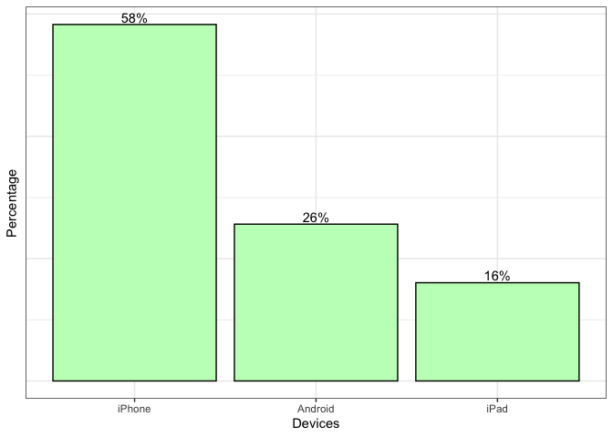
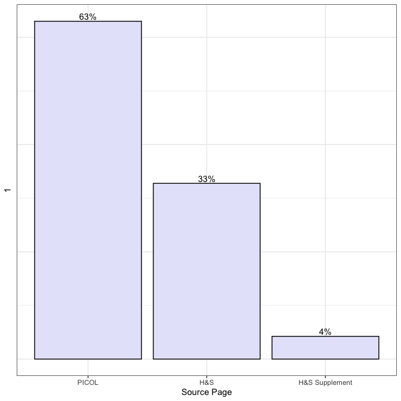
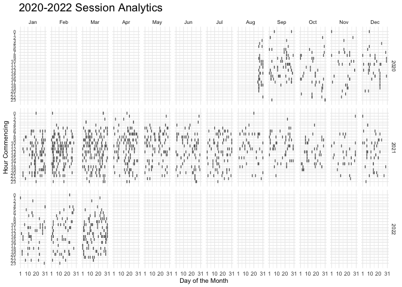

# How do user characteristics inform or explain their interaction with the ‘[Pesticides Labels Now!](https://deohs.washington.edu/pnash/LabelsNow)’ application?

## Authors: Aarti Tandon, Eddie Kasner, Kit Galvin, Pablo Palmández

 

## Table of Contents

-   [Introduction](#introduction)
-   [Executive Summary](#executive-summary)
-   [Objective](#objective)
-   [Features to Help Understand User
    Characteristics](#features-to-help-understand-user-characteristics)
-   [Data Subsets](#data-subsets)
-   [Descriptive Statistics](#descriptive-statistics)
    -   [evDownload.01](#evdownload.01)
    -   [evStart](#evstart)
    -   [evViewPage.01](#evviewpage.01)
-   [App Use By Location](#app-use-by-location)
    -   [Plot for US Sessions](#plot-for-us-sessions)
    -   [Plot for WA sessions with County
        Names](#plot-for-wa-sessions-with-county-names)
-   [App Use By Device](#app-use-by-device)
    -   [Devices Utilized to Access the
        Application](#devices-utilized-to-access-the-application)
-   [App Use By Language](#app-use-by-language)
    -   [Frequency of Each Language Accessed on the
        Application](#frequency-of-each-language-accessed-on-the-application)
    -   [Frequency of Different Languages by Operating
        System](#frequency-of-different-languages-by-operating-system)
-   [App Use By Time](#app-use-by-time)
    -   [Comparing User Sessions by ‘Day of the Month’, ‘Month’, and
        ‘Activity of the
        User’](#comparing-user-sessions-by-day-of-the-month-month-and-activity-of-the-user)
    -   [Comparing User Sessions by ‘Hour of the Day’, ‘Day of the
        Month’, and ‘Activity of the
        User’](#comparing-user-sessions-by-hour-of-the-day-day-of-the-month-and-activity-of-the-user)
    -   [Comparing User Sessions by ‘Month’, ‘Day of the Month’, and
        ‘Session Time (in
        minutes)’](#comparing-user-sessions-by-month-day-of-the-month-and-session-time-in-minutes)
    -   [Comparing User Sessions by ‘Hour of the Month’, ‘Day of the
        Month’, ‘Month’, and
        ‘Year’](#comparing-user-sessions-by-hour-of-the-month-day-of-the-month-month-and-year)  
-   [App Use By Activity](#app-use-by-activity)
    -   [Frequency of Each Source Page Accessed on the
        Application](#frequency-of-each-source-page-accessed-on-the-application)
    -   [Activity in Each Label
        Section](#activity-in-each-label-section)
    -   [Frequency of Links Utilized](#frequency-of-links-utilized)  
    -   [Frequency of Different Links by
        Language](#frequency-of-different-links-by-language)  
-   [Average Session Duration](#average-session-duration)  
-   [Appendix](#appendix)  
     

# Introduction

Hi! My name is Aarti Tandon and I am currently working as an
Undergraduate Research Assistant here at the University of Washington.
Through the [SURE-EH
program](https://deohs.washington.edu/apply-sure-eh), I work with the
[Pacific Northwest Agricultural Safety and Health
Center](https://deohs.washington.edu/pnash/) under the mentorship of
Dr. Eddie Kasner and Kit Galvin. This is my markdown file that I have
been working on this past year where I have analyzed data from the
‘[Bilingual Health and Safety
Messaging](https://deohs.washington.edu/pnash/LabelsNow)’ application.
My research is focused on reducing the gaps in fair and equal access for
marginalized peoples by understanding our user audience and their
preferences for app utility. While working on the app, I have been able
to stand at the crossroads of technology and human health. Using the
tools of statistics and data visualization, I have contributed to
research translation and the improvement of human health, environmental
resilience, and social and economic equity.

# Executive Summary

The ‘[Pesticides Labels
Now!](https://deohs.washington.edu/pnash/LabelsNow)’ mobile application
strives to minimize agricultural worker and community exposure and
illness from agricultural pesticides through improving access to
pesticide labels and safety information in Spanish and English.
Pesticide handlers, managers, and supervisors are able to gain access to
this information, change behaviors accordingly, and transfer the safety
information to others. We hypothesized that user characteristics such as
language choice, mobile device type, and location would determine
frequency of interactions with the application. This study investigates
the application’s user audience and their preferences for app utility.
Statistical analysis and graphing was conducted with R Studio (Version
2021.09.1) for users accessing the application over one year starting in
August 2020. The raw data set consisted primarily of users from the
State of Washington, containing 67,754 interactions and a total of 503
unique users. The results showed that user utilization is predominantly
concentrated in central Washington, which is part of the Columbia Basin,
and has very productive agricultural land. The overall frequency of each
language accessed on the application was relatively comparable - with
59% in English and 41% in Spanish. The analysis further indicated the
majority of users utilize the application through an iOS system. An
estimated 74% of interactions were accessed through an iPhone device and
26% were accessed through an Android device. By understanding the effect
of user characteristics in their interaction with the application,
necessary adjustments can be made to the application to create a more
user-friendly experience and contribute to improving access to pesticide
labels and their safety information.

# Objective

## To understand the ‘[Pesticide Labels Now](https://deohs.washington.edu/pnash/LabelsNow)’ mobile application user audience and their preferences for app utility.

# Features to Help Understand User Characteristics

-   Location
-   Device
-   Language

# Data Subsets

A data dictionary and descriptive statistics were prepared based on the
Pesticide Labels Now (PLN) [analysis
plan](https://docs.google.com/document/d/1mUHPYdpWljCWroODGenUjYlyae2ZWwqN4MScBLXlr2U/edit).
For a better representation of users, we ignored a list of random
identifiers (‘aid’ in *ignores.csv*) associated with the project team
members and generated descriptive statistics for three subsets:

-   [evDownload.01](https://github.com/aartitandon/SURE-EH-Research-Project/blob/main/Appendix.md#evdownload01-subset)
-   [evStart](https://github.com/aartitandon/SURE-EH-Research-Project/blob/main/Appendix.md#evstart-subset)
-   [evViewPage.01](https://github.com/aartitandon/SURE-EH-Research-Project/blob/main/Appendix.md#evviewpage01-subset)

# App Use By Location

## Map for US Sessions in 2020-2021

<figcaption align="center">
<b>Figure 1 - App Utilization on United States Map </b>
</figcaption>

Predominant use is concentrated in Washington, however, there is
scattered usage throughout the Eastern coast and California.

    ##   |                                                                              |                                                                      |   0%  |                                                                              |=                                                                     |   1%  |                                                                              |=                                                                     |   2%  |                                                                              |==                                                                    |   2%  |                                                                              |==                                                                    |   3%  |                                                                              |===                                                                   |   4%  |                                                                              |===                                                                   |   5%  |                                                                              |====                                                                  |   5%  |                                                                              |====                                                                  |   6%  |                                                                              |=====                                                                 |   7%  |                                                                              |=====                                                                 |   8%  |                                                                              |======                                                                |   8%  |                                                                              |======                                                                |   9%  |                                                                              |=======                                                               |  10%  |                                                                              |=======                                                               |  11%  |                                                                              |========                                                              |  11%  |                                                                              |========                                                              |  12%  |                                                                              |=========                                                             |  13%  |                                                                              |==========                                                            |  14%  |                                                                              |==========                                                            |  15%  |                                                                              |===========                                                           |  15%  |                                                                              |===========                                                           |  16%  |                                                                              |============                                                          |  16%  |                                                                              |============                                                          |  17%  |                                                                              |============                                                          |  18%  |                                                                              |=============                                                         |  18%  |                                                                              |=============                                                         |  19%  |                                                                              |==============                                                        |  19%  |                                                                              |==============                                                        |  20%  |                                                                              |==============                                                        |  21%  |                                                                              |===============                                                       |  21%  |                                                                              |===============                                                       |  22%  |                                                                              |================                                                      |  22%  |                                                                              |================                                                      |  23%  |                                                                              |================                                                      |  24%  |                                                                              |=================                                                     |  24%  |                                                                              |=================                                                     |  25%  |                                                                              |==================                                                    |  25%  |                                                                              |==================                                                    |  26%  |                                                                              |===================                                                   |  27%  |                                                                              |====================                                                  |  28%  |                                                                              |====================                                                  |  29%  |                                                                              |=====================                                                 |  29%  |                                                                              |=====================                                                 |  30%  |                                                                              |======================                                                |  31%  |                                                                              |======================                                                |  32%  |                                                                              |=======================                                               |  32%  |                                                                              |=======================                                               |  33%  |                                                                              |========================                                              |  34%  |                                                                              |========================                                              |  35%  |                                                                              |=========================                                             |  35%  |                                                                              |=========================                                             |  36%  |                                                                              |==========================                                            |  37%  |                                                                              |==========================                                            |  38%  |                                                                              |===========================                                           |  38%  |                                                                              |===========================                                           |  39%  |                                                                              |============================                                          |  39%  |                                                                              |============================                                          |  40%  |                                                                              |=============================                                         |  41%  |                                                                              |=============================                                         |  42%  |                                                                              |==============================                                        |  43%  |                                                                              |===============================                                       |  44%  |                                                                              |===============================                                       |  45%  |                                                                              |================================                                      |  45%  |                                                                              |================================                                      |  46%  |                                                                              |=================================                                     |  47%  |                                                                              |=================================                                     |  48%  |                                                                              |==================================                                    |  48%  |                                                                              |==================================                                    |  49%  |                                                                              |===================================                                   |  49%  |                                                                              |===================================                                   |  50%  |                                                                              |===================================                                   |  51%  |                                                                              |====================================                                  |  51%  |                                                                              |====================================                                  |  52%  |                                                                              |=====================================                                 |  52%  |                                                                              |=====================================                                 |  53%  |                                                                              |======================================                                |  54%  |                                                                              |======================================                                |  55%  |                                                                              |=======================================                               |  55%  |                                                                              |=======================================                               |  56%  |                                                                              |========================================                              |  57%  |                                                                              |========================================                              |  58%  |                                                                              |=========================================                             |  58%  |                                                                              |=========================================                             |  59%  |                                                                              |==========================================                            |  60%  |                                                                              |===========================================                           |  61%  |                                                                              |===========================================                           |  62%  |                                                                              |============================================                          |  62%  |                                                                              |============================================                          |  63%  |                                                                              |=============================================                         |  64%  |                                                                              |=============================================                         |  65%  |                                                                              |==============================================                        |  65%  |                                                                              |==============================================                        |  66%  |                                                                              |===============================================                       |  66%  |                                                                              |===============================================                       |  67%  |                                                                              |===============================================                       |  68%  |                                                                              |================================================                      |  68%  |                                                                              |================================================                      |  69%  |                                                                              |=================================================                     |  69%  |                                                                              |=================================================                     |  70%  |                                                                              |=================================================                     |  71%  |                                                                              |==================================================                    |  71%  |                                                                              |==================================================                    |  72%  |                                                                              |===================================================                   |  72%  |                                                                              |===================================================                   |  73%  |                                                                              |====================================================                  |  74%  |                                                                              |====================================================                  |  75%  |                                                                              |=====================================================                 |  75%  |                                                                              |=====================================================                 |  76%  |                                                                              |======================================================                |  77%  |                                                                              |=======================================================               |  78%  |                                                                              |=======================================================               |  79%  |                                                                              |========================================================              |  79%  |                                                                              |========================================================              |  80%  |                                                                              |========================================================              |  81%  |                                                                              |=========================================================             |  81%  |                                                                              |=========================================================             |  82%  |                                                                              |==========================================================            |  82%  |                                                                              |==========================================================            |  83%  |                                                                              |===========================================================           |  84%  |                                                                              |===========================================================           |  85%  |                                                                              |============================================================          |  85%  |                                                                              |============================================================          |  86%  |                                                                              |=============================================================         |  87%  |                                                                              |=============================================================         |  88%  |                                                                              |==============================================================        |  88%  |                                                                              |==============================================================        |  89%  |                                                                              |===============================================================       |  90%  |                                                                              |================================================================      |  91%  |                                                                              |================================================================      |  92%  |                                                                              |=================================================================     |  92%  |                                                                              |=================================================================     |  93%  |                                                                              |=================================================================     |  94%  |                                                                              |==================================================================    |  94%  |                                                                              |==================================================================    |  95%  |                                                                              |===================================================================   |  95%  |                                                                              |===================================================================   |  96%  |                                                                              |====================================================================  |  97%  |                                                                              |====================================================================  |  98%  |                                                                              |===================================================================== |  98%  |                                                                              |===================================================================== |  99%  |                                                                              |======================================================================|  99%  |                                                                              |======================================================================| 100%

    ##   |                                                                              |                                                                      |   0%  |                                                                              |                                                                      |   1%  |                                                                              |=                                                                     |   1%  |                                                                              |=                                                                     |   2%  |                                                                              |==                                                                    |   2%  |                                                                              |==                                                                    |   3%  |                                                                              |===                                                                   |   4%  |                                                                              |===                                                                   |   5%  |                                                                              |====                                                                  |   5%  |                                                                              |====                                                                  |   6%  |                                                                              |=====                                                                 |   7%  |                                                                              |=====                                                                 |   8%  |                                                                              |======                                                                |   8%  |                                                                              |======                                                                |   9%  |                                                                              |=======                                                               |   9%  |                                                                              |=======                                                               |  10%  |                                                                              |=======                                                               |  11%  |                                                                              |========                                                              |  11%  |                                                                              |========                                                              |  12%  |                                                                              |=========                                                             |  12%  |                                                                              |=========                                                             |  13%  |                                                                              |=========                                                             |  14%  |                                                                              |==========                                                            |  14%  |                                                                              |==========                                                            |  15%  |                                                                              |===========                                                           |  15%  |                                                                              |===========                                                           |  16%  |                                                                              |============                                                          |  16%  |                                                                              |============                                                          |  17%  |                                                                              |============                                                          |  18%  |                                                                              |=============                                                         |  18%  |                                                                              |=============                                                         |  19%  |                                                                              |==============                                                        |  19%  |                                                                              |==============                                                        |  20%  |                                                                              |==============                                                        |  21%  |                                                                              |===============                                                       |  21%  |                                                                              |===============                                                       |  22%  |                                                                              |================                                                      |  22%  |                                                                              |================                                                      |  23%  |                                                                              |=================                                                     |  24%  |                                                                              |=================                                                     |  25%  |                                                                              |==================                                                    |  25%  |                                                                              |==================                                                    |  26%  |                                                                              |===================                                                   |  27%  |                                                                              |===================                                                   |  28%  |                                                                              |====================                                                  |  28%  |                                                                              |====================                                                  |  29%  |                                                                              |=====================                                                 |  29%  |                                                                              |=====================                                                 |  30%  |                                                                              |=====================                                                 |  31%  |                                                                              |======================                                                |  31%  |                                                                              |======================                                                |  32%  |                                                                              |=======================                                               |  32%  |                                                                              |=======================                                               |  33%  |                                                                              |=======================                                               |  34%  |                                                                              |========================                                              |  34%  |                                                                              |========================                                              |  35%  |                                                                              |=========================                                             |  35%  |                                                                              |=========================                                             |  36%  |                                                                              |==========================                                            |  36%  |                                                                              |==========================                                            |  37%  |                                                                              |==========================                                            |  38%  |                                                                              |===========================                                           |  38%  |                                                                              |===========================                                           |  39%  |                                                                              |============================                                          |  39%  |                                                                              |============================                                          |  40%  |                                                                              |============================                                          |  41%  |                                                                              |=============================                                         |  41%  |                                                                              |=============================                                         |  42%  |                                                                              |==============================                                        |  42%  |                                                                              |==============================                                        |  43%  |                                                                              |===============================                                       |  44%  |                                                                              |===============================                                       |  45%  |                                                                              |================================                                      |  45%  |                                                                              |================================                                      |  46%  |                                                                              |=================================                                     |  46%  |                                                                              |=================================                                     |  47%  |                                                                              |=================================                                     |  48%  |                                                                              |==================================                                    |  48%  |                                                                              |==================================                                    |  49%  |                                                                              |===================================                                   |  49%  |                                                                              |===================================                                   |  50%  |                                                                              |===================================                                   |  51%  |                                                                              |====================================                                  |  51%  |                                                                              |====================================                                  |  52%  |                                                                              |=====================================                                 |  52%  |                                                                              |=====================================                                 |  53%  |                                                                              |=====================================                                 |  54%  |                                                                              |======================================                                |  54%  |                                                                              |======================================                                |  55%  |                                                                              |=======================================                               |  55%  |                                                                              |=======================================                               |  56%  |                                                                              |========================================                              |  57%  |                                                                              |========================================                              |  58%  |                                                                              |=========================================                             |  58%  |                                                                              |=========================================                             |  59%  |                                                                              |==========================================                            |  59%  |                                                                              |==========================================                            |  60%  |                                                                              |==========================================                            |  61%  |                                                                              |===========================================                           |  61%  |                                                                              |===========================================                           |  62%  |                                                                              |============================================                          |  62%  |                                                                              |============================================                          |  63%  |                                                                              |=============================================                         |  64%  |                                                                              |=============================================                         |  65%  |                                                                              |==============================================                        |  65%  |                                                                              |==============================================                        |  66%  |                                                                              |===============================================                       |  67%  |                                                                              |===============================================                       |  68%  |                                                                              |================================================                      |  68%  |                                                                              |================================================                      |  69%  |                                                                              |=================================================                     |  69%  |                                                                              |=================================================                     |  70%  |                                                                              |=================================================                     |  71%  |                                                                              |==================================================                    |  71%  |                                                                              |==================================================                    |  72%  |                                                                              |===================================================                   |  72%  |                                                                              |===================================================                   |  73%  |                                                                              |===================================================                   |  74%  |                                                                              |====================================================                  |  74%  |                                                                              |====================================================                  |  75%  |                                                                              |=====================================================                 |  75%  |                                                                              |=====================================================                 |  76%  |                                                                              |======================================================                |  76%  |                                                                              |======================================================                |  77%  |                                                                              |======================================================                |  78%  |                                                                              |=======================================================               |  78%  |                                                                              |=======================================================               |  79%  |                                                                              |========================================================              |  79%  |                                                                              |========================================================              |  80%  |                                                                              |========================================================              |  81%  |                                                                              |=========================================================             |  81%  |                                                                              |=========================================================             |  82%  |                                                                              |==========================================================            |  82%  |                                                                              |==========================================================            |  83%  |                                                                              |==========================================================            |  84%  |                                                                              |===========================================================           |  84%  |                                                                              |===========================================================           |  85%  |                                                                              |============================================================          |  85%  |                                                                              |============================================================          |  86%  |                                                                              |=============================================================         |  86%  |                                                                              |=============================================================         |  87%  |                                                                              |=============================================================         |  88%  |                                                                              |==============================================================        |  88%  |                                                                              |==============================================================        |  89%  |                                                                              |===============================================================       |  89%  |                                                                              |===============================================================       |  90%  |                                                                              |===============================================================       |  91%  |                                                                              |================================================================      |  91%  |                                                                              |================================================================      |  92%  |                                                                              |=================================================================     |  92%  |                                                                              |=================================================================     |  93%  |                                                                              |==================================================================    |  94%  |                                                                              |==================================================================    |  95%  |                                                                              |===================================================================   |  95%  |                                                                              |===================================================================   |  96%  |                                                                              |====================================================================  |  97%  |                                                                              |====================================================================  |  98%  |                                                                              |===================================================================== |  98%  |                                                                              |===================================================================== |  99%  |                                                                              |======================================================================|  99%  |                                                                              |======================================================================| 100%

## Map for Washington Sessions in 2020-2021

<figcaption align="center">
<b>Figure 2 - App Utilization in Washington </b>
</figcaption>

Predominant use is concentrated in central Washington, which is part of
the Columbia Basin, and has very productive agricultural land.

# App Use by Device

## Devices Utilized to Access the Application in 2020-2021

<figcaption align="center">
<b>Figure 3 - Bar Chart of Devices Utilized on the Application </b>
</figcaption>

The three devices utilized to access the application were an iPhone,
Android, or iPad. Approximately 75% of users were accessing the app
through an iOS system (e.g. iPhone, iPad) and 25% of users were
accessing the app through an Android system.

# App Use by Language

## Each Language Accessed on the Application in 2020-2021

<figcaption align="center">
<b>Figure 4 - Bar Chart of Language Frequency on the Application </b>
</figcaption>

The data shows there is 18% more activity in English than Spanish.
“Activity” can be noted as the number of clicks done on the application.
Since the ’Pesticides Labels Now! application initially asks the user
which language they wish to proceed in, there is no “default” language
and the results can be concluded as reliable and robust.

## Different Languages by Operating System in 2020-2021 (N = 67,\_\_\_ clicks)

<figcaption align="center">
<b>Figure 5 - Bar Chart of Language by Operating System </b>
</figcaption>

iOS users are more likely to access the information in English than
Spanish. Android users are more likely to access the information in
Spanish than English. This raises the question of why Spanish-speaking
users are more likely to have an Android device. \*language selection
clicks;

# App Use By Time

<figcaption align="center">
<b>Note: For the Calendar HeatMaps, the shade of blue will indicate the
usage on the application. A darker shade of blue corresponds to less
activity, while a lighter shade of blue corresponds to more activity. If
there is no blue, this means there was no application usage during that
time (e.g. month, day, hour). </b>
</figcaption>

## Comparing User Sessions by ‘Day of the Month’, ‘Month’, and ‘Activity of the User’ in 2020-2021

<figcaption align="center">
<b>Figure 6 - Calendar HeatMap Analyzing Each Session’s Duration in
Comparison to the ‘Day of the Month’, ‘Month’, and ‘Activity of the
User’ </b>
</figcaption>

Growing season starts around mid-March till the end of November. This
figure depicts the increase in session duration mid-year. The rise in
activity at this time conveys the success of the application targeting
this specific population of farmworkers. (include one more sentence
about pesticide training from Jan-March)

## Comparing User Sessions by ‘Hour of the Day’, ‘Day of the Month’, and ‘Activity of the User’

<figcaption align="center">
<b>Figure 7 - Calendar HeatMap Analyzing Each Session’s Duration in
Comparison to the ‘Hour of the Day’, ‘Day of the Month’, and ‘Activity
of the User’ </b>
</figcaption>

In regards to the ‘Day of the Month’, the usage remains relatively
consistent. However, there is a spike in usage of the application each
day from 12-3 PM. (include sentence about user clicks per session at end
of workday)

## Comparing User Sessions by ‘Month’, ‘Day of the Month’, and ‘Session Time (in minutes)’

<figcaption align="center">
<b>Figure 8 - Calendar HeatMap Analyzing Each Session’s Duration in
Comparison to the ‘Month’, ‘Day of the Month’, and ‘Session Time’ (in
minutes) </b>
</figcaption>

Growing season starts around mid-March till the end of November. Figure
5 depicts the increase in session duration from April to August. The
rise in activity at this time conveys the success of the application
targeting this specific population of farmworkers.

## Comparing User Sessions by ‘Hour of the Month’, ‘Day of the Month’, ‘Month’, and ‘Year’

<figcaption align="center">
<b>Figure 9 - Calendar HeatMap Analyzing Each Session’s Duration in
Comparison to the Hour of the Month, Day of the Month, Month, and Year
</b>
</figcaption>

It is important to note here that each line represents an individual
session. Starting from August 2020, the app utilization rises each month
as indicated by the increasing amount of lines(sessions). January
through April 2021 can be seen as the most successful months for the
application due to its popular activity during growing season.

# App Use By Activity

## Frequency of Each Source Page Accessed on the Application in 2020-2021

<figcaption align="center">
<b>Figure 10 - Barchart Displaying Frequency of Source Page Accessed
</b>
</figcaption>

‘PICOL’ can be notably distinguished as the most popular source page
accessed by users.

## Activity in Each Label Section in 2020-2021

<figcaption align="center">
<b>Figure 11 - Barchart Displaying Frequency of Each Link Accessed </b>
</figcaption>

The frequency of each ‘Label Section’ item accessed on the ‘Pesticides
Labels Now’ application was analyzed. ‘Product Information’, ‘Personal
Protective Equipment’ and ‘Pesticide Labels’ are the most popularly
accessed sections by users.

## Frequency of Links Utilized in 2020-2021

<figcaption align="center">
<b>Figure 12 - Barchart Displaying Frequency of Different Links by
Language </b>
</figcaption>

The frequency of each ‘Link’ accessed on the ‘Pesticides Labels Now’
application was analyzed. ‘Labels Search’ was the most popularly viewed
section by all users.

## Different Links by Language in 2020-2021

<figcaption align="center">
<b>Figure 13 - Barchart Displaying Frequency of Different Links by
Language </b>
</figcaption>

The frequency of each ‘Label Section’ item accessed on the ‘Pesticides
Labels Now’ application was compared to the user’s accessed language.
‘EULA’ was most popularly used by English readers and ‘Update News’ was
most popularly used by Spanish readers.

## Table of Top Ten Searched Pesticides in 2020-2021

<table>
<thead>
<tr>
<th style="text-align:left;">
Var1
</th>
<th style="text-align:right;">
Freq
</th>
</tr>
</thead>
<tbody>
<tr>
<td style="text-align:left;">
Lorsban® Advanced
</td>
<td style="text-align:right;">
23
</td>
</tr>
<tr>
<td style="text-align:left;">
PARAQUAT 43.2% SL
</td>
<td style="text-align:right;">
18
</td>
</tr>
<tr>
<td style="text-align:left;">
2,4-D AMINE 4 HERBICIDE
</td>
<td style="text-align:right;">
16
</td>
</tr>
<tr>
<td style="text-align:left;">
2,4-D /AMINE 4 HERBICIDE
</td>
<td style="text-align:right;">
14
</td>
</tr>
<tr>
<td style="text-align:left;">
Lorsban®-4E Insecticide
</td>
<td style="text-align:right;">
12
</td>
</tr>
<tr>
<td style="text-align:left;">
440 SUPERIOR SPRAY OIL
</td>
<td style="text-align:right;">
11
</td>
</tr>
<tr>
<td style="text-align:left;">
Delegate® WG
</td>
<td style="text-align:right;">
11
</td>
</tr>
<tr>
<td style="text-align:left;">
Carbaryl 4L
</td>
<td style="text-align:right;">
10
</td>
</tr>
<tr>
<td style="text-align:left;">
ABBA ULTRA MITICIDE/INSECTICIDE
</td>
<td style="text-align:right;">
9
</td>
</tr>
<tr>
<td style="text-align:left;">
440 Superior Spray Oil
</td>
<td style="text-align:right;">
8
</td>
</tr>
</tbody>
</table>
<figcaption align="center">
<b>Table 1 - Top Ten Searched Pesticides </b>
</figcaption>

Amongst 129 total pesticides in the application, Table 1 displays the
top ten searched pesticides. ‘Lorsban® Advanced’ was the most popularly
looked at pesticide among users from August 2020-2021.

# Average Session Duration

## 90.11 minutes

# Looking at New Data…

## Comparing User Sessions by ‘Hour of the Month’, ‘Day of the Month’, ‘Month’, and ‘Year’

# [Appendix](https://github.com/aartitandon/SURE-EH-Research-Project/blob/main/Appendix.md)
