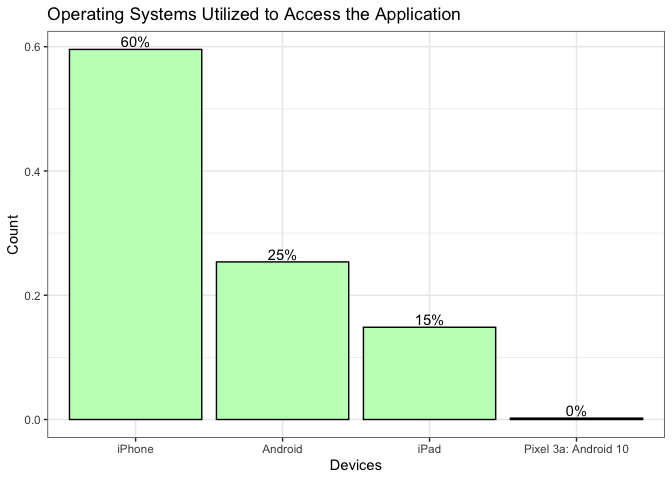
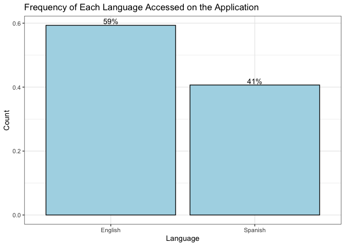
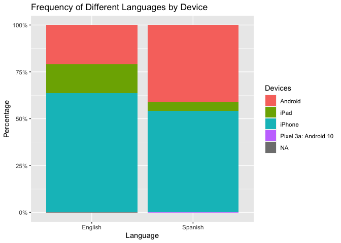
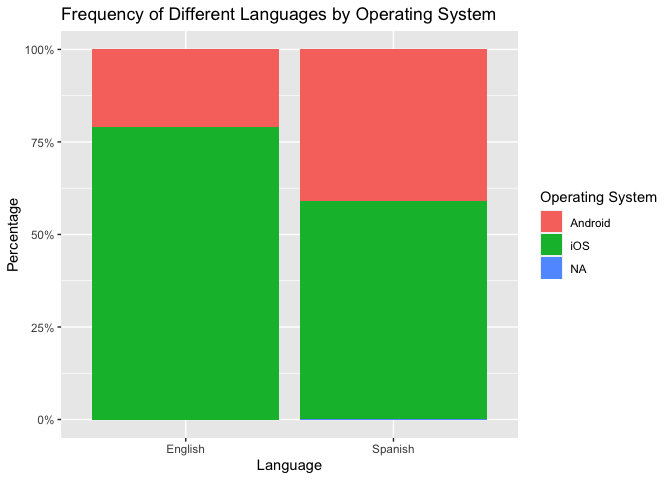
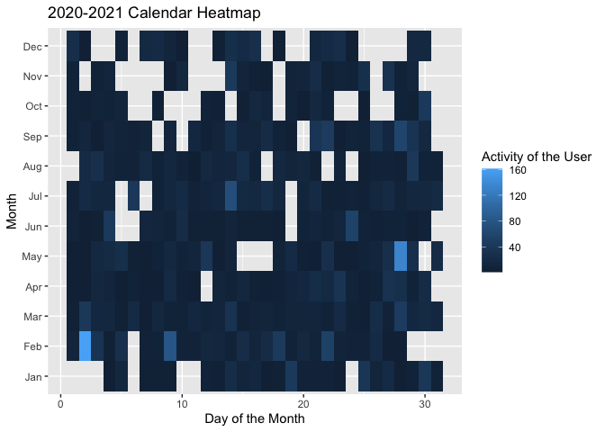
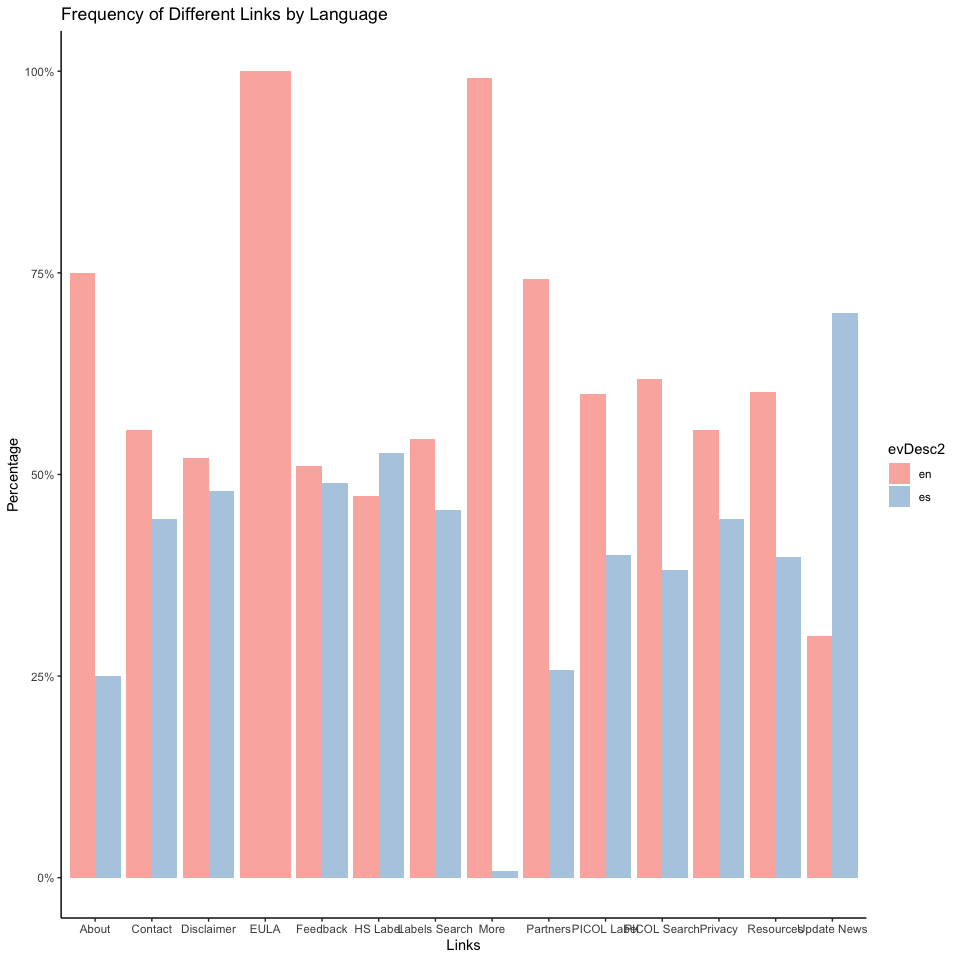

# How do user characteristics inform or explain their interaction with the ‘Pesticides Labels Now’ application?

## Objective: To understand the ‘Pesticide Labels Now’ mobile application user audience and their preferences for app utility.

 

# Executive Summary

A data dictionary and descriptive statistics were prepared based on the
Pesticide Labels Now (PLN) [analysis
plan](https://docs.google.com/document/d/1mUHPYdpWljCWroODGenUjYlyae2ZWwqN4MScBLXlr2U/edit).
For a better representation of users, we ignored a list of random
identifiers (‘aid’ in *ignores.csv*) associated with the project team
members and generated descriptive statistics for three subsets:

-   evDownload.01
-   evStart
-   evViewPage.01

# Features to Help Understand User Characteristics:

-   Location
-   Device
-   Language

# Data Dictionary

## evDownload.01 subset

Unique devices (aid)

    ## [1] 93

<table>
<thead>
<tr class="header">
<th>Variable</th>
<th>Description</th>
</tr>
</thead>
<tbody>
<tr class="odd">
<td>aid</td>
<td>Random device identifier</td>
</tr>
<tr class="even">
<td>epaReg</td>
<td>EPA regsistration number</td>
</tr>
<tr class="odd">
<td>prodName</td>
<td>Pesticide product name</td>
</tr>
<tr class="even">
<td>sourcePage</td>
<td>App page visited?</td>
</tr>
<tr class="odd">
<td>evType</td>
<td>Action taken on app (download)</td>
</tr>
<tr class="even">
<td>ts</td>
<td>Timestamp yyy:mm:dd:hh:mm:ss</td>
</tr>
</tbody>
</table>

## evStart subset

Unique users (aid)

    ## [1] 392

<table>
<thead>
<tr class="header">
<th>Variable</th>
<th>Description</th>
</tr>
</thead>
<tbody>
<tr class="odd">
<td>aid</td>
<td>Random device identifier</td>
</tr>
<tr class="even">
<td>evDesc1</td>
<td>App version?</td>
</tr>
<tr class="odd">
<td>evDesc2</td>
<td>Device type</td>
</tr>
<tr class="even">
<td>evDesc3</td>
<td>GPS coordinates</td>
</tr>
<tr class="odd">
<td>evType</td>
<td>Action taken on app (start page)</td>
</tr>
<tr class="even">
<td>ts</td>
<td>Timestamp yyy:mm:dd:hh:mm:ss</td>
</tr>
</tbody>
</table>

## evViewPage.01 subset

Unique users (aid)

    ## [1] 358

<table>
<thead>
<tr class="header">
<th>Variable</th>
<th>Description</th>
</tr>
</thead>
<tbody>
<tr class="odd">
<td>aid</td>
<td>Random device identifier</td>
</tr>
<tr class="even">
<td>evDesc1</td>
<td>First action on app</td>
</tr>
<tr class="odd">
<td>evDesc2</td>
<td>English or Spanish</td>
</tr>
<tr class="even">
<td>evDesc3</td>
<td>Pesticide label viewed</td>
</tr>
<tr class="odd">
<td>evType</td>
<td>Action taken on app (view page)</td>
</tr>
<tr class="even">
<td>ts</td>
<td>Timestamp yyy:mm:dd:hh:mm:ss</td>
</tr>
</tbody>
</table>

## Detailed variable descriptions

-   Device = identified by a randomly assigned identifier. = Person.
    Person = device. There is no way to distinguish individual users.
    One device can be used by ≥ 1 person and 1 person can use ≥ 1
    device.
-   Access = accessed app = put PLN on device and opened app (app opens
    to label List).
-   Session = time from when the app opened until just before next time
    it is opened.
-   PICOL Searches = PICOL results viewed.
-   Label searches = Label menu viewed.
-   View = accessed and viewed information (any combination of ≥ 1 of
    the following)
-   Label view = accessed + \[(opened ≥ 1 label) + (opened ≥ 1 menu
    bar)\] Label view + PDF = accessed + \[(opened ≥ 1 label) + (opened
    ≥ 1 menu bar)+ (downloaded label PDF)\]
-   PICOL view = accessed + \[(conducted ≥ 1 PICOL search) + (viewed ≥ 1
    PICOL result)\]
-   PICOL view + PDF = accessed app + \[(conducted ≥ 1 PICOL search) +
    (viewed ≥ 1 PICOL result) + (downloaded app)\]
-   General view = accessed +(viewed label search page + selected a
    label, but did not open menu bar) and/or ( viewed PICOL search page)
    and/or viewed more pages General view + links
-   Location = GPS coordinates. de-identified location in that it is
    somewhere within the ~ 500 ft radius. We will only report by broad
    areas. Agricultural regions if they are defined. Currently, many
    iPhone users are declining location as Apple is asking users if they
    want the location turned on/off with each update. We may only be
    able to evaluate this up to the April release date. App is only
    available to devices registered in the US, CA, and MX. However,
    phones registered in these countries can be used anywhere. For
    example, we had a user connect from S. America from a US registered
    phone.
-   Population A definition: anyone that has accessed the app. There is
    1 excluded population and 3 study subpopulations (based on gps
    location coordinates at time the app is opened.)
    -   Device used in WA state GPS data. (Not Seattle or King County)
    -   Device used outside of WA state
    -   No location (location services are off.)
    -   Exclude. King County or at least the Seattle metropolitan area
        locations. These are likely team and PNASH staff. Exclusion
        list. Selected random devices IDs are on an exclusion list.
        These are test devices.
-   Population B definition: (Only use if enough people respond to in
    app questions). Those users that respond to the location in-app
    question. (This response can be linked to app analytic data as it
    has the same random unique ID). This will be implemented very soon.
    -   Response I work in WA state (not quite the same as where they
        downloaded it)
    -   Response I work outside of Washington state
    -   Do not want to answer
    -   Skips answering the question. (will combine with c)

# Descriptive Statistics

## evDownload.01

## evStart

## evViewPage.01

# App Use By Location

## Plot for US Sessions

## Plot for WA sessions

    ##   |                                                                              |                                                                      |   0%  |                                                                              |=                                                                     |   1%  |                                                                              |=                                                                     |   2%  |                                                                              |==                                                                    |   2%  |                                                                              |==                                                                    |   3%  |                                                                              |===                                                                   |   4%  |                                                                              |===                                                                   |   5%  |                                                                              |====                                                                  |   5%  |                                                                              |====                                                                  |   6%  |                                                                              |=====                                                                 |   7%  |                                                                              |=====                                                                 |   8%  |                                                                              |======                                                                |   8%  |                                                                              |======                                                                |   9%  |                                                                              |=======                                                               |  10%  |                                                                              |=======                                                               |  11%  |                                                                              |========                                                              |  11%  |                                                                              |========                                                              |  12%  |                                                                              |=========                                                             |  13%  |                                                                              |==========                                                            |  14%  |                                                                              |==========                                                            |  15%  |                                                                              |===========                                                           |  15%  |                                                                              |===========                                                           |  16%  |                                                                              |============                                                          |  16%  |                                                                              |============                                                          |  17%  |                                                                              |============                                                          |  18%  |                                                                              |=============                                                         |  18%  |                                                                              |=============                                                         |  19%  |                                                                              |==============                                                        |  19%  |                                                                              |==============                                                        |  20%  |                                                                              |==============                                                        |  21%  |                                                                              |===============                                                       |  21%  |                                                                              |===============                                                       |  22%  |                                                                              |================                                                      |  22%  |                                                                              |================                                                      |  23%  |                                                                              |================                                                      |  24%  |                                                                              |=================                                                     |  24%  |                                                                              |=================                                                     |  25%  |                                                                              |==================                                                    |  25%  |                                                                              |==================                                                    |  26%  |                                                                              |===================                                                   |  27%  |                                                                              |====================                                                  |  28%  |                                                                              |====================                                                  |  29%  |                                                                              |=====================                                                 |  29%  |                                                                              |=====================                                                 |  30%  |                                                                              |======================                                                |  31%  |                                                                              |======================                                                |  32%  |                                                                              |=======================                                               |  32%  |                                                                              |=======================                                               |  33%  |                                                                              |========================                                              |  34%  |                                                                              |========================                                              |  35%  |                                                                              |=========================                                             |  35%  |                                                                              |=========================                                             |  36%  |                                                                              |==========================                                            |  37%  |                                                                              |==========================                                            |  38%  |                                                                              |===========================                                           |  38%  |                                                                              |===========================                                           |  39%  |                                                                              |============================                                          |  39%  |                                                                              |============================                                          |  40%  |                                                                              |=============================                                         |  41%  |                                                                              |=============================                                         |  42%  |                                                                              |==============================                                        |  43%  |                                                                              |===============================                                       |  44%  |                                                                              |===============================                                       |  45%  |                                                                              |================================                                      |  45%  |                                                                              |================================                                      |  46%  |                                                                              |=================================                                     |  47%  |                                                                              |=================================                                     |  48%  |                                                                              |==================================                                    |  48%  |                                                                              |==================================                                    |  49%  |                                                                              |===================================                                   |  49%  |                                                                              |===================================                                   |  50%  |                                                                              |===================================                                   |  51%  |                                                                              |====================================                                  |  51%  |                                                                              |====================================                                  |  52%  |                                                                              |=====================================                                 |  52%  |                                                                              |=====================================                                 |  53%  |                                                                              |======================================                                |  54%  |                                                                              |======================================                                |  55%  |                                                                              |=======================================                               |  55%  |                                                                              |=======================================                               |  56%  |                                                                              |========================================                              |  57%  |                                                                              |========================================                              |  58%  |                                                                              |=========================================                             |  58%  |                                                                              |=========================================                             |  59%  |                                                                              |==========================================                            |  60%  |                                                                              |===========================================                           |  61%  |                                                                              |===========================================                           |  62%  |                                                                              |============================================                          |  62%  |                                                                              |============================================                          |  63%  |                                                                              |=============================================                         |  64%  |                                                                              |=============================================                         |  65%  |                                                                              |==============================================                        |  65%  |                                                                              |==============================================                        |  66%  |                                                                              |===============================================                       |  66%  |                                                                              |===============================================                       |  67%  |                                                                              |===============================================                       |  68%  |                                                                              |================================================                      |  68%  |                                                                              |================================================                      |  69%  |                                                                              |=================================================                     |  69%  |                                                                              |=================================================                     |  70%  |                                                                              |=================================================                     |  71%  |                                                                              |==================================================                    |  71%  |                                                                              |==================================================                    |  72%  |                                                                              |===================================================                   |  72%  |                                                                              |===================================================                   |  73%  |                                                                              |====================================================                  |  74%  |                                                                              |====================================================                  |  75%  |                                                                              |=====================================================                 |  75%  |                                                                              |=====================================================                 |  76%  |                                                                              |======================================================                |  77%  |                                                                              |=======================================================               |  78%  |                                                                              |=======================================================               |  79%  |                                                                              |========================================================              |  79%  |                                                                              |========================================================              |  80%  |                                                                              |========================================================              |  81%  |                                                                              |=========================================================             |  81%  |                                                                              |=========================================================             |  82%  |                                                                              |==========================================================            |  82%  |                                                                              |==========================================================            |  83%  |                                                                              |===========================================================           |  84%  |                                                                              |===========================================================           |  85%  |                                                                              |============================================================          |  85%  |                                                                              |============================================================          |  86%  |                                                                              |=============================================================         |  87%  |                                                                              |=============================================================         |  88%  |                                                                              |==============================================================        |  88%  |                                                                              |==============================================================        |  89%  |                                                                              |===============================================================       |  90%  |                                                                              |================================================================      |  91%  |                                                                              |================================================================      |  92%  |                                                                              |=================================================================     |  92%  |                                                                              |=================================================================     |  93%  |                                                                              |=================================================================     |  94%  |                                                                              |==================================================================    |  94%  |                                                                              |==================================================================    |  95%  |                                                                              |===================================================================   |  95%  |                                                                              |===================================================================   |  96%  |                                                                              |====================================================================  |  97%  |                                                                              |====================================================================  |  98%  |                                                                              |===================================================================== |  98%  |                                                                              |===================================================================== |  99%  |                                                                              |======================================================================|  99%  |                                                                              |======================================================================| 100%

    ##   |                                                                              |                                                                      |   0%  |                                                                              |                                                                      |   1%  |                                                                              |=                                                                     |   1%  |                                                                              |=                                                                     |   2%  |                                                                              |==                                                                    |   2%  |                                                                              |==                                                                    |   3%  |                                                                              |===                                                                   |   4%  |                                                                              |===                                                                   |   5%  |                                                                              |====                                                                  |   5%  |                                                                              |====                                                                  |   6%  |                                                                              |=====                                                                 |   7%  |                                                                              |=====                                                                 |   8%  |                                                                              |======                                                                |   8%  |                                                                              |======                                                                |   9%  |                                                                              |=======                                                               |   9%  |                                                                              |=======                                                               |  10%  |                                                                              |=======                                                               |  11%  |                                                                              |========                                                              |  11%  |                                                                              |========                                                              |  12%  |                                                                              |=========                                                             |  12%  |                                                                              |=========                                                             |  13%  |                                                                              |=========                                                             |  14%  |                                                                              |==========                                                            |  14%  |                                                                              |==========                                                            |  15%  |                                                                              |===========                                                           |  15%  |                                                                              |===========                                                           |  16%  |                                                                              |============                                                          |  16%  |                                                                              |============                                                          |  17%  |                                                                              |============                                                          |  18%  |                                                                              |=============                                                         |  18%  |                                                                              |=============                                                         |  19%  |                                                                              |==============                                                        |  19%  |                                                                              |==============                                                        |  20%  |                                                                              |==============                                                        |  21%  |                                                                              |===============                                                       |  21%  |                                                                              |===============                                                       |  22%  |                                                                              |================                                                      |  22%  |                                                                              |================                                                      |  23%  |                                                                              |=================                                                     |  24%  |                                                                              |=================                                                     |  25%  |                                                                              |==================                                                    |  25%  |                                                                              |==================                                                    |  26%  |                                                                              |===================                                                   |  27%  |                                                                              |===================                                                   |  28%  |                                                                              |====================                                                  |  28%  |                                                                              |====================                                                  |  29%  |                                                                              |=====================                                                 |  29%  |                                                                              |=====================                                                 |  30%  |                                                                              |=====================                                                 |  31%  |                                                                              |======================                                                |  31%  |                                                                              |======================                                                |  32%  |                                                                              |=======================                                               |  32%  |                                                                              |=======================                                               |  33%  |                                                                              |=======================                                               |  34%  |                                                                              |========================                                              |  34%  |                                                                              |========================                                              |  35%  |                                                                              |=========================                                             |  35%  |                                                                              |=========================                                             |  36%  |                                                                              |==========================                                            |  36%  |                                                                              |==========================                                            |  37%  |                                                                              |==========================                                            |  38%  |                                                                              |===========================                                           |  38%  |                                                                              |===========================                                           |  39%  |                                                                              |============================                                          |  39%  |                                                                              |============================                                          |  40%  |                                                                              |============================                                          |  41%  |                                                                              |=============================                                         |  41%  |                                                                              |=============================                                         |  42%  |                                                                              |==============================                                        |  42%  |                                                                              |==============================                                        |  43%  |                                                                              |===============================                                       |  44%  |                                                                              |===============================                                       |  45%  |                                                                              |================================                                      |  45%  |                                                                              |================================                                      |  46%  |                                                                              |=================================                                     |  46%  |                                                                              |=================================                                     |  47%  |                                                                              |=================================                                     |  48%  |                                                                              |==================================                                    |  48%  |                                                                              |==================================                                    |  49%  |                                                                              |===================================                                   |  49%  |                                                                              |===================================                                   |  50%  |                                                                              |===================================                                   |  51%  |                                                                              |====================================                                  |  51%  |                                                                              |====================================                                  |  52%  |                                                                              |=====================================                                 |  52%  |                                                                              |=====================================                                 |  53%  |                                                                              |=====================================                                 |  54%  |                                                                              |======================================                                |  54%  |                                                                              |======================================                                |  55%  |                                                                              |=======================================                               |  55%  |                                                                              |=======================================                               |  56%  |                                                                              |========================================                              |  57%  |                                                                              |========================================                              |  58%  |                                                                              |=========================================                             |  58%  |                                                                              |=========================================                             |  59%  |                                                                              |==========================================                            |  59%  |                                                                              |==========================================                            |  60%  |                                                                              |==========================================                            |  61%  |                                                                              |===========================================                           |  61%  |                                                                              |===========================================                           |  62%  |                                                                              |============================================                          |  62%  |                                                                              |============================================                          |  63%  |                                                                              |=============================================                         |  64%  |                                                                              |=============================================                         |  65%  |                                                                              |==============================================                        |  65%  |                                                                              |==============================================                        |  66%  |                                                                              |===============================================                       |  67%  |                                                                              |===============================================                       |  68%  |                                                                              |================================================                      |  68%  |                                                                              |================================================                      |  69%  |                                                                              |=================================================                     |  69%  |                                                                              |=================================================                     |  70%  |                                                                              |=================================================                     |  71%  |                                                                              |==================================================                    |  71%  |                                                                              |==================================================                    |  72%  |                                                                              |===================================================                   |  72%  |                                                                              |===================================================                   |  73%  |                                                                              |===================================================                   |  74%  |                                                                              |====================================================                  |  74%  |                                                                              |====================================================                  |  75%  |                                                                              |=====================================================                 |  75%  |                                                                              |=====================================================                 |  76%  |                                                                              |======================================================                |  76%  |                                                                              |======================================================                |  77%  |                                                                              |======================================================                |  78%  |                                                                              |=======================================================               |  78%  |                                                                              |=======================================================               |  79%  |                                                                              |========================================================              |  79%  |                                                                              |========================================================              |  80%  |                                                                              |========================================================              |  81%  |                                                                              |=========================================================             |  81%  |                                                                              |=========================================================             |  82%  |                                                                              |==========================================================            |  82%  |                                                                              |==========================================================            |  83%  |                                                                              |==========================================================            |  84%  |                                                                              |===========================================================           |  84%  |                                                                              |===========================================================           |  85%  |                                                                              |============================================================          |  85%  |                                                                              |============================================================          |  86%  |                                                                              |=============================================================         |  86%  |                                                                              |=============================================================         |  87%  |                                                                              |=============================================================         |  88%  |                                                                              |==============================================================        |  88%  |                                                                              |==============================================================        |  89%  |                                                                              |===============================================================       |  89%  |                                                                              |===============================================================       |  90%  |                                                                              |===============================================================       |  91%  |                                                                              |================================================================      |  91%  |                                                                              |================================================================      |  92%  |                                                                              |=================================================================     |  92%  |                                                                              |=================================================================     |  93%  |                                                                              |==================================================================    |  94%  |                                                                              |==================================================================    |  95%  |                                                                              |===================================================================   |  95%  |                                                                              |===================================================================   |  96%  |                                                                              |====================================================================  |  97%  |                                                                              |====================================================================  |  98%  |                                                                              |===================================================================== |  98%  |                                                                              |===================================================================== |  99%  |                                                                              |======================================================================|  99%  |                                                                              |======================================================================| 100%

## Plot for WA sessions with County Names

# App Use by Device

## Devices Utilized to Access the Application

    ## 'data.frame':    11220 obs. of  9 variables:
    ##  $ aid       : chr  "4ed7c47c99a436bc7af83247107d18732b99834e3caf6d8dd0f9fc02ddbcee34" "4ed7c47c99a436bc7af83247107d18732b99834e3caf6d8dd0f9fc02ddbcee34" "38e8e6b6869f850b8a33196fc4c4efef815e73970c7d40274583ae2b9912fc2b" "66be76760e5c86168772ae342b57eef1af5a54ad7e9552c73fa684f8a9fdd0ea" ...
    ##  $ evDesc1   : chr  "1.0.4 (34)" "1.0.4 (34)" "1.0.4 (34)" "1.0.0 (30)" ...
    ##  $ evDesc2   : chr  "iphone,ios,cordova,capacitor,mobile,hybrid,Apple,iPhone,ios,14.0.1,ios" "iphone,ios,cordova,capacitor,mobile,hybrid,Apple,iPhone,ios,14.0.1,ios" "iphone,ios,cordova,capacitor,mobile,hybrid,Apple,iPhone,ios,13.7,ios" "iphone,ios,cordova,capacitor,mobile,hybrid,Apple,iPhone,ios,13.5.1,ios" ...
    ##  $ evDesc3   : chr  "(35.051366873052984,-79.04818778145427)" "(35.05139093907041,-79.04810525826915)" "(35.225780965553675,-80.77426135851753)" "(38.190336609848934,-121.23048384393766)" ...
    ##  $ evType    : chr  "evStart" "evStart" "evStart" "evStart" ...
    ##  $ ts        : chr  "2020-08-26T00:03:57.358Z" "2020-08-26T00:05:23.548Z" "2020-08-26T03:33:11.980Z" "2020-08-26T17:08:48.632Z" ...
    ##  $ device_cat: chr  "iphone" "iphone" "iphone" "iphone" ...
    ##  $ lat       : chr  "35.051366873052984" "35.05139093907041" "35.225780965553675" "38.190336609848934" ...
    ##  $ lon       : chr  "-79.04818778145427" "-79.04810525826915" "-80.77426135851753" "-121.23048384393766" ...

# App Use by Language

## Frequency of Each Language Accessed on the Application

## Frequency of Different Languages by Device

    ##     
    ##      android ipad iphone Pixel 3a: Android 10
    ##   en     457  335   1383                    0
    ##   es     610   74    808                    1

## Frequency of Different Languages by Operating System

    ##      row col

# App Use By Time

## Comparing User Sessions by ‘Day of the Month’, ‘Month’, and ‘Activity of the User’

## Comparing User Sessions by ‘Hour of the Day’, ‘Day of the Month’, and ‘Activity of the User’

## Comparing User Sessions by ‘Day of the Month’, ‘Month’, and ‘Session Time (in minutes)’

## Comparing User Sessions by ‘Hour of the Month’, ‘Day of the Month’, ‘Month’, and ‘Year’

# App Use By Activity

## Frequency of Each Source Page Accessed on the Application

    ## 'data.frame':    354 obs. of  6 variables:
    ##  $ aid       : chr  "d0573972b4e5751d9eee0d67e0696bd97f9563f09542e9fa0a494a60b5304332" "aa60dce9815bd4c2958e1a9410bb1ec6656202a67c1676877a99abbffc0dc703" "66be76760e5c86168772ae342b57eef1af5a54ad7e9552c73fa684f8a9fdd0ea" "33c5b5f6fe19a77b8433f9a516da568e6bd61fd3c1dadb607c7b27ad672ada03" ...
    ##  $ epaReg    : chr  "66330-404" "42750-19-5905" "432-1575" "9779-273" ...
    ##  $ prodName  : chr  "KASUMIN 2L" "2,4-D AMINE 4 HERBICIDE" "ALTUS" "AGRISOLUTIONS DIMATE 4E SYSTEMIC INSECTICIDE" ...
    ##  $ sourcePage: chr  "PICOL" "PICOL" "PICOL" "PICOL" ...
    ##  $ evType    : chr  "evDownloadLabel" "evDownloadLabel" "evDownloadLabel" "evDownloadLabel" ...
    ##  $ ts        : chr  "2020-08-27T11:56:40.858Z" "2020-08-27T19:05:52.237Z" "2020-08-29T17:32:42.200Z" "2020-09-01T21:21:23.077Z" ...

## Activity in Each Label Section

## Frequency of Different Links by Language

    ## 'data.frame':    3671 obs. of  6 variables:
    ##  $ aid    : chr  "97362f1ba9b08a01f001a4b5c1d5a6a15d296aadf248847e157e5efe41f8c2c2" "ac1e51c717cdc4efc891f63dc74e49ff3b9b4d4243672f46bcd47c14a7e43883" "97362f1ba9b08a01f001a4b5c1d5a6a15d296aadf248847e157e5efe41f8c2c2" "ac1e51c717cdc4efc891f63dc74e49ff3b9b4d4243672f46bcd47c14a7e43883" ...
    ##  $ evDesc1: chr  "Labels Search" "Labels Search" "PICOL Search" "Resources" ...
    ##  $ evDesc2: chr  "en" "en" "en" "en" ...
    ##  $ evDesc3: chr  "" "" "" "" ...
    ##  $ evType : chr  "evViewPage" "evViewPage" "evViewPage" "evViewPage" ...
    ##  $ ts     : chr  "2020-08-26T00:05:03.601Z" "2020-08-26T00:05:23.939Z" "2020-08-26T00:05:35.367Z" "2020-08-26T00:05:35.795Z" ...

    library("dplyr")
    table <- table(evDownload.01$prodName)
    my_table <- table[order(table, decreasing = TRUE)]
    my_table

    ## 
    ##                                    Lorsban® Advanced 
    ##                                                   23 
    ##                                    PARAQUAT 43.2% SL 
    ##                                                   18 
    ##                              2,4-D AMINE 4 HERBICIDE 
    ##                                                   16 
    ##                             2,4-D /AMINE 4 HERBICIDE 
    ##                                                   14 
    ##                              Lorsban®-4E Insecticide 
    ##                                                   12 
    ##                               440 SUPERIOR SPRAY OIL 
    ##                                                   11 
    ##                                         Delegate® WG 
    ##                                                   11 
    ##                                          Carbaryl 4L 
    ##                                                   10 
    ##                      ABBA ULTRA MITICIDE/INSECTICIDE 
    ##                                                    9 
    ##                               440 Superior Spray Oil 
    ##                                                    8 
    ##                                     Acramite® - 50WS 
    ##                                                    8 
    ##                             Assail® 70WP Insecticide 
    ##                                                    8 
    ##                                 Belt® SC Insecticide 
    ##                                                    7 
    ##                      Calypso® 4 Flowable Insecticide 
    ##                                                    7 
    ##                   3336 F TURF & ORNAMENTAL FUNGICIDE 
    ##                                                    6 
    ##                             Rex Lime Sulfur Solution 
    ##                                                    6 
    ##                     ABBA 0.15EC MITICIDE/INSECTICIDE 
    ##                                                    5 
    ##                           GRAMOXONE SL 2.0 HERBICIDE 
    ##                                                    5 
    ##                                        120 HERBICIDE 
    ##                                                    4 
    ##             ABACUS AGRICULTURAL MITICIDE/INSECTICIDE 
    ##                                                    4 
    ##                                            ABBA 0.15 
    ##                                                    4 
    ##                         BRANDT LIME SULFUR FUNGICIDE 
    ##                                                    4 
    ##                FireLine™ 17 WP fungicide/bactericide 
    ##                                                    4 
    ##                                 GALIGAN 2E HERBICIDE 
    ##                                                    4 
    ##                               ROUNDUP POWER MAX HERB 
    ##                                                    4 
    ##                                        2,4-D AMINE 4 
    ##                                                    3 
    ##                                470 SUPREME SPRAY OIL 
    ##                                                    3 
    ##                       AGRI-FLEX MITICIDE/INSECTICIDE 
    ##                                                    3 
    ##                              ASSAIL 70WP INSECTICIDE 
    ##                                                    3 
    ##                          DuPont™ Fontelis® FUNGICIDE 
    ##                                                    3 
    ##                                    Isomate®  CM Flex 
    ##                                                    3 
    ##                                  SULFUR DRY FLOWABLE 
    ##                                                    3 
    ##       3336 70EG TURF & ORNAMENTAL SYSTEMIC FUNGICIDE 
    ##                                                    2 
    ##                          ABAMEX MITICIDE/INSECTICIDE 
    ##                                                    2 
    ##                                          ABBA 0.15EC 
    ##                                                    2 
    ##                                ACENTHRIN INSECTICIDE 
    ##                                                    2 
    ##                                ACETO BIFENTHRIN 2 EC 
    ##                                                    2 
    ##                                          AGRI-MEK SC 
    ##                                                    2 
    ##                                        AGRI-MYCIN 17 
    ##                                                    2 
    ##         AGRISOLUTIONS DIMATE 4E SYSTEMIC INSECTICIDE 
    ##                                                    2 
    ##                                Asana® XL Insecticide 
    ##                                                    2 
    ## CHAMP DRY PRILL AGRICULTURAL FUNGICIDE / BACTERICIDE 
    ##                                                    2 
    ##                             CHAMP FORMULA 2 FLOWABLE 
    ##                                                    2 
    ##                                    Cidetrak® Da Mec™ 
    ##                                                    2 
    ##                              DELEGATE WG INSECTICIDE 
    ##                                                    2 
    ##        DiPel® DF Biological Insecticide Dry Flowable 
    ##                                                    2 
    ##                        DuPONT LANNATE LV INSECTICIDE 
    ##                                                    2 
    ##                                     DuPont™ Altacor® 
    ##                                                    2 
    ##                                FUSILADE DX HERBICIDE 
    ##                                                    2 
    ##                       Intruder® Max 70WP Insecticide 
    ##                                                    2 
    ##                         LEAF LIFE GAVICIDE GREEN 415 
    ##                                                    2 
    ##                                             LEPROTEC 
    ##                                                    2 
    ##                                      REGULATE SELECT 
    ##                                                    2 
    ##                          ROUNDUP POWER MAX HERBICIDE 
    ##                                                    2 
    ##              TIMECTIN 0.15EC AG INSECTICIDE/MITICIDE 
    ##                                                    2 
    ##                     Warrior II with Zeon Technology® 
    ##                                                    2 
    ##                                                 6-BA 
    ##                                                    1 
    ##                    ABAMECTIN 2% MITICIDE/INSECTICIDE 
    ##                                                    1 
    ##                                    ACADEMY FUNGICIDE 
    ##                                                    1 
    ##                            ACEPHATE 97UP INSECTICIDE 
    ##                                                    1 
    ##                                        ACRAMITE-50WS 
    ##                                                    1 
    ##                                        ACTIGARD 50WG 
    ##                                                    1 
    ##                              ADAMENT 50 WG FUNGICIDE 
    ##                                                    1 
    ##                       ADMIRE PRO SYSTEMIC PROTECTANT 
    ##                                                    1 
    ##                                      ADORN FUNGICIDE 
    ##                                                    1 
    ##                                           AGCLOR 310 
    ##                                                    1 
    ##                     AGRI-FOS SYSTEMIC FUNGICIDE PLUS 
    ##                                                    1 
    ##                     AGRI-MEK SC MITICIDE/INSECTICIDE 
    ##                                                    1 
    ##                       AGRISOLUTIONS RUGGED HERBICIDE 
    ##                                                    1 
    ##                                     AIM EC HERBICIDE 
    ##                                                    1 
    ##                                                ALTUS 
    ##                                                    1 
    ##              Ambush® 25W Insecticide Wettable Powder 
    ##                                                    1 
    ##                        APOGEE PLANT GROWTH REGULATOR 
    ##                                                    1 
    ##            AZAGUARD BOTANICAL INSECTICIDE/NEMATICIDE 
    ##                                                    1 
    ##                                               AZAMAX 
    ##                                                    1 
    ##                                       BATTALLION 2EC 
    ##                                                    1 
    ##                             BSP LIME-SULFUR SOLUTION 
    ##                                                    1 
    ##                  BUCCANEER PLUS GLYPHOSATE HERBICIDE 
    ##                                                    1 
    ##                                              CAPTIVA 
    ##                                                    1 
    ##                               CLEANSHOT 4L HERBICIDE 
    ##                                                    1 
    ##            DREXEL MALATHION 5EC INSECTICIDE/MITICIDE 
    ##                                                    1 
    ##                                        DuPONT EXIREL 
    ##                                                    1 
    ##            ecoFOG-170 DPA POST-HARVEST DIPHENYLAMINE 
    ##                                                    1 
    ##                                              ENTRUST 
    ##                                                    1 
    ##                 ENTRUST SC NATURALYTE INSECT CONTROL 
    ##                                                    1 
    ##             Entrust® SC Naturalite®   Insect Control 
    ##                                                    1 
    ##                                              Eraser™ 
    ##                                                    1 
    ##                                    FLUDIOXONIL 2L PH 
    ##                                                    1 
    ##                                    GLY STAR ORIGINAL 
    ##                                                    1 
    ##                                        GLY STAR PLUS 
    ##                                                    1 
    ##                                GOVERN 4E INSECTICIDE 
    ##                                                    1 
    ##                                HAWK-I 2L INSECTICIDE 
    ##                                                    1 
    ##                                              HDH TBZ 
    ##                                                    1 
    ##                                    IAP 440 SPRAY OIL 
    ##                                                    1 
    ##                      IAP HI SUPREME 440 SPRAY OIL-NW 
    ##                                                    1 
    ##                                           KASUMIN 2L 
    ##                                                    1 
    ##                                        LAMBDA SELECT 
    ##                                                    1 
    ##                                  Lambda-CY™ EC - RUP 
    ##                                                    1 
    ##                                    LIME SULFUR ULTRA 
    ##                                                    1 
    ##                LIME-SULFUR SOLUTION -CANCELLED 2020- 
    ##                                                    1 
    ##                    LIME-SULFUR SOLUTION AG FUNGICIDE 
    ##                                                    1 
    ##                                         LORSBAN 75WG 
    ##                                                    1 
    ##                               LORSBAN-4E INSECTICIDE 
    ##                                                    1 
    ##                                     LUNA TRANQUILITY 
    ##                                                    1 
    ##                                      Luna® SENSATION 
    ##                                                    1 
    ##                                         MAD DOG PLUS 
    ##                                                    1 
    ##                       MERIVON XEMIUM BRAND FUNGICIDE 
    ##                                                    1 
    ##                    NU-COP 50DF FUNGICIDE/BACTERICIDE 
    ##                                                    1 
    ##                                   ONAGER EW MITICIDE 
    ##                                                    1 
    ##                                        PARA-SHOT 3.0 
    ##                                                    1 
    ##                                          Pitch® 35WP 
    ##                                                    1 
    ##                           PROCURE 480SC AG FUNGICIDE 
    ##                                                    1 
    ##                                  PROWL H2O HERBICIDE 
    ##                                                    1 
    ##                  QUALI-PRO GLYPHOSATE PLUS HERBICIDE 
    ##                                                    1 
    ##                                   RELY 280 HERBICIDE 
    ##                                                    1 
    ##                                            RESIST 57 
    ##                                                    1 
    ##                             REX LIME SULFUR SOLUTION 
    ##                                                    1 
    ##                                  ROUNDUP WEATHER MAX 
    ##                                                    1 
    ##                        ROUNDUP WEATHER MAX HERBICIDE 
    ##                                                    1 
    ##                   SEVIN SL CARBARYL INSECTICIDE (ES) 
    ##                                                    1 
    ##                  Success® NATURALYTE® INSECT CONTROL 
    ##                                                    1 
    ##                   TALSTAR P PROFESSIONAL INSECTICIDE 
    ##                                                    1 
    ##                   TOPGUARD FUNGICIDE SPECIALTY CROPS 
    ##                                                    1 
    ##                                               Ultor® 
    ##                                                    1 
    ##                               VALENT ENVOY HERBICIDE 
    ##                                                    1 
    ##                                          VELUM PRIME 
    ##                                                    1 
    ##                                            VINAGREEN 
    ##                                                    1 
    ##                           WILLOWOOD ABAMECTIN 0.15EC 
    ##                                                    1 
    ##                   WYNCA USA SUNPHOSATE 41% HERBICIDE 
    ##                                                    1

my\_tab\_sort2 &lt;- my\_tab\[order(my\_tab, # Decreasing order of table
decreasing = TRUE)\] my\_tab\_sort2

# Average Session Duration

## 90.11 minutes
