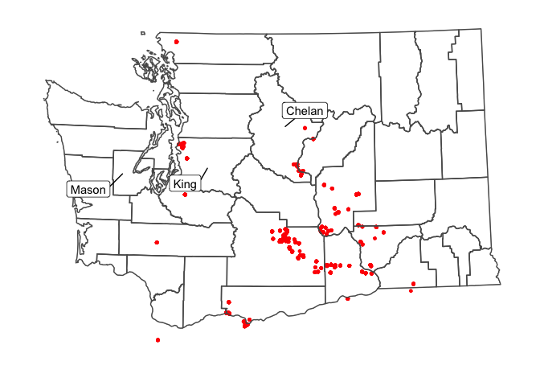
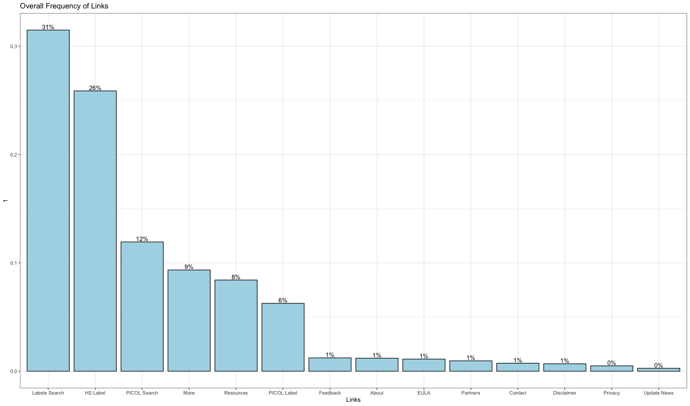
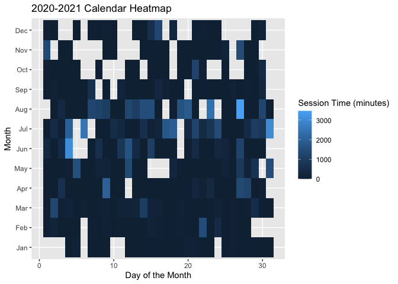
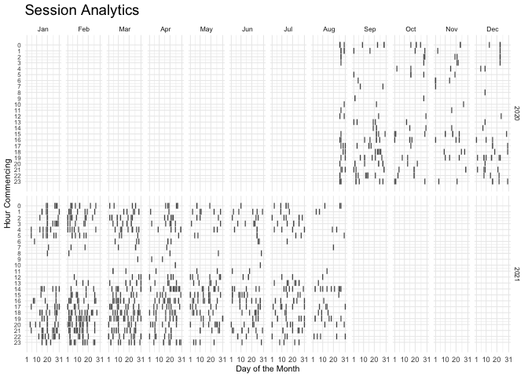

# How do user characteristics inform or explain their interaction with the ‘Pesticides Labels Now’ application?

## Objective: To understand the ‘Pesticide Labels Now’ mobile application user audience and their preferences for app utility.

$$\\\\\[0.5in\]$$

# Executive Summary

A data dictionary and descriptive statistics were prepared based on the
Pesticide Labels Now (PLN) [analysis
plan](https://docs.google.com/document/d/1mUHPYdpWljCWroODGenUjYlyae2ZWwqN4MScBLXlr2U/edit).
For a better representation of users, we ignored a list of random
identifiers (‘aid’ in *ignores.csv*) associated with the project team
members and generated descriptive statistics for three subsets:

-   evDownload.01
-   evStart
-   evViewPage.01

# Data Dictionary

## evDownload.01 subset

Unique devices (aid)

    ## [1] 93

<table>
<thead>
<tr class="header">
<th>Variable</th>
<th>Description</th>
</tr>
</thead>
<tbody>
<tr class="odd">
<td>aid</td>
<td>Random device identifier</td>
</tr>
<tr class="even">
<td>epaReg</td>
<td>EPA regsistration number</td>
</tr>
<tr class="odd">
<td>prodName</td>
<td>Pesticide product name</td>
</tr>
<tr class="even">
<td>sourcePage</td>
<td>App page visited?</td>
</tr>
<tr class="odd">
<td>evType</td>
<td>Action taken on app (download)</td>
</tr>
<tr class="even">
<td>ts</td>
<td>Timestamp yyy:mm:dd:hh:mm:ss</td>
</tr>
</tbody>
</table>

## evStart subset

Unique users (aid)

    ## [1] 392

<table>
<thead>
<tr class="header">
<th>Variable</th>
<th>Description</th>
</tr>
</thead>
<tbody>
<tr class="odd">
<td>aid</td>
<td>Random device identifier</td>
</tr>
<tr class="even">
<td>evDesc1</td>
<td>App version?</td>
</tr>
<tr class="odd">
<td>evDesc2</td>
<td>Device type</td>
</tr>
<tr class="even">
<td>evDesc3</td>
<td>GPS coordinates</td>
</tr>
<tr class="odd">
<td>evType</td>
<td>Action taken on app (start page)</td>
</tr>
<tr class="even">
<td>ts</td>
<td>Timestamp yyy:mm:dd:hh:mm:ss</td>
</tr>
</tbody>
</table>

## evViewPage.01 subset

Unique users (aid)

    ## [1] 358

<table>
<thead>
<tr class="header">
<th>Variable</th>
<th>Description</th>
</tr>
</thead>
<tbody>
<tr class="odd">
<td>aid</td>
<td>Random device identifier</td>
</tr>
<tr class="even">
<td>evDesc1</td>
<td>First action on app</td>
</tr>
<tr class="odd">
<td>evDesc2</td>
<td>English or Spanish</td>
</tr>
<tr class="even">
<td>evDesc3</td>
<td>Pesticide label viewed</td>
</tr>
<tr class="odd">
<td>evType</td>
<td>Action taken on app (view page)</td>
</tr>
<tr class="even">
<td>ts</td>
<td>Timestamp yyy:mm:dd:hh:mm:ss</td>
</tr>
</tbody>
</table>

## Detailed variable descriptions

-   Device = identified by a randomly assigned identifier. = Person.
    Person = device. There is no way to distinguish individual users.
    One device can be used by ≥ 1 person and 1 person can use ≥ 1
    device.
-   Access = accessed app = put PLN on device and opened app (app opens
    to label List).
-   Session = time from when the app opened until just before next time
    it is opened.
-   PICOL Searches = PICOL results viewed.
-   Label searches = Label menu viewed.
-   View = accessed and viewed information (any combination of ≥ 1 of
    the following)
-   Label view = accessed + \[(opened ≥ 1 label) + (opened ≥ 1 menu
    bar)\] Label view + PDF = accessed + \[(opened ≥ 1 label) + (opened
    ≥ 1 menu bar)+ (downloaded label PDF)\]
-   PICOL view = accessed + \[(conducted ≥ 1 PICOL search) + (viewed ≥ 1
    PICOL result)\]
-   PICOL view + PDF = accessed app + \[(conducted ≥ 1 PICOL search) +
    (viewed ≥ 1 PICOL result) + (downloaded app)\]
-   General view = accessed +(viewed label search page + selected a
    label, but did not open menu bar) and/or ( viewed PICOL search page)
    and/or viewed more pages General view + links
-   Location = GPS coordinates. de-identified location in that it is
    somewhere within the ~ 500 ft radius. We will only report by broad
    areas. Agricultural regions if they are defined. Currently, many
    iPhone users are declining location as Apple is asking users if they
    want the location turned on/off with each update. We may only be
    able to evaluate this up to the April release date. App is only
    available to devices registered in the US, CA, and MX. However,
    phones registered in these countries can be used anywhere. For
    example, we had a user connect from S. America from a US registered
    phone.
-   Population A definition: anyone that has accessed the app. There is
    1 excluded population and 3 study subpopulations (based on gps
    location coordinates at time the app is opened.)
    -   Device used in WA state GPS data. (Not Seattle or King County)
    -   Device used outside of WA state
    -   No location (location services are off.)
    -   Exclude. King County or at least the Seattle metropolitan area
        locations. These are likely team and PNASH staff. Exclusion
        list. Selected random devices IDs are on an exclusion list.
        These are test devices.
-   Population B definition: (Only use if enough people respond to in
    app questions). Those users that respond to the location in-app
    question. (This response can be linked to app analytic data as it
    has the same random unique ID). This will be implemented very soon.
    -   Response I work in WA state (not quite the same as where they
        downloaded it)
    -   Response I work outside of Washington state
    -   Do not want to answer
    -   Skips answering the question. (will combine with c)

# Descriptive Statistics

## evDownload.01

## evStart

## evViewPage.01

# App use by location

## Plot for US Sessions

## Plot for WA sessions

## Plot for WA Sessions

    ## 
    ## The downloaded binary packages are in
    ##  /var/folders/g8/z7k53ktx0pg62hb1c7cf4h1m0000gn/T//RtmpSYFbAY/downloaded_packages

    ##   |                                                                              |                                                                      |   0%  |                                                                              |=                                                                     |   1%  |                                                                              |=                                                                     |   2%  |                                                                              |==                                                                    |   2%  |                                                                              |==                                                                    |   3%  |                                                                              |===                                                                   |   4%  |                                                                              |===                                                                   |   5%  |                                                                              |====                                                                  |   5%  |                                                                              |====                                                                  |   6%  |                                                                              |=====                                                                 |   7%  |                                                                              |=====                                                                 |   8%  |                                                                              |======                                                                |   8%  |                                                                              |======                                                                |   9%  |                                                                              |=======                                                               |  10%  |                                                                              |=======                                                               |  11%  |                                                                              |========                                                              |  11%  |                                                                              |========                                                              |  12%  |                                                                              |=========                                                             |  13%  |                                                                              |==========                                                            |  14%  |                                                                              |==========                                                            |  15%  |                                                                              |===========                                                           |  15%  |                                                                              |===========                                                           |  16%  |                                                                              |============                                                          |  16%  |                                                                              |============                                                          |  17%  |                                                                              |============                                                          |  18%  |                                                                              |=============                                                         |  18%  |                                                                              |=============                                                         |  19%  |                                                                              |==============                                                        |  19%  |                                                                              |==============                                                        |  20%  |                                                                              |==============                                                        |  21%  |                                                                              |===============                                                       |  21%  |                                                                              |===============                                                       |  22%  |                                                                              |================                                                      |  22%  |                                                                              |================                                                      |  23%  |                                                                              |================                                                      |  24%  |                                                                              |=================                                                     |  24%  |                                                                              |=================                                                     |  25%  |                                                                              |==================                                                    |  25%  |                                                                              |==================                                                    |  26%  |                                                                              |===================                                                   |  27%  |                                                                              |====================                                                  |  28%  |                                                                              |====================                                                  |  29%  |                                                                              |=====================                                                 |  29%  |                                                                              |=====================                                                 |  30%  |                                                                              |======================                                                |  31%  |                                                                              |======================                                                |  32%  |                                                                              |=======================                                               |  32%  |                                                                              |=======================                                               |  33%  |                                                                              |========================                                              |  34%  |                                                                              |========================                                              |  35%  |                                                                              |=========================                                             |  35%  |                                                                              |=========================                                             |  36%  |                                                                              |==========================                                            |  37%  |                                                                              |==========================                                            |  38%  |                                                                              |===========================                                           |  38%  |                                                                              |===========================                                           |  39%  |                                                                              |============================                                          |  39%  |                                                                              |============================                                          |  40%  |                                                                              |=============================                                         |  41%  |                                                                              |=============================                                         |  42%  |                                                                              |==============================                                        |  43%  |                                                                              |===============================                                       |  44%  |                                                                              |===============================                                       |  45%  |                                                                              |================================                                      |  45%  |                                                                              |================================                                      |  46%  |                                                                              |=================================                                     |  47%  |                                                                              |=================================                                     |  48%  |                                                                              |==================================                                    |  48%  |                                                                              |==================================                                    |  49%  |                                                                              |===================================                                   |  49%  |                                                                              |===================================                                   |  50%  |                                                                              |===================================                                   |  51%  |                                                                              |====================================                                  |  51%  |                                                                              |====================================                                  |  52%  |                                                                              |=====================================                                 |  52%  |                                                                              |=====================================                                 |  53%  |                                                                              |======================================                                |  54%  |                                                                              |======================================                                |  55%  |                                                                              |=======================================                               |  55%  |                                                                              |=======================================                               |  56%  |                                                                              |========================================                              |  57%  |                                                                              |========================================                              |  58%  |                                                                              |=========================================                             |  58%  |                                                                              |=========================================                             |  59%  |                                                                              |==========================================                            |  60%  |                                                                              |===========================================                           |  61%  |                                                                              |===========================================                           |  62%  |                                                                              |============================================                          |  62%  |                                                                              |============================================                          |  63%  |                                                                              |=============================================                         |  64%  |                                                                              |=============================================                         |  65%  |                                                                              |==============================================                        |  65%  |                                                                              |==============================================                        |  66%  |                                                                              |===============================================                       |  66%  |                                                                              |===============================================                       |  67%  |                                                                              |===============================================                       |  68%  |                                                                              |================================================                      |  68%  |                                                                              |================================================                      |  69%  |                                                                              |=================================================                     |  69%  |                                                                              |=================================================                     |  70%  |                                                                              |=================================================                     |  71%  |                                                                              |==================================================                    |  71%  |                                                                              |==================================================                    |  72%  |                                                                              |===================================================                   |  72%  |                                                                              |===================================================                   |  73%  |                                                                              |====================================================                  |  74%  |                                                                              |====================================================                  |  75%  |                                                                              |=====================================================                 |  75%  |                                                                              |=====================================================                 |  76%  |                                                                              |======================================================                |  77%  |                                                                              |=======================================================               |  78%  |                                                                              |=======================================================               |  79%  |                                                                              |========================================================              |  79%  |                                                                              |========================================================              |  80%  |                                                                              |========================================================              |  81%  |                                                                              |=========================================================             |  81%  |                                                                              |=========================================================             |  82%  |                                                                              |==========================================================            |  82%  |                                                                              |==========================================================            |  83%  |                                                                              |===========================================================           |  84%  |                                                                              |===========================================================           |  85%  |                                                                              |============================================================          |  85%  |                                                                              |============================================================          |  86%  |                                                                              |=============================================================         |  87%  |                                                                              |=============================================================         |  88%  |                                                                              |==============================================================        |  88%  |                                                                              |==============================================================        |  89%  |                                                                              |===============================================================       |  90%  |                                                                              |================================================================      |  91%  |                                                                              |================================================================      |  92%  |                                                                              |=================================================================     |  92%  |                                                                              |=================================================================     |  93%  |                                                                              |=================================================================     |  94%  |                                                                              |==================================================================    |  94%  |                                                                              |==================================================================    |  95%  |                                                                              |===================================================================   |  95%  |                                                                              |===================================================================   |  96%  |                                                                              |====================================================================  |  97%  |                                                                              |====================================================================  |  98%  |                                                                              |===================================================================== |  98%  |                                                                              |===================================================================== |  99%  |                                                                              |======================================================================|  99%  |                                                                              |======================================================================| 100%

    ##   |                                                                              |                                                                      |   0%  |                                                                              |                                                                      |   1%  |                                                                              |=                                                                     |   1%  |                                                                              |=                                                                     |   2%  |                                                                              |==                                                                    |   2%  |                                                                              |==                                                                    |   3%  |                                                                              |===                                                                   |   4%  |                                                                              |===                                                                   |   5%  |                                                                              |====                                                                  |   5%  |                                                                              |====                                                                  |   6%  |                                                                              |=====                                                                 |   7%  |                                                                              |=====                                                                 |   8%  |                                                                              |======                                                                |   8%  |                                                                              |======                                                                |   9%  |                                                                              |=======                                                               |   9%  |                                                                              |=======                                                               |  10%  |                                                                              |=======                                                               |  11%  |                                                                              |========                                                              |  11%  |                                                                              |========                                                              |  12%  |                                                                              |=========                                                             |  12%  |                                                                              |=========                                                             |  13%  |                                                                              |=========                                                             |  14%  |                                                                              |==========                                                            |  14%  |                                                                              |==========                                                            |  15%  |                                                                              |===========                                                           |  15%  |                                                                              |===========                                                           |  16%  |                                                                              |============                                                          |  16%  |                                                                              |============                                                          |  17%  |                                                                              |============                                                          |  18%  |                                                                              |=============                                                         |  18%  |                                                                              |=============                                                         |  19%  |                                                                              |==============                                                        |  19%  |                                                                              |==============                                                        |  20%  |                                                                              |==============                                                        |  21%  |                                                                              |===============                                                       |  21%  |                                                                              |===============                                                       |  22%  |                                                                              |================                                                      |  22%  |                                                                              |================                                                      |  23%  |                                                                              |=================                                                     |  24%  |                                                                              |=================                                                     |  25%  |                                                                              |==================                                                    |  25%  |                                                                              |==================                                                    |  26%  |                                                                              |===================                                                   |  27%  |                                                                              |===================                                                   |  28%  |                                                                              |====================                                                  |  28%  |                                                                              |====================                                                  |  29%  |                                                                              |=====================                                                 |  29%  |                                                                              |=====================                                                 |  30%  |                                                                              |=====================                                                 |  31%  |                                                                              |======================                                                |  31%  |                                                                              |======================                                                |  32%  |                                                                              |=======================                                               |  32%  |                                                                              |=======================                                               |  33%  |                                                                              |=======================                                               |  34%  |                                                                              |========================                                              |  34%  |                                                                              |========================                                              |  35%  |                                                                              |=========================                                             |  35%  |                                                                              |=========================                                             |  36%  |                                                                              |==========================                                            |  36%  |                                                                              |==========================                                            |  37%  |                                                                              |==========================                                            |  38%  |                                                                              |===========================                                           |  38%  |                                                                              |===========================                                           |  39%  |                                                                              |============================                                          |  39%  |                                                                              |============================                                          |  40%  |                                                                              |============================                                          |  41%  |                                                                              |=============================                                         |  41%  |                                                                              |=============================                                         |  42%  |                                                                              |==============================                                        |  42%  |                                                                              |==============================                                        |  43%  |                                                                              |===============================                                       |  44%  |                                                                              |===============================                                       |  45%  |                                                                              |================================                                      |  45%  |                                                                              |================================                                      |  46%  |                                                                              |=================================                                     |  46%  |                                                                              |=================================                                     |  47%  |                                                                              |=================================                                     |  48%  |                                                                              |==================================                                    |  48%  |                                                                              |==================================                                    |  49%  |                                                                              |===================================                                   |  49%  |                                                                              |===================================                                   |  50%  |                                                                              |===================================                                   |  51%  |                                                                              |====================================                                  |  51%  |                                                                              |====================================                                  |  52%  |                                                                              |=====================================                                 |  52%  |                                                                              |=====================================                                 |  53%  |                                                                              |=====================================                                 |  54%  |                                                                              |======================================                                |  54%  |                                                                              |======================================                                |  55%  |                                                                              |=======================================                               |  55%  |                                                                              |=======================================                               |  56%  |                                                                              |========================================                              |  57%  |                                                                              |========================================                              |  58%  |                                                                              |=========================================                             |  58%  |                                                                              |=========================================                             |  59%  |                                                                              |==========================================                            |  59%  |                                                                              |==========================================                            |  60%  |                                                                              |==========================================                            |  61%  |                                                                              |===========================================                           |  61%  |                                                                              |===========================================                           |  62%  |                                                                              |============================================                          |  62%  |                                                                              |============================================                          |  63%  |                                                                              |=============================================                         |  64%  |                                                                              |=============================================                         |  65%  |                                                                              |==============================================                        |  65%  |                                                                              |==============================================                        |  66%  |                                                                              |===============================================                       |  67%  |                                                                              |===============================================                       |  68%  |                                                                              |================================================                      |  68%  |                                                                              |================================================                      |  69%  |                                                                              |=================================================                     |  69%  |                                                                              |=================================================                     |  70%  |                                                                              |=================================================                     |  71%  |                                                                              |==================================================                    |  71%  |                                                                              |==================================================                    |  72%  |                                                                              |===================================================                   |  72%  |                                                                              |===================================================                   |  73%  |                                                                              |===================================================                   |  74%  |                                                                              |====================================================                  |  74%  |                                                                              |====================================================                  |  75%  |                                                                              |=====================================================                 |  75%  |                                                                              |=====================================================                 |  76%  |                                                                              |======================================================                |  76%  |                                                                              |======================================================                |  77%  |                                                                              |======================================================                |  78%  |                                                                              |=======================================================               |  78%  |                                                                              |=======================================================               |  79%  |                                                                              |========================================================              |  79%  |                                                                              |========================================================              |  80%  |                                                                              |========================================================              |  81%  |                                                                              |=========================================================             |  81%  |                                                                              |=========================================================             |  82%  |                                                                              |==========================================================            |  82%  |                                                                              |==========================================================            |  83%  |                                                                              |==========================================================            |  84%  |                                                                              |===========================================================           |  84%  |                                                                              |===========================================================           |  85%  |                                                                              |============================================================          |  85%  |                                                                              |============================================================          |  86%  |                                                                              |=============================================================         |  86%  |                                                                              |=============================================================         |  87%  |                                                                              |=============================================================         |  88%  |                                                                              |==============================================================        |  88%  |                                                                              |==============================================================        |  89%  |                                                                              |===============================================================       |  89%  |                                                                              |===============================================================       |  90%  |                                                                              |===============================================================       |  91%  |                                                                              |================================================================      |  91%  |                                                                              |================================================================      |  92%  |                                                                              |=================================================================     |  92%  |                                                                              |=================================================================     |  93%  |                                                                              |==================================================================    |  94%  |                                                                              |==================================================================    |  95%  |                                                                              |===================================================================   |  95%  |                                                                              |===================================================================   |  96%  |                                                                              |====================================================================  |  97%  |                                                                              |====================================================================  |  98%  |                                                                              |===================================================================== |  98%  |                                                                              |===================================================================== |  99%  |                                                                              |======================================================================|  99%  |                                                                              |======================================================================| 100%

## Plot for WA sessions with County Names

# Device time use patterns

# Dataframe summaries

# Which operating systems are utilized to access the application?

# Which language is more frequently utilized with the ‘Pesticide Labels Now’ application?

## Frequency of Different Languages by Device

## Frequency of Different Languages by Operating System

# 2020-2021 Time-Series Calendar HeatMap

## Comparing User Sessions by ‘Day of the Month’, ‘Month’, and ‘Activity of the User’

## Comparing User Sessions by ‘Hour of the Day’, ‘Day of the Month’, and ‘Activity of the User’

## Comparing User Sessions by ‘Day of the Month’, ‘Month’, and ‘Session Time (in minutes)’

## Comparing User Sessions by ‘Hour of the Month’, ‘Day of the Month’, ‘Month’, and ‘Year’

# Average Session Duration

## 90.11 minutes
