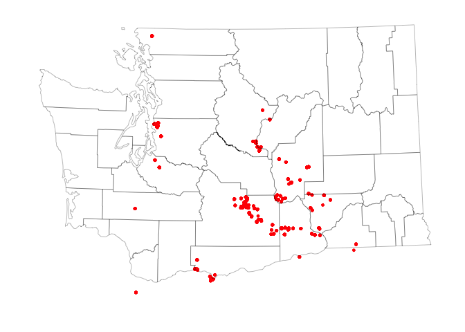
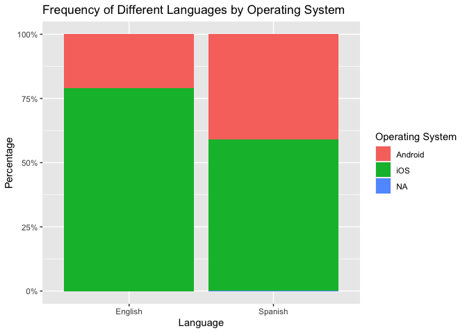
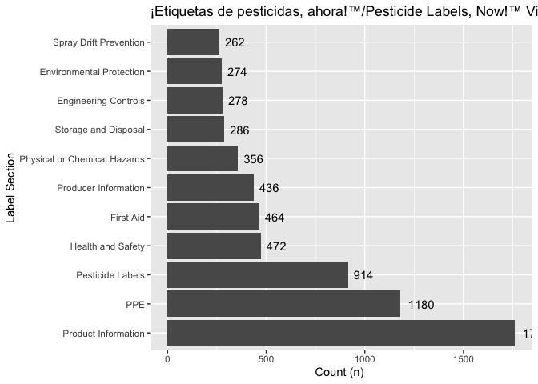
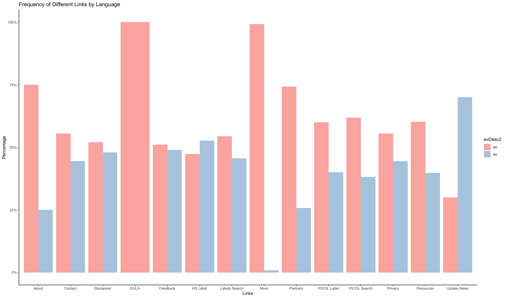

# How do user characteristics inform or explain their interaction with the ‘Pesticides Labels Now’ application?

## Authors: Aarti Tandon & Dr. Eddie Kasner

Hi! My name is Aarti Tandon and I am currently working as an
Undergraduate Research Assistant here at the University of Washington. I
work with the Pacific Northwest Agricultural Safety and Health Center
under the mentorship of Dr. Eddie Kasner and Kit Galvin.

This is my markdown file analyzing data from the ‘Bilingual Health and
Safety Messaging’ application. My research helps reduce the gaps in fair
and equal access for marginalized peoples by understanding our user
audience and their preferences for app utility. While working on the
app, I have been able to stand at the crossroads of technology and human
health. Using the tools of statistics and data visualization, I have
contributed to research translation and the improvement of human health,
environmental resilience, and social and economic equity.

 

# Executive Summary

The ‘Pesticides Labels Now!’ mobile application strives to minimize
agricultural worker and community exposure and illness from agricultural
pesticides through improving access to pesticide labels and safety
information in Spanish and English. Pesticide handlers, managers, and
supervisors are able to gain access to this information, change
behaviors accordingly, and transfer the safety information to others. We
hypothesized that user characteristics such as language choice, mobile
device type, and location would determine frequency of interactions with
the application. This study investigates the application’s user audience
and their preferences for app utility. Statistical analysis and graphing
was conducted with R Studio (Version 2021.09.1) for users accessing the
application over one year starting in August 2020. The raw data set
consisted primarily of users from the State of Washington, containing
67,754 interactions and a total of 503 unique users. The results showed
that user utilization is predominantly concentrated in central
Washington, which is part of the Columbia Basin, and has very productive
agricultural land. The overall frequency of each language accessed on
the application was relatively comparable - with 59% in English and 41%
in Spanish. The analysis further indicated the majority of users utilize
the application through an iOS system. An estimated 74% of interactions
were accessed through an iPhone device and 26% were accessed through an
Android device. By understanding the effect of user characteristics in
their interaction with the application, necessary adjustments can be
made to the application to create a more user-friendly experience and
contribute to improving access to pesticide labels and their safety
information.

# Objective

## To understand the ‘Pesticide Labels Now’ mobile application user audience and their preferences for app utility.

# Features to Help Understand User Characteristics

-   Location
-   Device
-   Language

# Data Subsets

A data dictionary and descriptive statistics were prepared based on the
Pesticide Labels Now (PLN) [analysis
plan](https://docs.google.com/document/d/1mUHPYdpWljCWroODGenUjYlyae2ZWwqN4MScBLXlr2U/edit).
For a better representation of users, we ignored a list of random
identifiers (‘aid’ in *ignores.csv*) associated with the project team
members and generated descriptive statistics for three subsets:

-   evDownload.01
-   evStart
-   evViewPage.01

# Descriptive Statistics

## evDownload.01

## evStart

## evViewPage.01

# App Use By Location

## Plot for US Sessions

An amazing plot

## Plot for WA sessions

    ##   |                                                                              |                                                                      |   0%  |                                                                              |=                                                                     |   1%  |                                                                              |=                                                                     |   2%  |                                                                              |==                                                                    |   2%  |                                                                              |==                                                                    |   3%  |                                                                              |===                                                                   |   4%  |                                                                              |===                                                                   |   5%  |                                                                              |====                                                                  |   5%  |                                                                              |====                                                                  |   6%  |                                                                              |=====                                                                 |   7%  |                                                                              |=====                                                                 |   8%  |                                                                              |======                                                                |   8%  |                                                                              |======                                                                |   9%  |                                                                              |=======                                                               |  10%  |                                                                              |=======                                                               |  11%  |                                                                              |========                                                              |  11%  |                                                                              |========                                                              |  12%  |                                                                              |=========                                                             |  13%  |                                                                              |==========                                                            |  14%  |                                                                              |==========                                                            |  15%  |                                                                              |===========                                                           |  15%  |                                                                              |===========                                                           |  16%  |                                                                              |============                                                          |  16%  |                                                                              |============                                                          |  17%  |                                                                              |============                                                          |  18%  |                                                                              |=============                                                         |  18%  |                                                                              |=============                                                         |  19%  |                                                                              |==============                                                        |  19%  |                                                                              |==============                                                        |  20%  |                                                                              |==============                                                        |  21%  |                                                                              |===============                                                       |  21%  |                                                                              |===============                                                       |  22%  |                                                                              |================                                                      |  22%  |                                                                              |================                                                      |  23%  |                                                                              |================                                                      |  24%  |                                                                              |=================                                                     |  24%  |                                                                              |=================                                                     |  25%  |                                                                              |==================                                                    |  25%  |                                                                              |==================                                                    |  26%  |                                                                              |===================                                                   |  27%  |                                                                              |====================                                                  |  28%  |                                                                              |====================                                                  |  29%  |                                                                              |=====================                                                 |  29%  |                                                                              |=====================                                                 |  30%  |                                                                              |======================                                                |  31%  |                                                                              |======================                                                |  32%  |                                                                              |=======================                                               |  32%  |                                                                              |=======================                                               |  33%  |                                                                              |========================                                              |  34%  |                                                                              |========================                                              |  35%  |                                                                              |=========================                                             |  35%  |                                                                              |=========================                                             |  36%  |                                                                              |==========================                                            |  37%  |                                                                              |==========================                                            |  38%  |                                                                              |===========================                                           |  38%  |                                                                              |===========================                                           |  39%  |                                                                              |============================                                          |  39%  |                                                                              |============================                                          |  40%  |                                                                              |=============================                                         |  41%  |                                                                              |=============================                                         |  42%  |                                                                              |==============================                                        |  43%  |                                                                              |===============================                                       |  44%  |                                                                              |===============================                                       |  45%  |                                                                              |================================                                      |  45%  |                                                                              |================================                                      |  46%  |                                                                              |=================================                                     |  47%  |                                                                              |=================================                                     |  48%  |                                                                              |==================================                                    |  48%  |                                                                              |==================================                                    |  49%  |                                                                              |===================================                                   |  49%  |                                                                              |===================================                                   |  50%  |                                                                              |===================================                                   |  51%  |                                                                              |====================================                                  |  51%  |                                                                              |====================================                                  |  52%  |                                                                              |=====================================                                 |  52%  |                                                                              |=====================================                                 |  53%  |                                                                              |======================================                                |  54%  |                                                                              |======================================                                |  55%  |                                                                              |=======================================                               |  55%  |                                                                              |=======================================                               |  56%  |                                                                              |========================================                              |  57%  |                                                                              |========================================                              |  58%  |                                                                              |=========================================                             |  58%  |                                                                              |=========================================                             |  59%  |                                                                              |==========================================                            |  60%  |                                                                              |===========================================                           |  61%  |                                                                              |===========================================                           |  62%  |                                                                              |============================================                          |  62%  |                                                                              |============================================                          |  63%  |                                                                              |=============================================                         |  64%  |                                                                              |=============================================                         |  65%  |                                                                              |==============================================                        |  65%  |                                                                              |==============================================                        |  66%  |                                                                              |===============================================                       |  66%  |                                                                              |===============================================                       |  67%  |                                                                              |===============================================                       |  68%  |                                                                              |================================================                      |  68%  |                                                                              |================================================                      |  69%  |                                                                              |=================================================                     |  69%  |                                                                              |=================================================                     |  70%  |                                                                              |=================================================                     |  71%  |                                                                              |==================================================                    |  71%  |                                                                              |==================================================                    |  72%  |                                                                              |===================================================                   |  72%  |                                                                              |===================================================                   |  73%  |                                                                              |====================================================                  |  74%  |                                                                              |====================================================                  |  75%  |                                                                              |=====================================================                 |  75%  |                                                                              |=====================================================                 |  76%  |                                                                              |======================================================                |  77%  |                                                                              |=======================================================               |  78%  |                                                                              |=======================================================               |  79%  |                                                                              |========================================================              |  79%  |                                                                              |========================================================              |  80%  |                                                                              |========================================================              |  81%  |                                                                              |=========================================================             |  81%  |                                                                              |=========================================================             |  82%  |                                                                              |==========================================================            |  82%  |                                                                              |==========================================================            |  83%  |                                                                              |===========================================================           |  84%  |                                                                              |===========================================================           |  85%  |                                                                              |============================================================          |  85%  |                                                                              |============================================================          |  86%  |                                                                              |=============================================================         |  87%  |                                                                              |=============================================================         |  88%  |                                                                              |==============================================================        |  88%  |                                                                              |==============================================================        |  89%  |                                                                              |===============================================================       |  90%  |                                                                              |================================================================      |  91%  |                                                                              |================================================================      |  92%  |                                                                              |=================================================================     |  92%  |                                                                              |=================================================================     |  93%  |                                                                              |=================================================================     |  94%  |                                                                              |==================================================================    |  94%  |                                                                              |==================================================================    |  95%  |                                                                              |===================================================================   |  95%  |                                                                              |===================================================================   |  96%  |                                                                              |====================================================================  |  97%  |                                                                              |====================================================================  |  98%  |                                                                              |===================================================================== |  98%  |                                                                              |===================================================================== |  99%  |                                                                              |======================================================================|  99%  |                                                                              |======================================================================| 100%

    ##   |                                                                              |                                                                      |   0%  |                                                                              |                                                                      |   1%  |                                                                              |=                                                                     |   1%  |                                                                              |=                                                                     |   2%  |                                                                              |==                                                                    |   2%  |                                                                              |==                                                                    |   3%  |                                                                              |===                                                                   |   4%  |                                                                              |===                                                                   |   5%  |                                                                              |====                                                                  |   5%  |                                                                              |====                                                                  |   6%  |                                                                              |=====                                                                 |   7%  |                                                                              |=====                                                                 |   8%  |                                                                              |======                                                                |   8%  |                                                                              |======                                                                |   9%  |                                                                              |=======                                                               |   9%  |                                                                              |=======                                                               |  10%  |                                                                              |=======                                                               |  11%  |                                                                              |========                                                              |  11%  |                                                                              |========                                                              |  12%  |                                                                              |=========                                                             |  12%  |                                                                              |=========                                                             |  13%  |                                                                              |=========                                                             |  14%  |                                                                              |==========                                                            |  14%  |                                                                              |==========                                                            |  15%  |                                                                              |===========                                                           |  15%  |                                                                              |===========                                                           |  16%  |                                                                              |============                                                          |  16%  |                                                                              |============                                                          |  17%  |                                                                              |============                                                          |  18%  |                                                                              |=============                                                         |  18%  |                                                                              |=============                                                         |  19%  |                                                                              |==============                                                        |  19%  |                                                                              |==============                                                        |  20%  |                                                                              |==============                                                        |  21%  |                                                                              |===============                                                       |  21%  |                                                                              |===============                                                       |  22%  |                                                                              |================                                                      |  22%  |                                                                              |================                                                      |  23%  |                                                                              |=================                                                     |  24%  |                                                                              |=================                                                     |  25%  |                                                                              |==================                                                    |  25%  |                                                                              |==================                                                    |  26%  |                                                                              |===================                                                   |  27%  |                                                                              |===================                                                   |  28%  |                                                                              |====================                                                  |  28%  |                                                                              |====================                                                  |  29%  |                                                                              |=====================                                                 |  29%  |                                                                              |=====================                                                 |  30%  |                                                                              |=====================                                                 |  31%  |                                                                              |======================                                                |  31%  |                                                                              |======================                                                |  32%  |                                                                              |=======================                                               |  32%  |                                                                              |=======================                                               |  33%  |                                                                              |=======================                                               |  34%  |                                                                              |========================                                              |  34%  |                                                                              |========================                                              |  35%  |                                                                              |=========================                                             |  35%  |                                                                              |=========================                                             |  36%  |                                                                              |==========================                                            |  36%  |                                                                              |==========================                                            |  37%  |                                                                              |==========================                                            |  38%  |                                                                              |===========================                                           |  38%  |                                                                              |===========================                                           |  39%  |                                                                              |============================                                          |  39%  |                                                                              |============================                                          |  40%  |                                                                              |============================                                          |  41%  |                                                                              |=============================                                         |  41%  |                                                                              |=============================                                         |  42%  |                                                                              |==============================                                        |  42%  |                                                                              |==============================                                        |  43%  |                                                                              |===============================                                       |  44%  |                                                                              |===============================                                       |  45%  |                                                                              |================================                                      |  45%  |                                                                              |================================                                      |  46%  |                                                                              |=================================                                     |  46%  |                                                                              |=================================                                     |  47%  |                                                                              |=================================                                     |  48%  |                                                                              |==================================                                    |  48%  |                                                                              |==================================                                    |  49%  |                                                                              |===================================                                   |  49%  |                                                                              |===================================                                   |  50%  |                                                                              |===================================                                   |  51%  |                                                                              |====================================                                  |  51%  |                                                                              |====================================                                  |  52%  |                                                                              |=====================================                                 |  52%  |                                                                              |=====================================                                 |  53%  |                                                                              |=====================================                                 |  54%  |                                                                              |======================================                                |  54%  |                                                                              |======================================                                |  55%  |                                                                              |=======================================                               |  55%  |                                                                              |=======================================                               |  56%  |                                                                              |========================================                              |  57%  |                                                                              |========================================                              |  58%  |                                                                              |=========================================                             |  58%  |                                                                              |=========================================                             |  59%  |                                                                              |==========================================                            |  59%  |                                                                              |==========================================                            |  60%  |                                                                              |==========================================                            |  61%  |                                                                              |===========================================                           |  61%  |                                                                              |===========================================                           |  62%  |                                                                              |============================================                          |  62%  |                                                                              |============================================                          |  63%  |                                                                              |=============================================                         |  64%  |                                                                              |=============================================                         |  65%  |                                                                              |==============================================                        |  65%  |                                                                              |==============================================                        |  66%  |                                                                              |===============================================                       |  67%  |                                                                              |===============================================                       |  68%  |                                                                              |================================================                      |  68%  |                                                                              |================================================                      |  69%  |                                                                              |=================================================                     |  69%  |                                                                              |=================================================                     |  70%  |                                                                              |=================================================                     |  71%  |                                                                              |==================================================                    |  71%  |                                                                              |==================================================                    |  72%  |                                                                              |===================================================                   |  72%  |                                                                              |===================================================                   |  73%  |                                                                              |===================================================                   |  74%  |                                                                              |====================================================                  |  74%  |                                                                              |====================================================                  |  75%  |                                                                              |=====================================================                 |  75%  |                                                                              |=====================================================                 |  76%  |                                                                              |======================================================                |  76%  |                                                                              |======================================================                |  77%  |                                                                              |======================================================                |  78%  |                                                                              |=======================================================               |  78%  |                                                                              |=======================================================               |  79%  |                                                                              |========================================================              |  79%  |                                                                              |========================================================              |  80%  |                                                                              |========================================================              |  81%  |                                                                              |=========================================================             |  81%  |                                                                              |=========================================================             |  82%  |                                                                              |==========================================================            |  82%  |                                                                              |==========================================================            |  83%  |                                                                              |==========================================================            |  84%  |                                                                              |===========================================================           |  84%  |                                                                              |===========================================================           |  85%  |                                                                              |============================================================          |  85%  |                                                                              |============================================================          |  86%  |                                                                              |=============================================================         |  86%  |                                                                              |=============================================================         |  87%  |                                                                              |=============================================================         |  88%  |                                                                              |==============================================================        |  88%  |                                                                              |==============================================================        |  89%  |                                                                              |===============================================================       |  89%  |                                                                              |===============================================================       |  90%  |                                                                              |===============================================================       |  91%  |                                                                              |================================================================      |  91%  |                                                                              |================================================================      |  92%  |                                                                              |=================================================================     |  92%  |                                                                              |=================================================================     |  93%  |                                                                              |==================================================================    |  94%  |                                                                              |==================================================================    |  95%  |                                                                              |===================================================================   |  95%  |                                                                              |===================================================================   |  96%  |                                                                              |====================================================================  |  97%  |                                                                              |====================================================================  |  98%  |                                                                              |===================================================================== |  98%  |                                                                              |===================================================================== |  99%  |                                                                              |======================================================================|  99%  |                                                                              |======================================================================| 100%

## Plot for WA sessions with County Names

# App Use by Device

## Devices Utilized to Access the Application

\`\`\`{r analyzing-devices, warning=F, message=F, echo=F, results=F,
eval=T, fig.cap=“~53% more activity on an iOS system than Android. iOS
users are more likely to access the information in English than Spanish.
Android users are more likely to access the information in Spanish than
English. This raises the question why Spanish-speaking users are ..
Since the ’Pesticides Labels Now! application initially asks the user
which language they wish to proceed in, there is no “default” language
and the results can be concluded as reliable and robust. “} #
SubQuestion #1: Which operating systems are utilized to access the
application?

str(evStart) per\_data &lt;- evStart %>% count(device\_cat) %>%
mutate(per = n / sum(n), per\_label = paste0(round(per\*100), “%”))

library(ggplot2) ggplot(per\_data, aes(x = reorder(n, -per), y=per)) +
geom\_bar(stat = “identity”, fill = “darkseagreen1”, color = “black”) +
geom\_text(aes(label=per\_label), vjust=-0.25) + labs(x = “Devices”, y =
“Count”,  
title = “Devices Utilized to Access the Application”) + theme\_bw() +
scale\_x\_discrete(labels = c(“iPhone”, “Android”, “iPad”, “Pixel 3a:
Android 10”))

    # App Use by Language
    ## Frequency of Each Language Accessed on the Application
    

    ## Frequency of Different Languages by Operating System 
    

    # App Use By Time

    ## Comparing User Sessions by 'Day of the Month', 'Month', and 'Activity of the User'
    

    ## Comparing User Sessions by 'Hour of the Day', 'Day of the Month', and 'Activity of the User'
    

    ## Comparing User Sessions by 'Month', 'Day of the Month', and 'Session Time (in minutes)'
    

    ## Comparing User Sessions by 'Hour of the Month', 'Day of the Month', 'Month', and 'Year'
    

    # App Use By Activity 
    ## Frequency of Each Source Page Accessed on the Application 
    

    ## Activity in Each Label Section 
    

    ## Frequency of Links Utilized 
    

    ## Frequency of Different Links by Language
    

    ## Table of Top Ten Searched Pesticides 
    <table>
     <thead>
      <tr>
       <th style="text-align:left;"> Var1 </th>
       <th style="text-align:right;"> Freq </th>
      </tr>
     </thead>
    <tbody>
      <tr>
       <td style="text-align:left;"> Lorsban® Advanced </td>
       <td style="text-align:right;"> 23 </td>
      </tr>
      <tr>
       <td style="text-align:left;"> PARAQUAT 43.2% SL </td>
       <td style="text-align:right;"> 18 </td>
      </tr>
      <tr>
       <td style="text-align:left;"> 2,4-D AMINE 4 HERBICIDE </td>
       <td style="text-align:right;"> 16 </td>
      </tr>
      <tr>
       <td style="text-align:left;"> 2,4-D /AMINE 4 HERBICIDE </td>
       <td style="text-align:right;"> 14 </td>
      </tr>
      <tr>
       <td style="text-align:left;"> Lorsban®-4E Insecticide </td>
       <td style="text-align:right;"> 12 </td>
      </tr>
      <tr>
       <td style="text-align:left;"> 440 SUPERIOR SPRAY OIL </td>
       <td style="text-align:right;"> 11 </td>
      </tr>
      <tr>
       <td style="text-align:left;"> Delegate® WG </td>
       <td style="text-align:right;"> 11 </td>
      </tr>
      <tr>
       <td style="text-align:left;"> Carbaryl 4L </td>
       <td style="text-align:right;"> 10 </td>
      </tr>
      <tr>
       <td style="text-align:left;"> ABBA ULTRA MITICIDE/INSECTICIDE </td>
       <td style="text-align:right;"> 9 </td>
      </tr>
      <tr>
       <td style="text-align:left;"> 440 Superior Spray Oil </td>
       <td style="text-align:right;"> 8 </td>
      </tr>
    </tbody>
    </table>

    # Average Session Duration 
    ## 90.11 minutes

    \newpage
    \pagenumbering{arabic}

    # APPENDIX

     

    # Data Dictionary 

    ## evDownload.01 subset

    Unique devices (aid)

## \[1\] 93

    | Variable      | Description                    |
    |---------------|--------------------------------|
    | aid           | Random device identifier       |
    | epaReg        | EPA regsistration number       |
    | prodName      | Pesticide product name         |
    | sourcePage    | App page visited?              |
    | evType        | Action taken on app (download) |
    | ts            | Timestamp yyy:mm:dd:hh:mm:ss   |

    ## evStart subset

    Unique users (aid)

## \[1\] 392

    | Variable      | Description                     |
    |---------------|---------------------------------|
    | aid           | Random device identifier        |
    | evDesc1       | App version?                    |
    | evDesc2       | Device type                     |
    | evDesc3       | GPS coordinates                 |
    | evType        | Action taken on app (start page) |
    | ts            | Timestamp yyy:mm:dd:hh:mm:ss    |

    ## evViewPage.01 subset

    Unique users (aid)

## \[1\] 358

\`\`\`

<table>
<thead>
<tr class="header">
<th>Variable</th>
<th>Description</th>
</tr>
</thead>
<tbody>
<tr class="odd">
<td>aid</td>
<td>Random device identifier</td>
</tr>
<tr class="even">
<td>evDesc1</td>
<td>First action on app</td>
</tr>
<tr class="odd">
<td>evDesc2</td>
<td>English or Spanish</td>
</tr>
<tr class="even">
<td>evDesc3</td>
<td>Pesticide label viewed</td>
</tr>
<tr class="odd">
<td>evType</td>
<td>Action taken on app (view page)</td>
</tr>
<tr class="even">
<td>ts</td>
<td>Timestamp yyy:mm:dd:hh:mm:ss</td>
</tr>
</tbody>
</table>

## Detailed variable descriptions

-   Device = identified by a randomly assigned identifier. = Person.
    Person = device. There is no way to distinguish individual users.
    One device can be used by ≥ 1 person and 1 person can use ≥ 1
    device.
-   Access = accessed app = put PLN on device and opened app (app opens
    to label List).
-   Session = time from when the app opened until just before next time
    it is opened.
-   PICOL Searches = PICOL results viewed.
-   Label searches = Label menu viewed.
-   View = accessed and viewed information (any combination of ≥ 1 of
    the following)
-   Label view = accessed + \[(opened ≥ 1 label) + (opened ≥ 1 menu
    bar)\] Label view + PDF = accessed + \[(opened ≥ 1 label) + (opened
    ≥ 1 menu bar)+ (downloaded label PDF)\]
-   PICOL view = accessed + \[(conducted ≥ 1 PICOL search) + (viewed ≥ 1
    PICOL result)\]
-   PICOL view + PDF = accessed app + \[(conducted ≥ 1 PICOL search) +
    (viewed ≥ 1 PICOL result) + (downloaded app)\]
-   General view = accessed +(viewed label search page + selected a
    label, but did not open menu bar) and/or ( viewed PICOL search page)
    and/or viewed more pages General view + links
-   Location = GPS coordinates. de-identified location in that it is
    somewhere within the ~ 500 ft radius. We will only report by broad
    areas. Agricultural regions if they are defined. Currently, many
    iPhone users are declining location as Apple is asking users if they
    want the location turned on/off with each update. We may only be
    able to evaluate this up to the April release date. App is only
    available to devices registered in the US, CA, and MX. However,
    phones registered in these countries can be used anywhere. For
    example, we had a user connect from S. America from a US registered
    phone.
-   Population A definition: anyone that has accessed the app. There is
    1 excluded population and 3 study subpopulations (based on gps
    location coordinates at time the app is opened.)
    -   Device used in WA state GPS data. (Not Seattle or King County)
    -   Device used outside of WA state
    -   No location (location services are off.)
    -   Exclude. King County or at least the Seattle metropolitan area
        locations. These are likely team and PNASH staff. Exclusion
        list. Selected random devices IDs are on an exclusion list.
        These are test devices.
-   Population B definition: (Only use if enough people respond to in
    app questions). Those users that respond to the location in-app
    question. (This response can be linked to app analytic data as it
    has the same random unique ID). This will be implemented very soon.
    -   Response I work in WA state (not quite the same as where they
        downloaded it)
    -   Response I work outside of Washington state
    -   Do not want to answer
    -   Skips answering the question. (will combine with c)
